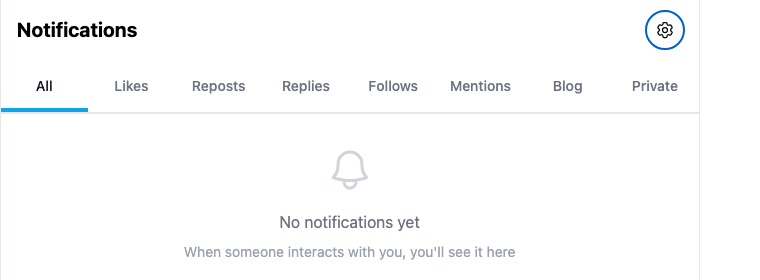
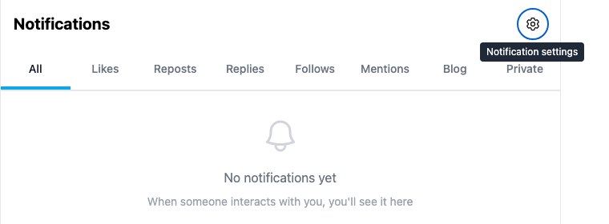
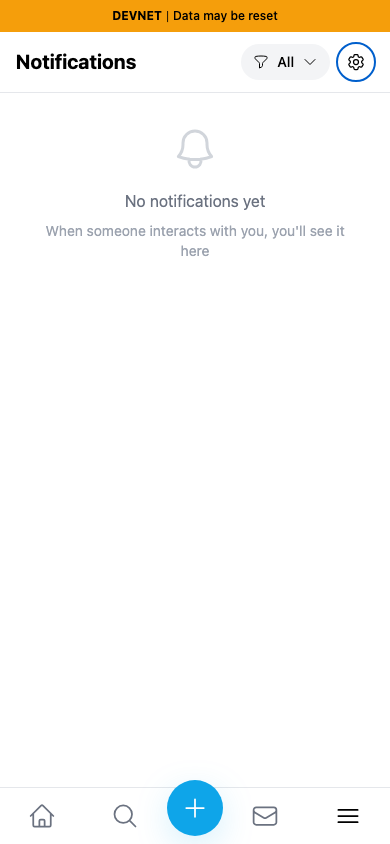
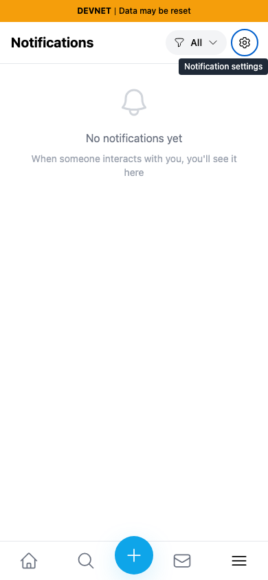

# Yappr #476 — identify the notification settings link

Exact staging base `c98a6ecd7e26ae5bc9fc8e400e6011eb8465b3a0`; full PR head `8147051bbc55e63b4fbbb2f0c3725846a349858c`. Separate `npm run build:devnet` production exports at localhost ports 3260/3264. Same synthetic persona 39 (`9NFhqxW8upkFMVTE5h5VmYWLdSEJ26B2iMKdhCFgsWkd`), normal password UI login, actual empty notifications, no injected responses/state. Fresh Chromium contexts, light theme, en-US, America/Chicago, desktop 1440×1100 and mobile 390×844.

Before — focused cog has no accessible name or tooltip:

After — focused link is identified:

Focused views are matching pixel crops x333/y40/760×280 of the full screenshots, without resize or annotation. An initially too-narrow crop was discarded because it clipped the tooltip; these final crops show the full label.

[Full desktop before](comparison/before/desktop.png) · [after](comparison/after/desktop.png).

| Before mobile | After mobile |
|---|---|
|  |  |

All six final images inspected at original resolution. Accessible-name assertions separately verify the nonvisual change: before unnamed `link`, after `link "Notification settings"`. Enter on both exact revisions reaches the real notification settings route and Push Notifications section. No network write was submitted for the comparison. The separate unread mobile-header overflow is QA75, outside this PR.

Targeted ESLint, full TypeScript, devnet build and independent source review passed. [Assertions](assertions.json).

## SHA-256

- `089f19fcce70953167d40b6e2b69bb20c71d5c0a36af2a34612693b940b9f2b9` — `EVIDENCE_MATRIX.md`
- `08a5a954026d885bb7ccab546fa01a19572cbdba70ceef70392caab26018433c` — `assertions.json`
- `05d585cbe6f18ace9c7ffc101a810a34e87e43344f494b87430a335fde01d91d` — `comparison/after/desktop.png`
- `a10647e8b836b1fb9aeb2d79319324383f7116ba80af530f586bfda90b0efbee` — `comparison/after/focus.png`
- `4d82c0785bccba4d8ac3c18742722604cc45e1073de89f3110124a4b1edc5a28` — `comparison/after/mobile.png`
- `0218faaeafde05aa511d2672c882ab9141bdfc467cf2f170727c0479ae37e5ff` — `comparison/before/desktop.png`
- `9f100814d7204919b0691ca6614e327d673bd7668d13fd52141486c008ed14bc` — `comparison/before/focus.png`
- `e50ef13db2deff8153e40c0a69d8f2aba30942f61fbeb26fbc09919b837bb695` — `comparison/before/mobile.png`
