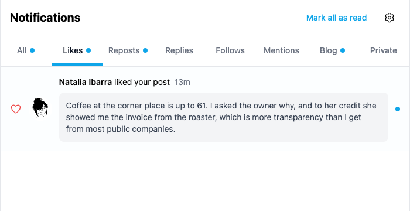
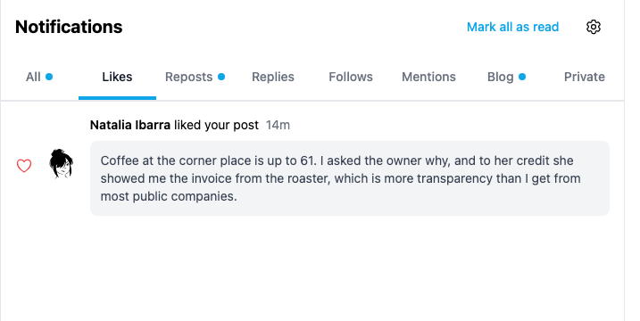
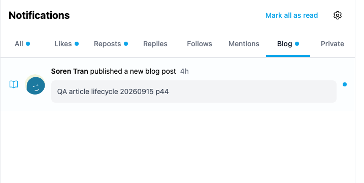
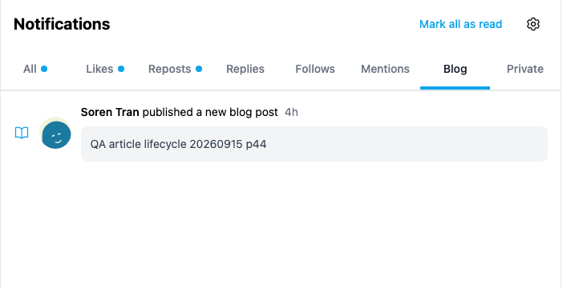

# Yappr #478 — mark opened notification previews as read

Historical exact staging base `c98a6ecd7e26ae5bc9fc8e400e6011eb8465b3a0`; full PR head `d64931848660871b7696cae2fa824c24bf45fdc1`. The target staging branch has advanced since this independent one-file change branched; these images compare the frozen pre-change base against the complete PR head. Separate `npm run build:devnet` production exports at ports3260/3284; each compiled commit verified in Settings About. Fresh Chromium contexts for each scenario, normal password login, light theme, en-US, America/Chicago,1440×1100. No injected notification entries, intercepted responses, or altered clocks.

Both members of each pair show the Notifications page **after opening the same preview, verifying its exact destination, and returning**. Before retains the blue unread row dot and selected-tab dot. After clears both; full overviews additionally show the sidebar count falling3→2. Other notifications stay unread. Real relative ages advance during the sequential captures (Like13m→14m); no claim depends on the displayed age.

Before — post preview returned but still unread:

After — post preview read state persisted:

Before — article preview returned but still unread:

After — article preview read state persisted:

Matching focused screenshots are x333/y40/717×360 pixel regions of the actual viewport, without scaling or annotations. Full overviews: [Like before](comparison/before/like-desktop.png), [Like after](comparison/after/like-desktop.png), [Blog before](comparison/before/blogPost-desktop.png), [Blog after](comparison/after/blogPost-desktop.png). All8 final PNGs inspected at original resolution.

Shared synthetic QA fixture:

- Recipient39: `9NFhqxW8upkFMVTE5h5VmYWLdSEJ26B2iMKdhCFgsWkd`.
- Actor38: `4epjp48EuEG7UetQ7uExDsYNsoWLeVWU9Ym26sXb64WM` (Natalia Ibarra).
- Existing seeded post: `H6upQuVsZVXHYMsXqRyp87T3aEu1bNCSb67mKmpbyLHX`.
- Existing QA44 blog: `GZkg15HyWHb3L4QjcnE6xU2AqkPBtxSYhC76qVHSu1rz`.
- Existing article: `Btrwo7erz9EZhhp14i6PJGmWc8ygsCqgXcZLeLGXJ8QD`, slug `qa-article-lifecycle-20260915-p44`.

Normal actor Like/Repost and recipient blog Follow produced the real notification queries. No original content was edited for the comparison. Exact notification IDs are in the safe assertions. Temporary relations are shared with the parallel mobile-header comparison and are removed once both captures finish.

Procedural checks, separate from screenshot claims: on each revision, Like mouse click, Repost keyboard Enter and blog mouse click navigate to the exact target; the head clears unread1→0 while the base retains1. Each outcome survives full reload. A base row-click control reads the same notification. An already-read preview remains read on both revisions and after another reload. ESLint, full TypeScript, devnet build and independent source review passed.

## SHA-256

- `36321931d4221406b27c0e30c03d00ca0ef4a52a4088ec3b2ca8eaeae7b2178a` — `EVIDENCE_MATRIX.md`
- `51f43cbd0010e792b7e1fb0129acfd191219aed91669705ebeedecff194762f3` — `assertions.json`
- `d3461d07ea581fbd378c71f746d2ff5c738adda7cd5d793cd037c0eaa5734a8a` — `comparison/after/blogPost-desktop.png`
- `8a0db7c6e3c6e82e404aa6041606726f405a15e48d975918c14bffeee1995ed0` — `comparison/after/blogPost-focus.png`
- `11f84794d979d30b2109b0afe2a7c96aeeaa5a4d508455099ffb4776fb7e6763` — `comparison/after/like-desktop.png`
- `bc1ed63bab17188c56f320e5f0b4395f9b7b8ce40674789f23e010f805101bd9` — `comparison/after/like-focus.png`
- `af94d4c6ded1f0651c88b737094d785c644b8fc630c9d95838004cfc190e302c` — `comparison/before/blogPost-desktop.png`
- `ea18ea04b31c91847dda19761505bb912addfc194371f896d07f736a10fd2b15` — `comparison/before/blogPost-focus.png`
- `50cc31b5bc8f1e9211d01037efe684bf7e42b8d7b24214ae2ced481f393fd8cc` — `comparison/before/like-desktop.png`
- `9a59cec57ad146595e1adb7e7a86810de0927588bcd487330e0ec0dc4182fe2d` — `comparison/before/like-focus.png`
