# Mobile notification header — PR479 restack

Unread notifications expose “Mark all as read” and push the mobile filter/settings gear beyond the viewport. This fix uses a two-row mobile header: title/settings above read-all/filter.

Fresh comparison after stacking on PR476. **Before exact parent: `8147051bbc55e63b4fbbb2f0c3725846a349858c`. After full head: `562e76009b448fd4c4ce85b7df5f1bf57c9a76c1`.** This replaces the earlier PR479 pre-restack comparison.

Same two real devnet Like/Repost notifications on post `H6upQuVsZVXHYMsXqRyp87T3aEu1bNCSb67mKmpbyLHX`; recipient `9NFhqxW8upkFMVTE5h5VmYWLdSEJ26B2iMKdhCFgsWkd`. Normal password login in separate fresh contexts; no storage or response mocks. Matching independent production exports and unchanged static adapters. Chromium, light theme, en-US, America/Chicago, 390×844 /320×844 /1440×1100. Compiled revision verified in About before each capture. Temporary engagements removed afterward and readback confirmed absent; no private-feed data changed. The desktop footer-logo omission is an unrelated adapter artifact.

| Before — exact parent, 390px unread All | After — full head, 390px unread All |
| --- | --- |
| 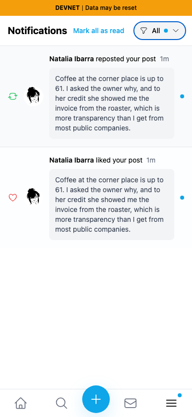 | 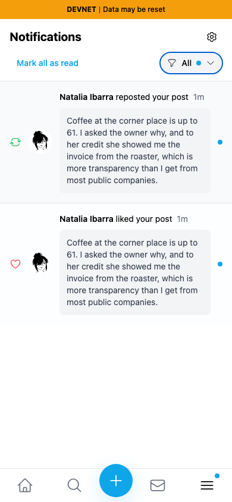 |

| Before — exact parent, 320px unread Mentions | After — full head, 320px unread Mentions |
| --- | --- |
| 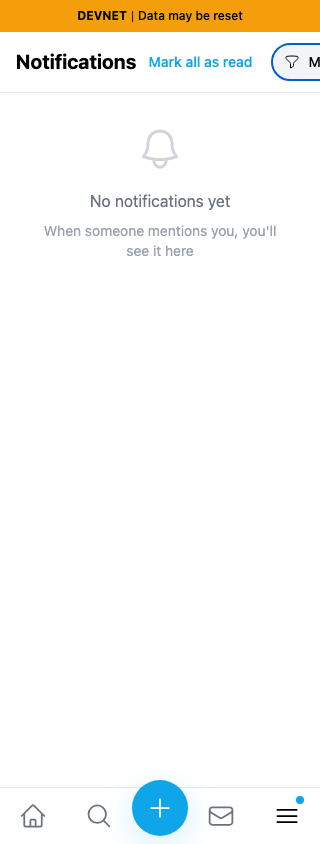 |  |

| Before — 390px read | After — 390px read |
| --- | --- |
| 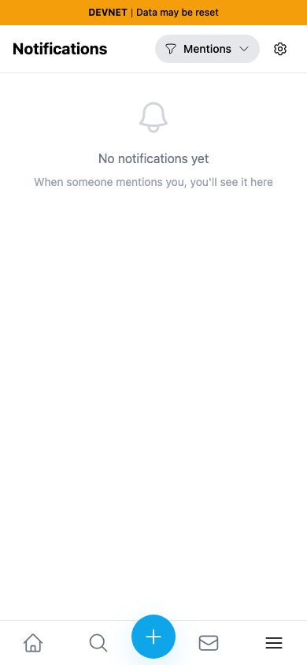 |  |

| Before — 320px read | After — 320px read |
| --- | --- |
| 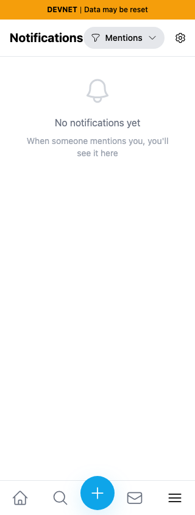 | 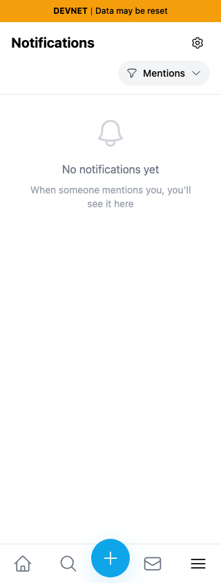 |

Desktop stays one row. Settings moves ahead of read-all so visual and Tab order agree.

| Before — desktop | After — desktop |
| --- | --- |
| 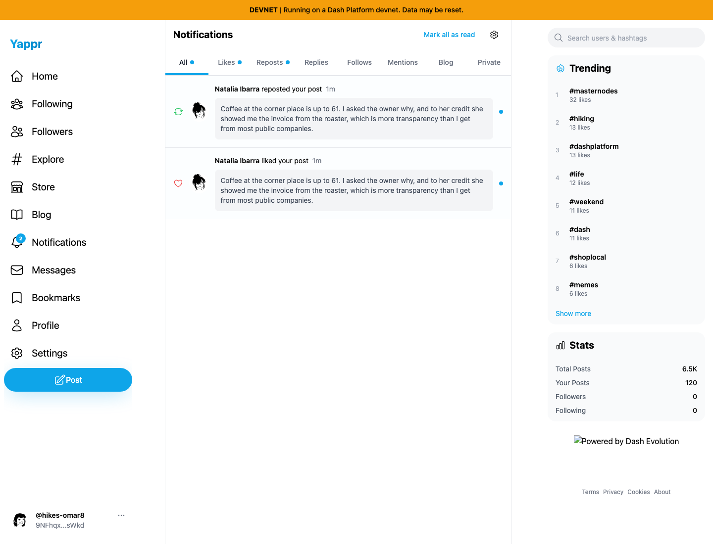 |  |

The parent PR's named settings link and keyboard tooltip are preserved. Tooltip screenshots show the focused settings control; the tooltip temporarily overlays the filter below on mobile. Tab moves to read-all/filter and dismisses it normally.

| Before — desktop focus tooltip | After — desktop focus tooltip |
| --- | --- |
| 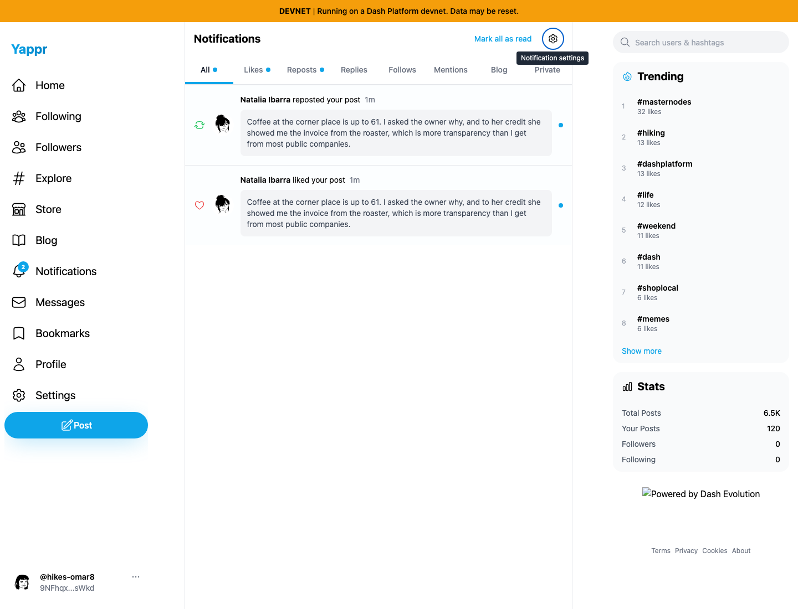 | 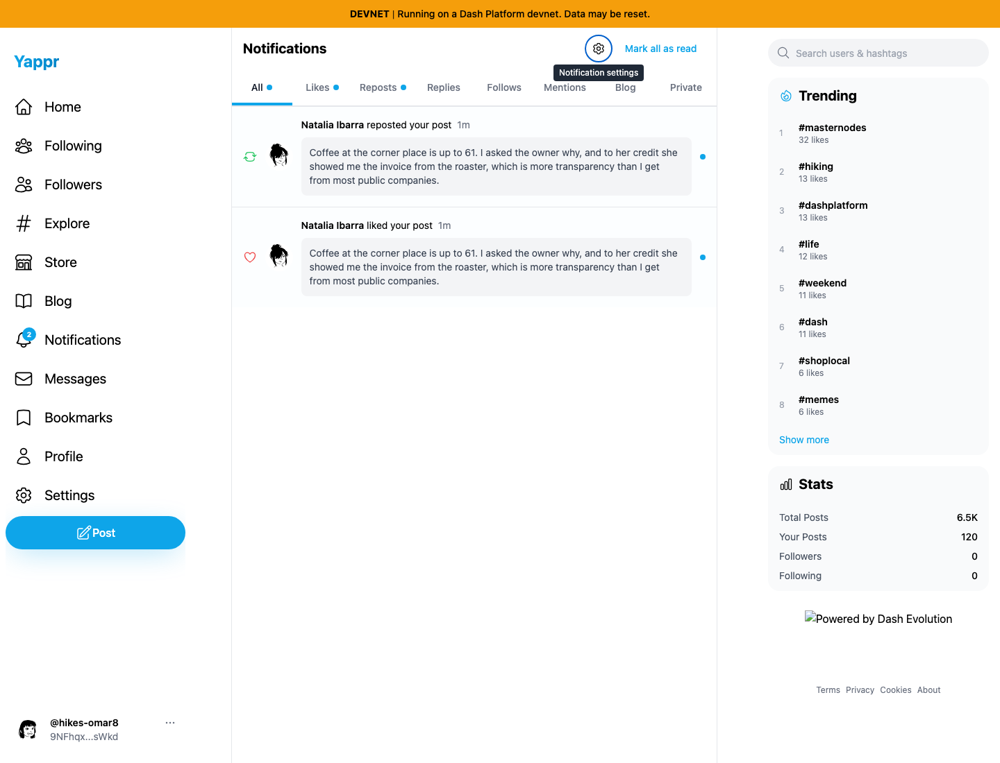 |

| After — 390px keyboard tooltip | After — 320px keyboard tooltip |
| --- | --- |
| 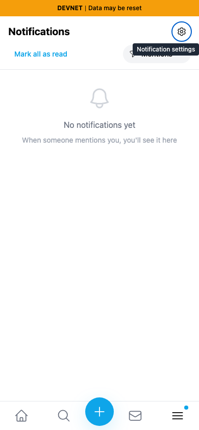 | 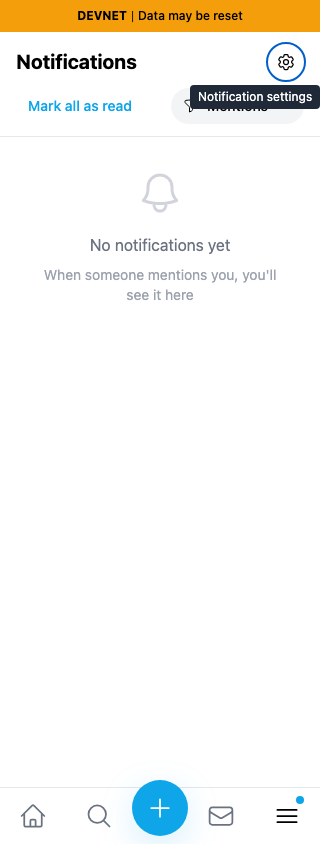 |

All fourteen final PNGs inspected at original resolution. Build, full lint, TypeScript and independent actual-diff review pass. Browser geometry: base document421px with All,449px with Mentions at both mobile widths; head matches320/390px viewport. All controls stay within bounds. One named settings link, focus tooltip, settings→read-all→filter Tab order, filter Enter/Escape focus return, settings route, and mark-all persistence after reload pass. See `assertions.json`.

Range-diff retains the one mobile-layout commit and explains only the parent tooltip/name integration. The complete Tooltip-wrapped Link moves to grid row1; no duplicate gear or handler change.
