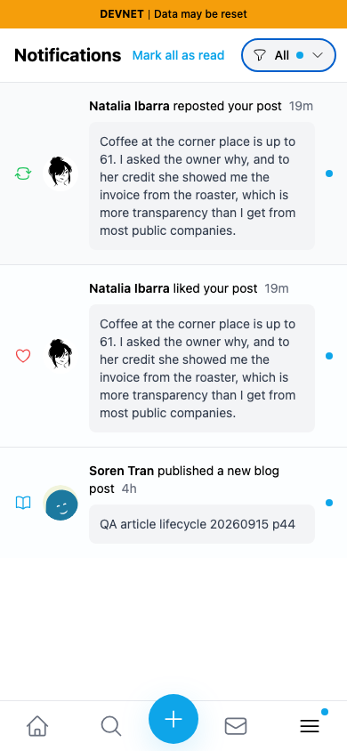
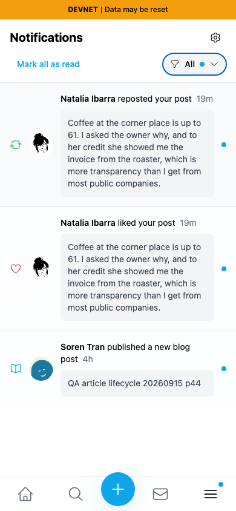
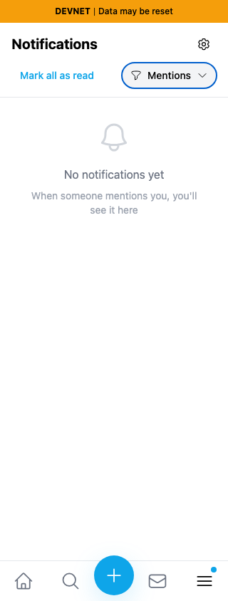
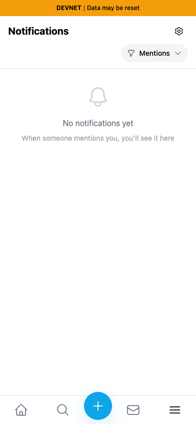

# Yappr #479 — fit notification controls on mobile

Historical exact staging base `c98a6ecd7e26ae5bc9fc8e400e6011eb8465b3a0`; full PR head `9872dfe7ea1536266e2ddfd9c187594069c95bda`. Staging has advanced since this independent change branched. Separate production exports (`npm run build:devnet`) at ports3260/3285, compiled source hash verified in Settings About. Fresh Chromium contexts, light theme, en-US, America/Chicago, normal persona39 password login. No injected notification data, intercepted responses or altered clocks.

With unread notifications, the old one-row header extends421px with All selected and449px with Mentions selected, at both320px and390px viewports. The settings cog is off-screen; at320px even the filter label is clipped. The fix keeps title/settings on the first mobile row and read-all/filter on the second. Every header control and the document fit320/390px in all measured cases. A first wrapping-only implementation left a lone cog on a third row and was discarded; all final head captures below are from9872dfe7.

| Before —390px, unread All | After —390px, unread All |
|---|---|
|  |  |

| Before —320px, unread Mentions | After —320px, unread Mentions |
|---|---|
|  |  |

The Mentions filter is empty, but the Like/Repost/blog notifications are unread in other filters, so read-all remains visible. Below, normal Mark all as read removes the action and clears unread badges; the filter keeps its stable second row after the fix:

| Before —390px, read | After —390px, read |
|---|---|
|  |  |

| Before —320px, read | After —320px, read |
|---|---|
|  |  |

Desktop keeps one-line flex sizing. The settings cog now precedes read-all so DOM, visual order and keyboard order agree at both responsive layouts: [before desktop](comparison/before/desktop.png), [after desktop](comparison/after/desktop.png).

Shared synthetic QA fixture: recipient39 `9NFhqxW8upkFMVTE5h5VmYWLdSEJ26B2iMKdhCFgsWkd`; actor38 `4epjp48EuEG7UetQ7uExDsYNsoWLeVWU9Ym26sXb64WM` normal Like/Repost on seeded post `H6upQuVsZVXHYMsXqRyp87T3aEu1bNCSb67mKmpbyLHX`; recipient follows existing QA44 blog `GZkg15HyWHb3L4QjcnE6xU2AqkPBtxSYhC76qVHSu1rz`, article `Btrwo7erz9EZhhp14i6PJGmWc8ygsCqgXcZLeLGXJ8QD`. Same actual three notifications on both captures. Ages progress naturally; final screenshots happen to both display19m/4h. No original content changed. Temporary Like/Repost/blog Follow relations are cleaned up after the shared comparisons.

All10 final screenshots inspected at original resolution, including read state and desktop order. No crop, scaling or annotation. Separate procedural assertions verify all header bounds within viewport, All/Mentions at both widths, cog→read-all→filter Tab order, filter Enter/Escape with focus restoration, Mark all as read plus reload persistence, and settings navigation. Desktop controls also fit. ESLint, full TypeScript, devnet build and independent source review passed. The separate settings-name/tooltip fix is #476; this branch compares against the pre-#476 base and does not claim the tooltip change.

## SHA-256

- `d50677f593735a3d02925bebe98c34703d3b39388c0eb919b59ddef39ddfdc79` — `EVIDENCE_MATRIX.md`
- `11627adf09e7d1612ef391b3f819f6a0bdb29ca263aaedb3edbccca11bd2a516` — `assertions.json`
- `3d55781d29d7114309844fd984f84f9c66975f336ac4ee91ecc7f7bffb59ac46` — `comparison/after/320-read.png`
- `8a515cdbd02b773feaa3ef35bc5ed9f9f23a3032da04796c7028c198c1d73f98` — `comparison/after/320-unread.png`
- `bc225aac49d20c86a27d3cb8928c78365b348fabfe973a25b2fa0ed4bff2011a` — `comparison/after/390-read.png`
- `cccdf93443db42e874b2eec4e32f2902396a2d736fe7549bdc77e8ffb64478b5` — `comparison/after/390-unread.png`
- `5e7fe2ca73a8e4e96d64db54bc3fbe38f240105b00b5fe63076480b9d215ea37` — `comparison/after/desktop.png`
- `d250f390487e050c95c6558520eb8caaf742ab7fbe0061b7a84f0a60273788d9` — `comparison/before/320-read.png`
- `3788ca8f9256030686436f47b94fb0c8aa8eaccdc05f7ce262068492b7abd40a` — `comparison/before/320-unread.png`
- `7c7913ee801ae8915a314e6373d6fbafe96fc94f99f7aea71dcf40e1ca5ff6fb` — `comparison/before/390-read.png`
- `350c0f647eb3c1d4fc2b7082baca6f640f02072e6d628263500f0401cfedda37` — `comparison/before/390-unread.png`
- `03c6c8cf11ceca503ed0f24d7fddd191840a8a22e088871ce0ac5266bb9236bf` — `comparison/before/desktop.png`
