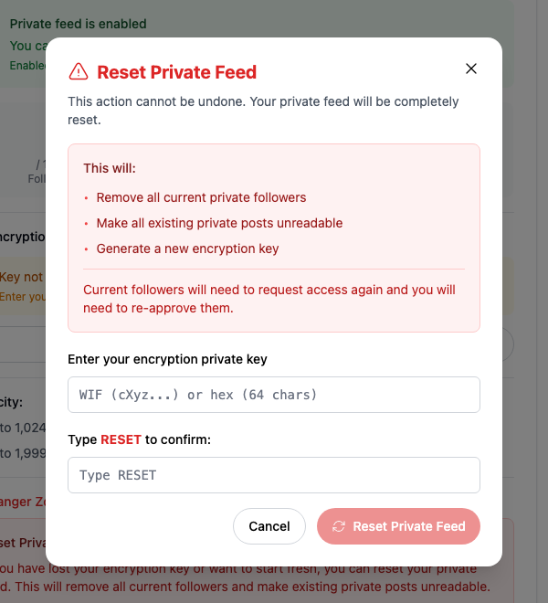
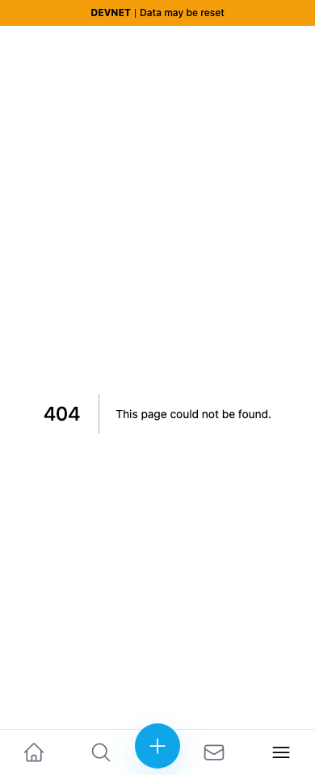
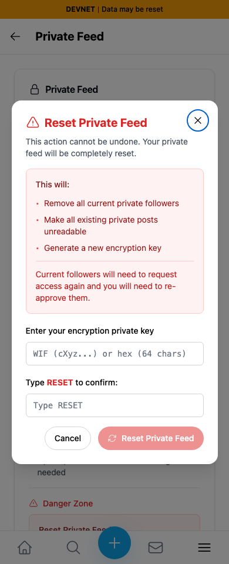

# Yappr #482 — private-feed recovery navigation

Selecting **Reset Private Feed** in **Lost Your Encryption Key?** currently leaves the configured devnet base path and shows 404. The fix uses Next navigation to retain the base path and open the existing reset confirmation.

Exact frozen staging base `733faf53cd893cba861476a4af75b442ed67ca72`; full signed PR head `462dd9be4f221954bbde9590f6ba0b2a4452cc82`. The target staging branch advanced after this one-file change branched; these images compare the exact frozen pre-change base with the complete PR head. Both independent production devnet exports were verified through their compiled Settings About commit: ports 3278/3292. Chromium light theme, en-US, America/Chicago, fresh context and normal registered authentication key 2 login for each scenario. Desktop 1440×1100; mobile 390×960.

Shared synthetic QA identity: `9NFhqxW8upkFMVTE5h5VmYWLdSEJ26B2iMKdhCFgsWkd` (`hikes-omar8`), enabled private feed with no private followers. No session encryption key entered. No injected state, response interception, altered clocks, or submitted feed resets. Sequential captures use the same real devnet identity and feed; incidental network-wide sidebar statistics may change and are not compared.

## Desktop result after activating recovery

Before — exact base:

After — full head:

The matched focus images crop x420/y220/600×660 from the full unaltered 1440×1100 screenshots, without scaling. [Before full overview](comparison/before/desktop-destination.png) · [After full overview](comparison/after/desktop-destination.png).

## Mobile result after keyboard Enter on recovery

| Before — exact base | After — full head |
|---|---|
|  |  |

## Shared trigger

The selected control is the recovery dialog's **Reset Private Feed** button, reached through **Enter Encryption Key → See recovery options**. These context screenshots show the unchanged control before activation:

[Before trigger](comparison/before/desktop-trigger.png) · [After trigger](comparison/after/desktop-trigger.png).

The viewport excludes browser chrome. Procedurally verified destination URLs in [assertions.json](assertions.json): base `/settings?section=privateFeed&action=reset` drops `/devnet`; head `/devnet/settings/?section=privateFeed` retains it and clears the action query after the dialog opens. Screenshots show404 versus the actual reset confirmation, rather than asserting an address-bar image.

After checks on both viewports: the empty reset form remains disabled; Cancel closes it; full reload retains enabled feed and does not reopen the dialog. Reset was never submitted. ESLint, full TypeScript, devnet production build and independent source review passed. All 8 final PNGs inspected at original resolution, including crops. [Evidence matrix](EVIDENCE_MATRIX.md).

## SHA-256

- `ef773afdf3367765cfc1304cf524440a35fd619334a7c56f39710f5fab5869b8` — `EVIDENCE_MATRIX.md`
- `ad43267ea1bcf29d472c1bb493c7fbfcbea81c3ac2688b4895032c57af7f0860` — `README.md`
- `50ea2ef1514ccca71eb175ed45dfec94941563fa39f88953918af8a5e7d97f34` — `assertions.json`
- `b70813b8a69e11cb24903e82e770413fd8b6c8798103fc5826173466225dea33` — `comparison/after/desktop-destination.png`
- `ac37f36e1bb10218ad7980f5a7f3f4604b4737ce5183e734078dfee62fc68747` — `comparison/after/desktop-focus.png`
- `3178d40dd1c60bf961484714292737b0a03d5c62603eaa1eb7d11bdd6f0c4154` — `comparison/after/desktop-trigger.png`
- `d0df0c9f7b50c8fff7817c2a5ee980853c877ad055398229617bf9cb3eef6ac3` — `comparison/after/mobile-destination.png`
- `9344422e5cea3e413ba1c91fd59c2f201d41d98119d90c75ecdb1078ce96ca98` — `comparison/before/desktop-destination.png`
- `969fee5f3939c01e10d5bcd1b098c106d1070b2b611694b6f8af7cfcdcdfcdc9` — `comparison/before/desktop-focus.png`
- `3178d40dd1c60bf961484714292737b0a03d5c62603eaa1eb7d11bdd6f0c4154` — `comparison/before/desktop-trigger.png`
- `1879aed85ee04eab13a765383521ca9451e42dddf88e93104f96a0f84926cdff` — `comparison/before/mobile-destination.png`
