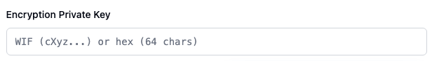
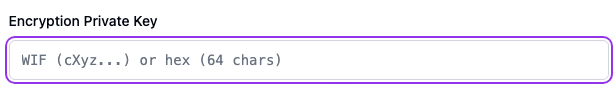
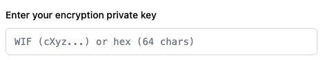
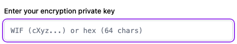
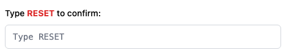
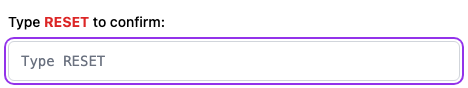

# Yappr #483 — associate private-feed form labels

Before is exact staging base `733faf53cd893cba861476a4af75b442ed67ca72`. After is the full signed PR head `34325b025251717c8b821559e83982b193cbc41d`. Both revisions were separately built with `npm run build:devnet` and served at localhost3278/3291. Each browser's About page was checked against the compiled commit hash.

Every pair follows the same action: click the visible label while its input is blank. Before, the field is not focused. After, the corresponding field gets the purple focus ring. No styles or input focus were injected into the page.

The associated accessible names are asserted separately: before, both key fields use the placeholder `WIF (cXyz...) or hex (64 chars)` and confirmation uses `Type RESET`; after, names match the three visible labels. Each input changes from zero associated labels to exactly one.

The enable form uses synthetic persona38 `4epjp48EuEG7UetQ7uExDsYNsoWLeVWU9Ym26sXb64WM`, whose feed is disabled. The reset form uses synthetic persona39 `9NFhqxW8upkFMVTE5h5VmYWLdSEJ26B2iMKdhCFgsWkd`, whose existing feed is enabled, with zero private posts/followers. Fresh browser contexts signed in through the normal UI with their authentication key2 WIFs; the encryption key stays absent from the session on both revisions. Credentials were not captured or published.

Chromium,1440×1200, device scale1, light theme, en-US, America/Chicago. Inputs remain empty, Enable and Reset stay disabled, and both flows are cancelled. No private-feed transition was submitted. Exact crops and UI assertions are recorded in [before](assertions-before.json) and [after](assertions-after.json). The separate existing reset-dialog Escape focus-restoration defect is recorded there and is outside this label fix.

## Enable private feed — Encryption Private Key

Before — exact base, after clicking the visible label:

After — full PR head, after clicking the same label:

[Full overview before](comparison/before/enable-key-overview.png) · [Full overview after](comparison/after/enable-key-overview.png).

## Reset private feed — encryption key

Before — exact base, after clicking the visible label:

After — full PR head, after clicking the same label:

[Full overview before](comparison/before/reset-key-overview.png) · [Full overview after](comparison/after/reset-key-overview.png).

## Reset private feed — confirmation

Before — exact base, after clicking the visible label:

After — full PR head, after clicking the same label:

[Full overview before](comparison/before/reset-confirm-overview.png) · [Full overview after](comparison/after/reset-confirm-overview.png).

All twelve final screenshots were inspected at original resolution. Focus views are unscaled rectangular captures of the input group with an8px margin; coordinates are in the assertions. The published reset pair was recaptured with matching fresh key-based sign-ins after an unrelated QA run changed password-vault data during an earlier, unpublished attempt.

Targeted ESLint, full TypeScript, devnet production build, normal UI checks, and independent source review passed. No changes were made to the already-labelled EncryptionKeyModal.

## SHA-256

- `03f585b76a855309bcc0a735827000505a63acd9a33ffb3c012e1bb61ef2d335` — `EVIDENCE_MATRIX.md`
- `df6f068b30b35a172541700dd43b2cf6c175476a39fa3deefb3be18539959a9c` — `assertions-after.json`
- `5ef82dff46d1da7986bd2a1d2c84cdae3506d79d9869a535d52524e209ff3650` — `assertions-before.json`
- `1ce562d09d4667497abdcfc5238a5e5e38651c444b489c216dda36d0ec1621c9` — `comparison/after/enable-key-focus.png`
- `02c5016840858fd369feec75aaeb138928fede5ea64ce3ca6e9e3b14b3e8ec29` — `comparison/after/enable-key-overview.png`
- `36f4154388c6e42c75148fc5509c2fe08bc1642665d5f314c5da307c9220074c` — `comparison/after/reset-confirm-focus.png`
- `d55f8675b137671805732c689d229d29a9426b48f2e301bf09c94cd798ba5061` — `comparison/after/reset-confirm-overview.png`
- `43d1bc64b6464908e38cba10263abc42fd9d8362c129a3354753cb3d90cc87ee` — `comparison/after/reset-key-focus.png`
- `3e1849d76396f4fb2e955bfabc88ddd8d0116e6e90065acc8fa88c4b2686db6d` — `comparison/after/reset-key-overview.png`
- `c14d49b807256e259596fdbcee35c3912fe9720f8c093d8caf0d04c8493c7c0d` — `comparison/before/enable-key-focus.png`
- `97b005c07a03cb01975e8839bbbbd88ea19507eb4bf081fd62bf0b83203735ca` — `comparison/before/enable-key-overview.png`
- `84930c240b90ef45a469156a5ee15e2dfe7efe5209e4aa6147660011c58b21bb` — `comparison/before/reset-confirm-focus.png`
- `433419538aca85c00e1e02f4878795b986765e054518d40bce27ff405df778e3` — `comparison/before/reset-confirm-overview.png`
- `14cb824d8c85e354132ed60c2f01450c16b8151b56930d6c65784d52b6f7ba6c` — `comparison/before/reset-key-focus.png`
- `433419538aca85c00e1e02f4878795b986765e054518d40bce27ff405df778e3` — `comparison/before/reset-key-overview.png`
