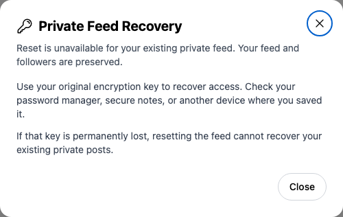

# Yappr #483 — associate the private-feed Enable label

This authoritative comparison supersedes artifact `1c1db05f4c479ad7c1dba65c8a7429fbb0ef82b7`. PR #483 is now stacked on #509. Reset-label changes are superseded by #509, which removes the unsupported reset form. Only the Enable key label remains in this PR.

Before is exact #509 base `14217bea918e4676cd8e4c0c13d059561295c4d2`. After is full signed #483 head `e65d33681a6c289fa0255bde0d8dfd0366193664`. Both separately built with `npm run build:devnet`, served localhost3299/3297. Fresh normal sign-ins and compiled About hashes checked for both revisions. Chromium1440×1200, scale1, light, en-US, America/Chicago.

The same synthetic persona38 `4epjp48EuEG7UetQ7uExDsYNsoWLeVWU9Ym26sXb64WM` clicks Encryption Private Key with a blank field. Before it has no associated label and its accessible name falls back to the placeholder; after the label names and focuses it, visibly shown by the purple ring. Enable remains disabled, Cancel returns to the disabled-feed panel. No feed transition or secret entry was performed.

Before — exact base, after label click:

After — full head, same label click:

[Full overview before](comparison/before/enable-key-overview.png) · [Full overview after](comparison/after/enable-key-overview.png).

## Recovery preserved

Same enabled persona39 `9NFhqxW8upkFMVTE5h5VmYWLdSEJ26B2iMKdhCFgsWkd`, direct settings recovery route. This is an unchanged-state compatibility check, not a claimed visual improvement. Both have no input or Reset mutation button; Close preserves feed state.

All six final PNGs inspected at original resolution. Focus crops are unscaled input group plus8px margin. Exact assertions: [before](assertions-before.json), [after](assertions-after.json). No authentication state or private keys published.

Validation: targeted ESLint, full TypeScript, reset-refusal unit regression, devnet production build, root independent review of actual base/head diff, UI label focus/accessibility and unchanged recovery checks. Rebase range-diff preserves Enable patch exactly and deliberately removes obsolete Reset label hunks. Reset component is byte-identical to #509.

## SHA-256

- `62f568ce261234908a09026b9967ecb70429a5b0480ab4db4988fb89964c0c90` — `EVIDENCE_MATRIX.md`
- `268cd2293d0cfd357534bf5da72c6b2aa643d3cabeed7a69952e67b46a5bfd3f` — `assertions-after.json`
- `6fe8761f37cae84a660fa1e2432231c11c797c7642e593c851a74f5345f5e4c9` — `assertions-before.json`
- `1ce562d09d4667497abdcfc5238a5e5e38651c444b489c216dda36d0ec1621c9` — `comparison/after/enable-key-focus.png`
- `694d818ac8c3116e986bc61d3a133e4ad3c046628ab5e3e62b2012ccb7667c7d` — `comparison/after/enable-key-overview.png`
- `5612f6837389837838656969518b1b2c8fa7031dd879f319ebaf55a5aba59f7b` — `comparison/after/recovery-retained.png`
- `c14d49b807256e259596fdbcee35c3912fe9720f8c093d8caf0d04c8493c7c0d` — `comparison/before/enable-key-focus.png`
- `0d47ecea5cdccc32a2103cd6c644b327c54c9a7f14519e09fc8b6c668b4f7105` — `comparison/before/enable-key-overview.png`
- `5612f6837389837838656969518b1b2c8fa7031dd879f319ebaf55a5aba59f7b` — `comparison/before/recovery-retained.png`
