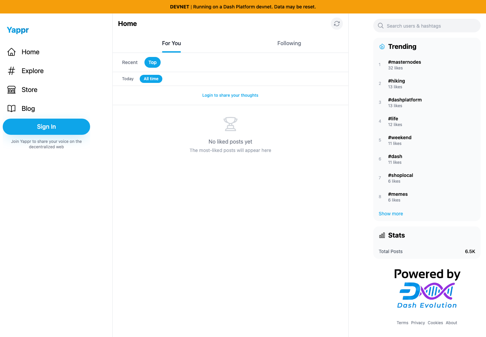
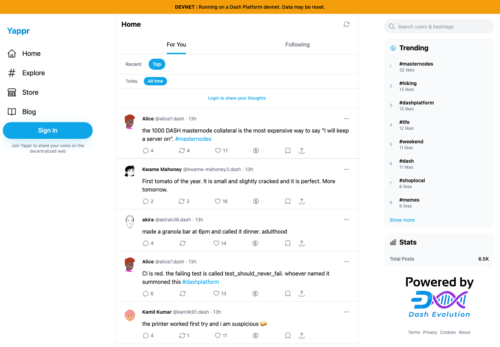

# Yappr PR #484 — Recover SDK reads after offline endpoint exhaustion

Source PR: https://github.com/PastaPastaPasta/yappr/pull/484

- Before: frozen staging base `733faf53cd893cba861476a4af75b442ed67ca72` (production BUILD_ID `733faf53`).
- After: signed full PR head `80f03385b49f4c7bac7823e233ec1df8a8e0e90c` (production BUILD_ID `80f03385`).
- Independent clean worktrees and production `build:devnet` exports, served with the same local static helper on ports 4203/4204. Both use the actual configured devnet backend.
- Separate fresh Chromium contexts; 1440×1000 viewport, scale 1, light theme, en-US, America/Chicago. Public Top / All time feed, same initial 20 post IDs.

## Visible result after connectivity returns

Both sessions started with 20 ranked posts. Each received five ordinary Refresh clicks while Playwright's browser transport was offline; both reached the SDK's real `no available addresses to use` error. Transport was then restored and the ordinary Refresh button clicked, without navigating or reloading.

| Before — exact base | After — full PR head |
|---|---|
|  |  |

Before stayed at zero posts and emitted no backend request for that online Refresh. After made seven backend requests and restored the same 20 post IDs. The screenshot demonstrates the visible empty-versus-restored state; connectivity, request counts and IDs are documented in the JSON measurements. A subsequent full reload of the baseline restored those same 20 IDs, providing a working-backend control.

## Matching healthy starting state

| Before — exact base | After — full PR head |
|---|---|
|  |  |

No application state, DOM, SDK internals, service results, or HTTP responses were injected. Only browser transport connectivity was changed. The content is the existing seeded devnet dataset. No state-transition writes were performed by this check. These are final unmodified screenshots, each inspected at original resolution.

## Compatibility and validation

- An additional normal login with existing QA identity `VQpFJTzQqdTzMQQcJmKhARpXBE5f9GjwRZ8UMCY2stW` (@hamzak78) repeated the five offline Refreshes and online Refresh. The same 20 posts returned; the Profile link still targeted the same identity and no Sign In prompt returned. No credentials are included.
- 238 unit tests, lint, full application TypeScript, E2E TypeScript, and production devnet build passed. Seven focused unit tests use mocked SDK/React hooks to cover concurrent readers, failed bootstrap/recovery, retained configuration, shared error-recovery backoff, stale provider completions, and stable readiness. Those mocks are unit-test coverage, not browser evidence.
- The same real-browser smoke regression failed on the frozen base at the recovered-list assertion and passed on the final head; neither run skipped. This claim covers that targeted regression, not the full devnet E2E suite.
- Independent code-review-validator/code-simplifier review approved the final change. Bootstrap readiness stays true after startup so reconnect does not retrigger form population; the service gates readers while its SDK is rebuilt.
- This identifies a client/session recovery problem. It does not establish a Dash Platform or GroveDB defect. The change rebuilds connectivity; it does not replay writes.

## Measurements

- [Before and reload-control measurements](before-results.json)
- [After measurements](after-results.json)
- [Authenticated compatibility measurements](authenticated-results.json)
- [Evidence matrix](matrix.json)
- [Baseline E2E failure](base-e2e.log) / [head E2E pass](head-e2e.log)
- [SHA-256 manifest](SHA256SUMS)
