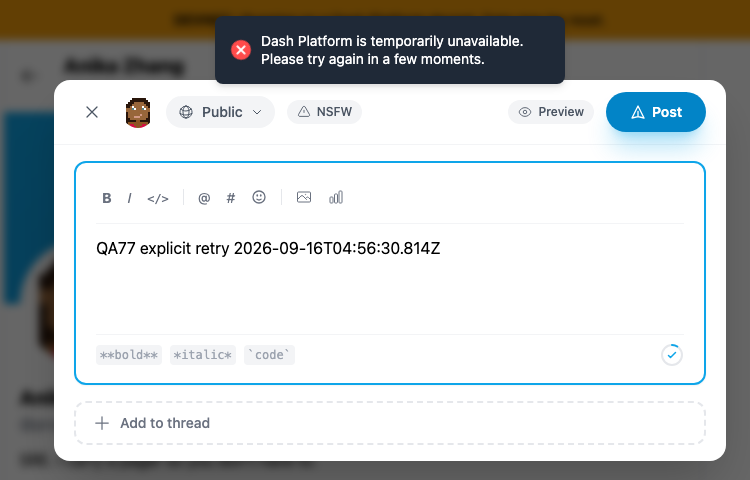
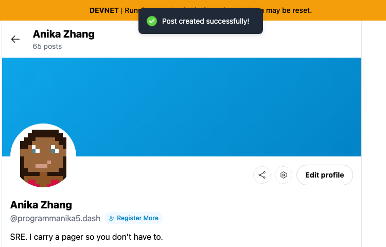

# Yappr PR #484 — recover exhausted SDK connections (QA77)

This final comparison covers both browser online recovery and the additional case where DAPI failures exhaust the SDK address pool while the browser remains online. It supersedes the earlier head-only scope. Source PR: https://github.com/PastaPastaPasta/yappr/pull/484.

Before exact target base: `cf0efbc10b8757137063113ebbd2061e8b87d8f7`. After full signed PR head: `87bdb83bbb98497d0f9354e6841ca067a763a8ec`. Both independent production devnet exports report their matching build IDs ([runtime readback](online-recovery/runtime-builds.json)). Chromium viewport 1440×1100, light theme, separate contexts and ordinary visible identity/WIF login. No auth/storage/DOM/SDK state injection or fabricated responses.

Both sessions used QA identity `1R7KNEEbzqg3574bybNCTJjvctH1jFg76vNc6PsWVet` (Anika Zhang / programmanika5) and the identical single-post draft `QA77 explicit retry 2026-09-16T04:56:30.814Z`. Playwright aborted only broadcast transport requests before delivery, without inspecting or modifying payloads. The browser stayed online. The initial action failed and retained the draft in both builds. The route was explicitly removed, then both sessions waited four seconds without any broadcast. One ordinary Post retry was then clicked in each.

| Before — exact base | After — full PR head |
|---|---|
|  |  |

These matching detail crops come from inspected full originals: [before](online-recovery/before-online-retry.png), [after](online-recovery/after-online-retry.png). No reload, navigation or online event occurred before either retry result. The baseline sent no new broadcast after restoration and again reported unavailable. The fixed build delivered exactly one broadcast after the explicit retry and showed “Post created successfully!”.

The existing post retry layer and SDK endpoint failover are unchanged: the initial failed action attempted five blocked transport requests in the baseline and nine in the fixed build. The observer itself calls no operation again; its regression tests verify one rejected broadcast remains rejected and is not repeated, even when recovery fails. Do not interpret the fault-injection attempt counts as duplicate delivered posts: every initial request was blocked before delivery.

An independent SDK read found exactly one matching post `oLAscppjFhBsks9otKJ3PaQZEFGAx14HMcRjLUMDXe3` ([public readback](online-recovery/published-readback.json)). The profile does not refresh its list after successful publication, an independent defect tracked as QA147; therefore the [persisted post screenshot](online-recovery/after-post-readback.png) was captured after reload and is explicitly separate from the no-reload retry-success pair. No claim about profile freshness is made for this patch. [UI/transport assertions](online-recovery/live-test.json) and [evidence matrix](online-recovery/matrix.md) provide the full sequence.

The owner then deleted the post through the ordinary UI. A fresh UI load showed the tombstone; an independent [cleanup readback](online-recovery/cleanup-readback.json) confirms revision 2, deleted=true and empty content. Two earlier screenshot-setup trials also left only confirmed tombstones; their public IDs are recorded in the ledger. There are no live test posts from this check.

Validation: 277 unit tests, lint, full application/E2E TypeScript, production devnet build, independent code-review-validator and code-simplifier review passed. Both final real-browser smoke tests passed ([log](online-recovery/head-e2e.log)): offline→online feed recovery and address exhaustion while remaining online. Additional unit controls cover query-only recovery, concurrent read/write failures sharing a single rebuild, stale-instance failures, validation-error no-rebuild, unchanged synchronous/stream returns, retained original rejection, and no write replay by the observer. The wrapper covers SDK facades; direct raw-WASM calls remain outside this observer. The client fix does not establish a Dash Platform or GroveDB defect.

All final images were opened at original resolution before publication. Earlier offline guest/authenticated 20-post comparisons remain available as explicitly historical evidence at [base733faf53/head80f03385](https://github.com/PastaPastaPasta/dash-ui-artifacts/blob/dcb166962601ecf68878b51ae872dd110620aa47/yappr/pr-484/README.md); they are not the final-head comparison.
