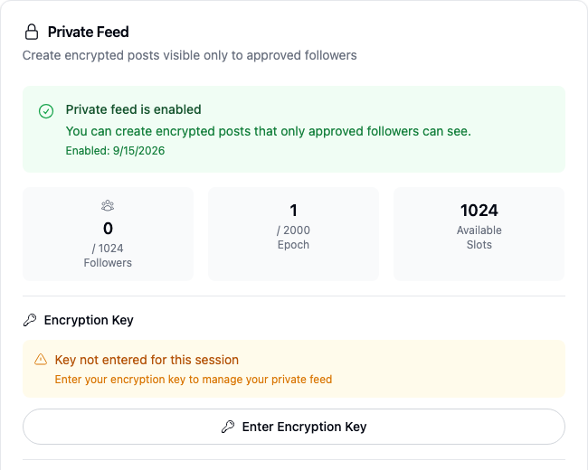
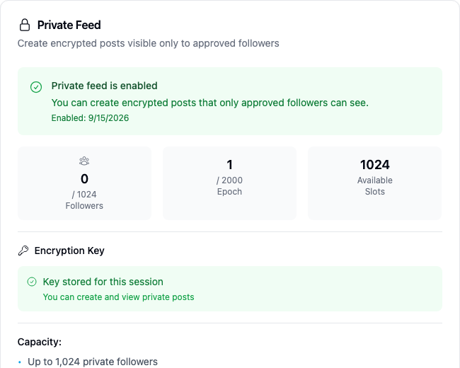
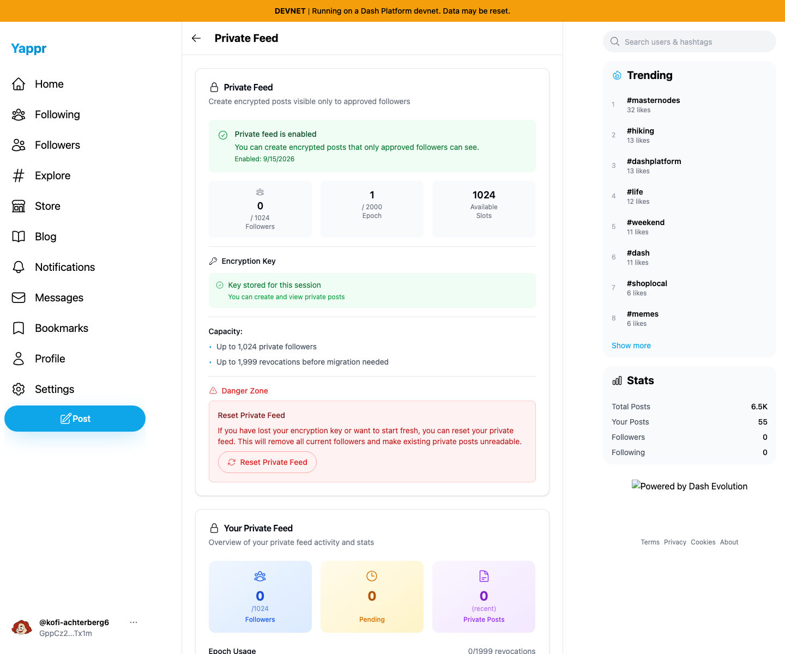

# Yappr #485 — retain the encryption key accepted by private-feed setup

Branch-base staging revision `733faf53cd893cba861476a4af75b442ed67ca72`; full signed PR head `8c102ad4cebc951c7114d0730c050309c67e54aa`. Separate `npm run build:devnet` production exports at localhost ports 3278 and 3293; both compiled About hashes verified. The staging target moved after branch creation; this comparison names the exact frozen pre-change source used, not a moving deployment.

**Distinct synthetic devnet owners are required for this first-enable comparison:** before persona39 `9NFhqxW8upkFMVTE5h5VmYWLdSEJ26B2iMKdhCFgsWkd` (`hikes-omar8`), after persona60 `GppCz2g6a6JYr7rGtwpEc4VgDX7b7wifz8uWXM1CTx1m` (`kofi-achterberg6`). Both use normal password sign-in with unlocked auth vaults, registered encryption key4, and the first successful Enable flow. Persona60's read-only preflight confirmed no feed, grants or private posts. No feed reset/delete was used to recreate a screenshot. Public owner/sidebar data naturally differs.

Shared configuration: devnet moutai, checked-in `.env.devnet`, fresh Chromium contexts, light theme, en-US, America/Chicago, 1440×1200, same private-feed settings route and scroll position. Secret fields were empty or absent at capture. No injected response/state, content replacement or clock override was used.

Before — frozen branch base, persona39 immediately after actual Enable: feed enabled, but key missing and a second key-entry prompt.

After — full PR head, persona60 immediately after actual Enable: feed enabled and key available.

The focused images are matching 650×520 pixel crops at x358/y125 from the full screenshots, without resize or annotation. [Before full desktop](comparison/before/desktop.png) · [After full desktop](comparison/after/desktop.png). Five final PNGs were opened and inspected at original resolution, including both crops.

After compatibility check — the same persona60 key is recovered through normal password login in a fresh browser context:

Actual head checks: key absent before Enable, first Enable creates the feed and stores the accepted key, no redundant key-entry button, reload retains readiness, fresh-context password login restores the key from the vault. No private post or follower was created. The enabled synthetic feed and password vault are preserved for the ongoing audit. [Head assertions](after-results.json) · [Baseline observations](before-results.json) · [Read-only preflight](persona60-preflight.json) · [Evidence matrix](matrix.md).

Targeted ESLint, full TypeScript, production devnet build and independent source review passed. Storage-denial and vault-backup failure messages were source-reviewed but were not fault-injected. An unavailable/locked vault follows the existing merge helper behavior; this PR makes no promise of cross-device recovery without an unlocked vault. The separate stale sibling-panel bug (QA82) remains visible immediately after setup and is outside this PR; the panels refresh after reload.

## SHA-256

- `8df8274477894aec1f2b9d482e1699099a9680a5b5a80e4f6c63e968cc73d544` — `after-results.json`
- `44b039168289dd3954d90a9eca7e9dfe269a9dc9130a6142f44ded0c4e9177bc` — `before-results.json`
- `86a1c26b46efbed4cb9c0893ed900d321b7f493f79f53a3884509305e3098149` — `comparison/after/desktop.png`
- `8c2c8cfcf720057dbeadb0089ff0b2c8041fb1a899e885d3d39c6ff40b59b01d` — `comparison/after/focus.png`
- `1a63fc4ac0cb700b0e1b9e8c092b14c1dc9d9eb1081b2cfe90d7df89e39a3feb` — `comparison/after/fresh-password.png`
- `0d19f98b3a6f68451486b324eccb52478d3f870d3ff752a48d7595dab2323148` — `comparison/before/desktop.png`
- `8abbf1aa6fa42700446c6a07d7f106562ecf43774e1abaef4334d9f00306ac8b` — `comparison/before/focus.png`
- `c6802fcbaf04d01c825a46359f1ebac4141446aba506cf0dfa4bb675804778e8` — `matrix.md`
- `ea636c11c3efd950b823d9cd716b3e1a4667b2c49a9c81b817f84fbab77d8048` — `persona60-preflight.json`
