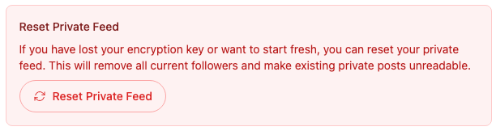
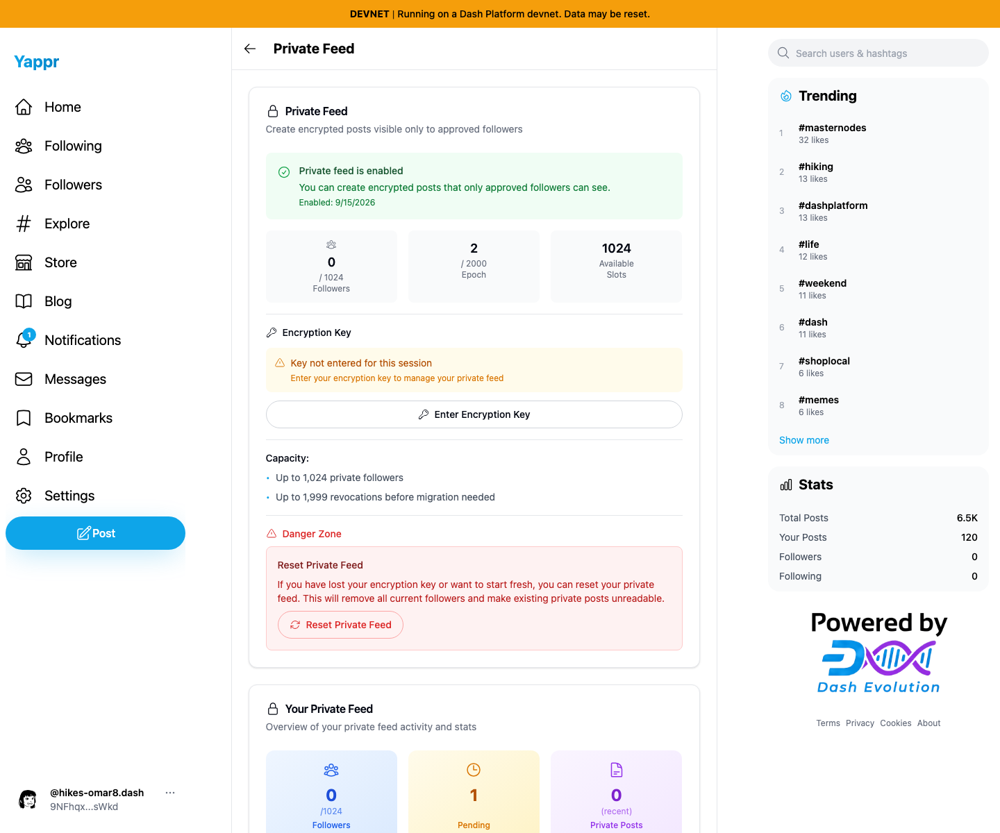
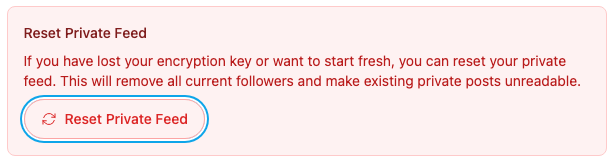
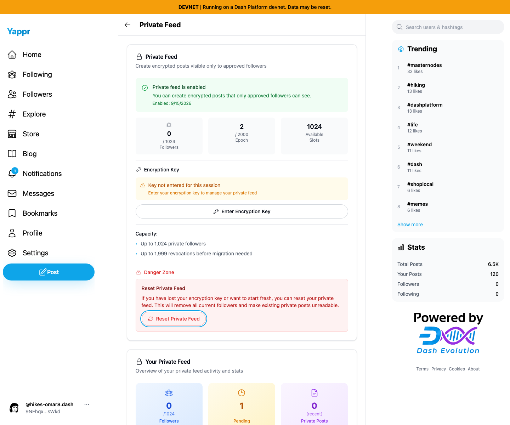

# Yappr PR486: private-feed dialog focus return

Source PR: https://github.com/PastaPastaPasta/yappr/pull/486

Before: `cf0efbc10b8757137063113ebbd2061e8b87d8f7` (frozen staging).
After: `f612ec3b8720385ee8cbbc7cbd0166b701b59d98` (full PR head).

Both are independent production devnet builds, verified through the About build hash. Fresh Chromium contexts, 1440×1200, device scale 1, en-US, America/Chicago, light theme. Shared seeded QA identity 39 `9NFhqxW8upkFMVTE5h5VmYWLdSEJ26B2iMKdhCFgsWkd` (`hikes-omar8`). Normal key2 WIF sign-in. No injected auth/storage/data. Feed enabled at epoch 2, 0 private followers, 1 residual request from another coordinated QA cycle; this same stable backdrop appears on both sides. The earlier unpublished pair used epoch 1 / pending 0 before that independent cycle. Both reset fields are empty. No encryption key entry, reset confirmation, or network writes.

Focus Reset Private Feed, press Enter, move through the dialog with Tab, then press Escape. Before, `document.activeElement` is BODY and no button focus ring remains. After, the original button has its native blue focus ring; Enter reopens it without refocusing. Screenshots are unmodified captures and matching focused crops. Both local servers use the same static export mapping, including root public assets.

## Before — exact base

## After — full PR head

## Open-dialog context

The empty form and disabled destructive action are unchanged. Both open-dialog captures are provided for context, not as a claimed UI change.

[Before open dialog](before-reset-open.png) · [After open dialog](after-reset-open.png)

## Validation

- Targeted lint, full TypeScript, production devnet build, and independent source review passed.
- Actual app: Escape, Cancel, close button, and overlay dismissal all fell to BODY before and restored the original reset trigger after.
- Actual app: nine Tab presses remained inside the reset dialog. Enter reopened it from the restored trigger.
- Actual app: Enter Encryption Key → See recovery options → Escape returned to See recovery options after the fix; I Found My Key returned to the same parent control; then parent Escape returned to the page's Enter Encryption Key button. Those three return checks fell to BODY before. Nested Tab containment passed.
- A separate disposable React DOM browser harness imported the exact committed Modal and dependencies. It confirmed simultaneous first-dialog close/second-dialog open kept focus in the new dialog, disconnected openers were skipped without exceptions, and caller open/close handlers retained precedence when they preventDefault. This is a component compatibility fixture, not another production user story.

See [before assertions](assertions-before.json), [after assertions](assertions-after.json), [component harness results](transition-harness-results.json), and [evidence matrix](EVIDENCE_MATRIX.md). Tests cover these paths; this is not a claim that every dialog or browser autofocus variant has been audited.

Six final PNGs inspected at original resolution before publication. Published files are fetched and checked by content type, size, and SHA256; the rendered PR is inspected after linking. No credentials or browser state are published. Earlier unpublished733/078 captures were superseded by this pair after preserving staging's newly merged caller-focus hooks during rebase.
