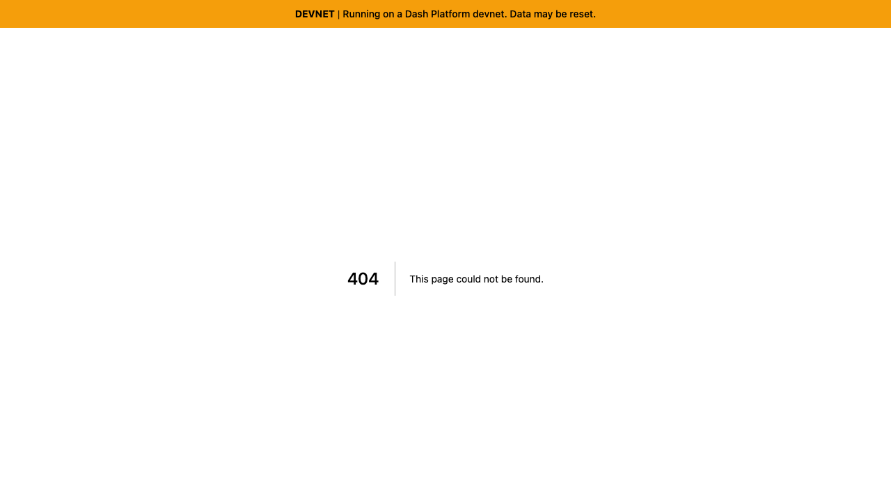
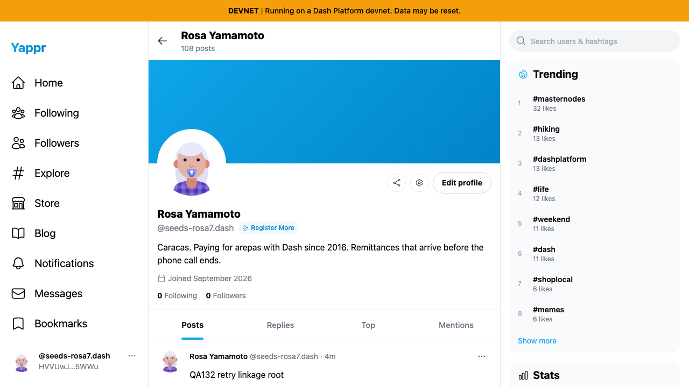
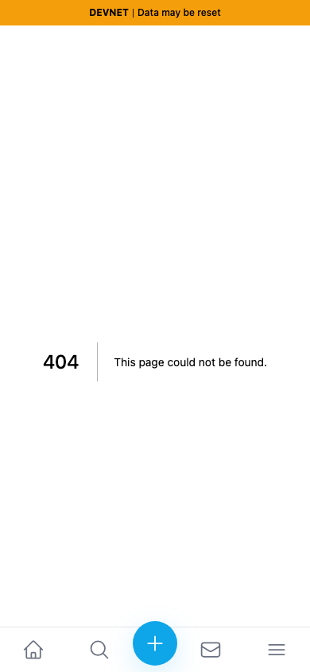
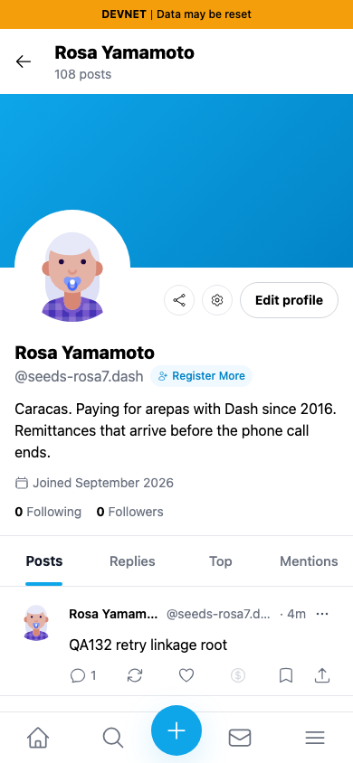

# QA91 — copied profile link, current stacked revision

This comparison supersedes the earlier #490 screenshots after restacking onto #489.

Exact base: `29f8abe2305a0b53c5f3d549c761e2072f45c0aa` (#489).
Full PR head: `85f7ed007d9a79c462179fb59059e102714bee95`.

Both independently built devnet exports use the same real persona55, Rosa Yamamoto (`HVVUwJLhEngLH5LkZx8FgUkcso28xK7tn5gaaHke5WWu`), fresh seeded sessions, light theme and matching 1280×720/390×844 viewports. Session seeding is not login evidence. Clicking Share profile reads the real clipboard and opens that unchanged URL in a fresh tab. Before omits /devnet and opens404; after opens the same profile successfully. Different local ports are recorded in JSON. Live profile posts/counts can change while other controlled tests run; they are not the asserted change. No profile mutation was submitted.

| Viewport | Before — exact parent #489 | After — full #490 head |
|---|---|---|
| Desktop |  |  |
| Mobile |  |  |

Four final originals were inspected at original resolution. The final committed devnet build, lint/types and independent actual-diff/range-diff review passed. The only range-diff change is surrounding header layout from #489; its wrapping classes remain intact.
