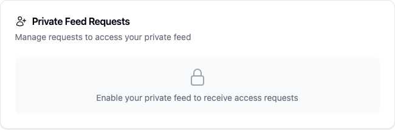
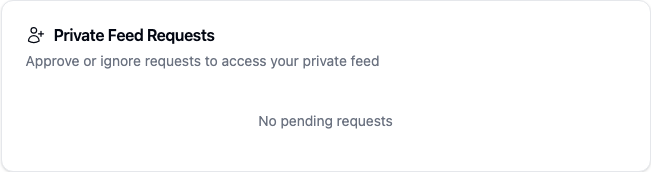

# Yappr #493 — refresh private-feed sibling panels after owner actions

Before is exact #485 head `b5b72b15421cdb8df1e4ed600f0dfa4e2e8a8a9f`; after is exact #493 head `eef277a640d2226c8ee127e1a6a78e0308c8316c`. Separate production devnet builds localhost3299/3297, Chromium1440x1200, fresh normal sign-ins. This restack supersedes prior evidence.

Before uses persona79 (`mxntRqug49iiEeka2RDRnQrf8hJZBkkQe971Am68wnJ`): key retention works, but sibling Requests/Followers still show Enable immediately after creation. After uses fresh persona80 (`FdEpAQb1kgKCWXsgQCtAf8g1KXL2zNXVkLj4we2wQagg`): first Enable leaves key available and both sibling panels immediately show enabled empty states without reload. Distinct owners are required because feed state is immutable.

Full overviews: [before](before-enable-desktop.png) · [after](after-enable-desktop.png).

Same controlled owner39/requester38 lifecycle: before revocation follower list emptied while dashboard remained stale; after dashboard/followers immediately agree at zero and epoch advances, and Requests observes refresh. Sequential revocations have before1→2 and after2→3 epochs. Full captures: before/after dashboard, follower list, main. S06 all ordinary notification preferences off still showed private request before/after reload; original preferences restored. Final cleanup removed temporary Follow/request; fresh owner zero requests/followers, no private posts.

All 11 PNGs inspected at original resolution; assertions/IDs/limitations in JSON and matrix. No reset. Validation: ESLint, full TypeScript, reset unit, 3 #485 browser regressions, devnet builds, independent diff review, range-diff.
