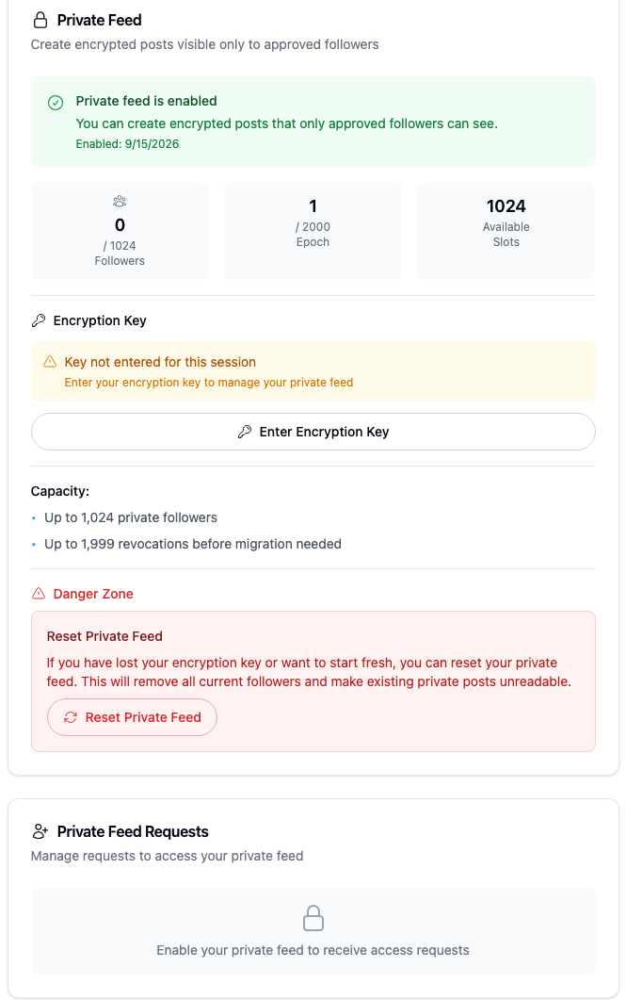
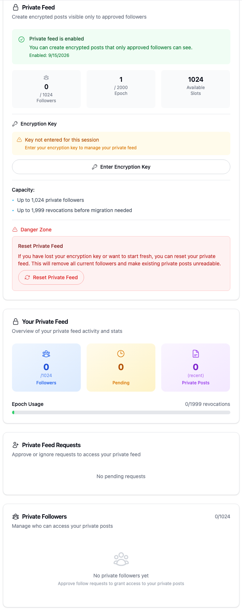
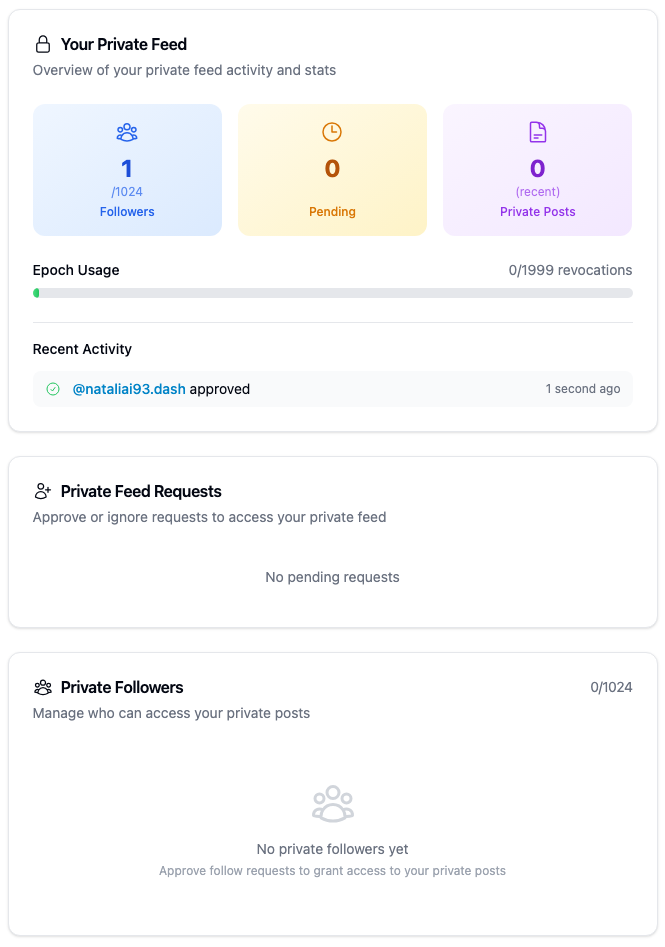
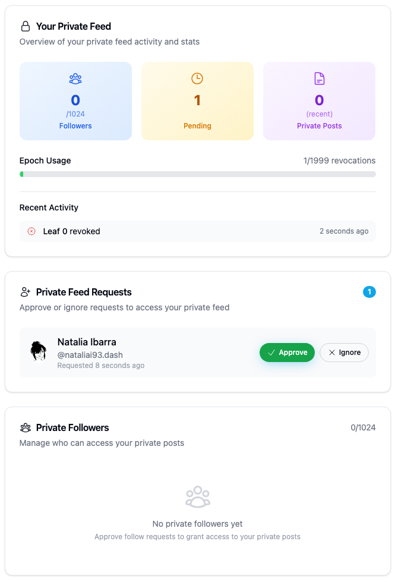

# Yappr #493 — refresh private-feed panels after owner actions

Enabling a private feed leaves sibling panels disabled. Revoking a follower updates the list but leaves the settings/dashboard count and epoch stale. Successful owner actions now broadcast the existing shared refresh, and the Requests panel subscribes to that refresh.

Exact frozen staging base `733faf53cd893cba861476a4af75b442ed67ca72`; full signed PR head `471094556c8d5d9457676f205dfe4df2a0742117`. Separate production devnet builds at ports 3278/3297; compiled Settings About hashes verified by each capture run. The target staging branch has advanced since this independent change branched. Both runs use Chromium 1440×1200, scale 1, light theme, en-US and America/Chicago. No injected state, mocked responses or direct-service writes.

The owners deliberately differ because a first Enable cannot be replayed on the same identity:

- Before owner 39: `9NFhqxW8upkFMVTE5h5VmYWLdSEJ26B2iMKdhCFgsWkd` (`hikes-omar8`), normal password-vault login.
- After owner 61: `8yBzzwur8s7BirZDX1yq3NCkv3HM3cgjsL3PZVjeVdSd` (`codes-esperanza7`), normal authentication key 2 login.
- Same actor 38: `4epjp48EuEG7UetQ7uExDsYNsoWLeVWU9Ym26sXb64WM` (`nataliai93`), normal authentication key 2 login.

These are funded synthetic QA identities. Each owner starts with no private feed, enables it, and begins the later approval/revocation cycle with an empty feed at epoch 1. The actor follows, requests access and is approved, then the owner revokes before actor grant recovery. No private posts were created. Names, timestamps and activity ages are not compared across owners.

**First Enable — before (owner 39):** settings reports enabled, but Requests still tells the owner to enable the feed. The crop ends after this Requests card; the separate Followers disabled state is recorded in assertions, not visible here.

**First Enable — after (owner 61):** dashboard, Requests and Followers load the enabled state without reloading the page.

**Revoke — before (owner 39):** the follower list is empty and shows 0/1024, but the dashboard still shows 1 follower and 0/1999 revocations. The contradiction persists after five seconds.

**Revoke — after (owner 61):** the dashboard and follower list both show0, and epoch usage shows 1/1999 revocations, without reload. The later reload agrees with these counts and epoch 2 in settings.

The visible pending request after revocation is the existing requester-owned request reappearing once its grant is removed (separate QA94). Refresh now loads that existing state immediately. It is not evidence that the revocation failed or a newly created request. The baseline script's final zero-pending expectation failed for this reason; [before-revoke-assertions.json](before-revoke-assertions.json) is intentionally preserved as a partial run, not described as all passing. [Before fresh-session verification](before-final-verification.json) confirms zero followers, epoch 2 and the residual request. [After enable/revoke assertions](after-enable-revoke-assertions.json) confirm the successful comparison and reload control.

Reset compatibility is **blocked by separate QA109**. A subsequent reset attempt failed with `privateFeedState is not mutable and can not be replaced`, after the reset implementation had already deleted revocation history. Reset did not succeed. This PR's reset-success refresh callback was source-reviewed only; the screenshots above precede that later attempt. [Failure observation](reset-observation-assertions.json). The later [cleanup record](final-cleanup.json) reports no grants/requests, removed ordinary follow and epoch 1 after that partial failure; its success flag refers to cleanup, not a successful reset. Owner 39's QA94 fixture was retained. No further fixture writes were performed for publication.

Separate QA81 remains visible as “Key not entered for this session” after Enable; the normal key-entry UI was used before the after approval/revocation cycle. This PR makes no key-retention or reset-success claim.

All four final PNGs were inspected at original resolution and their pixels exactly match unscaled crops of the capture originals:

| Published crop | Original | Original size | Crop bounds (left, top, right, bottom) |
|---|---|---|---|
| Before Enable | enable-after.png |1440×1200|(350,139,1015,1200)|
| After Enable | after-enable-main.png |701×1788|(18,100,683,1774)|
| Before Revoke | before-revoke-overview.png |1440×1885|(350,925,1015,1872)|
| After Revoke | after-revoke-main.png |701×1877|(18,885,683,1864)|

The original viewport sizes match; element/full-page captures extend beyond the viewport. No resizing, stitching or annotation was applied. The revoke crops avoid the fixed header overlay present in their full-page originals. [Final evidence matrix](EVIDENCE_MATRIX.md).

Validation: targeted ESLint, full TypeScript, production devnet build and independent source review passed. Actual Enable → Request → Approve → Revoke, immediate/reload consistency and ordinary-follow cleanup passed on the head. The baseline zero-pending expectation and subsequent reset did not pass, as described above.

## SHA-256

- `ab2ac9d3c2d89990e5bda6fcc82288412f109bc44155d6c14f81b068ee29a69b` — `EVIDENCE_MATRIX.md`
- `954084da43e24fd3e831e60a79a8f9eb911373d7e6186812ae4daed99be83a6a` — `after-enable-revoke-assertions.json`
- `9f2953b92f36c64150e8e764beb44bc8acf5a41277d82514a8a945e0f3136a93` — `before-enable-assertions.json`
- `71332ecf983fff9714a4e415363fcc830eca4cad260336360108c8c427fa6108` — `before-final-verification.json`
- `99e40fc453e8d668560b8e7b3eaf05c2d7fa92b5c1b3ba4a92298316a02d6cf4` — `before-revoke-assertions.json`
- `6e48e0a51b8a2b97ffbe677e37405e601cacdac9ec8e386c4836276a154090a4` — `comparison/after/enable-panels.png`
- `376b912da1948b017d48b986b44f2fa5d96665c0b81d183eb870f44a36502844` — `comparison/after/revoke-panels.png`
- `843d611527c2dab003288dc646c3f54d224a7c44d553cb89500086dc8b7b7aa4` — `comparison/before/enable-panels.png`
- `3e8a2f5f0a1fb7a19500a408e30bf0e601ec837fdc7d98097237119caaed50c8` — `comparison/before/revoke-panels.png`
- `e407e2a3c257525316e26fe65a31cdba76cd4fc36fbc810d2f2e386a8a66fba3` — `final-cleanup.json`
- `ce2e9f7086a50a54d398821968a6c11410e58751d6b217be30e792dc05d56a8e` — `reset-observation-assertions.json`
