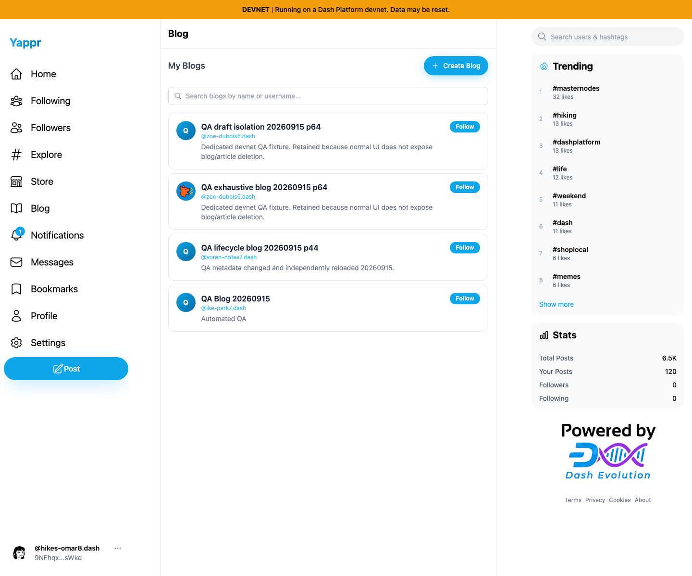

# Yappr PR494: Create Blog focus return

Source PR: https://github.com/PastaPastaPasta/yappr/pull/494

Before: `cf0efbc10b8757137063113ebbd2061e8b87d8f7` (exact frozen staging).
After: `b859758af3926c76fba47a5dd149ff30ce8b7a5c` (full signed PR head).

Both are independent production devnet builds, verified through About. Both local servers use the same static export mapping. Fresh Chromium contexts, 1440×1200, device scale 1, en-US, America/Chicago, light theme. Shared seeded QA identity 39 `9NFhqxW8upkFMVTE5h5VmYWLdSEJ26B2iMKdhCFgsWkd` (`hikes-omar8`), signed in normally with key 2 WIF. No injected auth, storage, DOM, or network state. No form values entered and no blog created. Other QA blog fixtures appear in discovery on both overview screenshots; they were not modified by this test.

Focus Create Blog, press Enter, move through the blank dialog with Tab, then press Escape. Before, `document.activeElement` is BODY and no button focus ring remains. After, the original Create Blog button regains its native ring; Enter reopens it without refocusing. Screenshots are unmodified full captures and matching header crops.

## Before — exact base

## After — full PR head

## Open-dialog context

[Before blank dialog](before-open.png) · [After blank dialog](after-open.png)

The blank form, accessible description, and disabled creation action are unchanged. These open-dialog screenshots provide context, not a claimed visual change.

## Validation

- Component lint and explicit E2E-file lint passed; application and E2E TypeScript passed; production devnet build passed; independent source review approved.
- Actual app: Escape, Cancel, close X, and overlay dismissal each fell to BODY before and restored Create Blog after.
- Actual app: 12 Tab presses stayed in the dialog; keyboard reopening from the restored trigger passed; description remained accessible; Create Blog remained disabled with blank form values.
- Actual app: Escape at 390×844 and 320×740 fell to BODY before and restored the trigger after. Mobile layout overflow is independently tracked as QA87 and is not changed by this fix.
- The existing repository browser regression now asserts keyboard opening, Cancel focus return, reopening, and Escape focus return. Its types and lint were checked locally; the above full-app UI assertions used fresh normal sign-in with the shared QA fixture.

See [before assertions](assertions-before.json), [after assertions](assertions-after.json), and [evidence matrix](EVIDENCE_MATRIX.md). Six final PNGs were inspected at original resolution. Public files are fetched and matched against local content type, size, and SHA256; the rendered PR is inspected after linking. No credentials or browser state are published.
