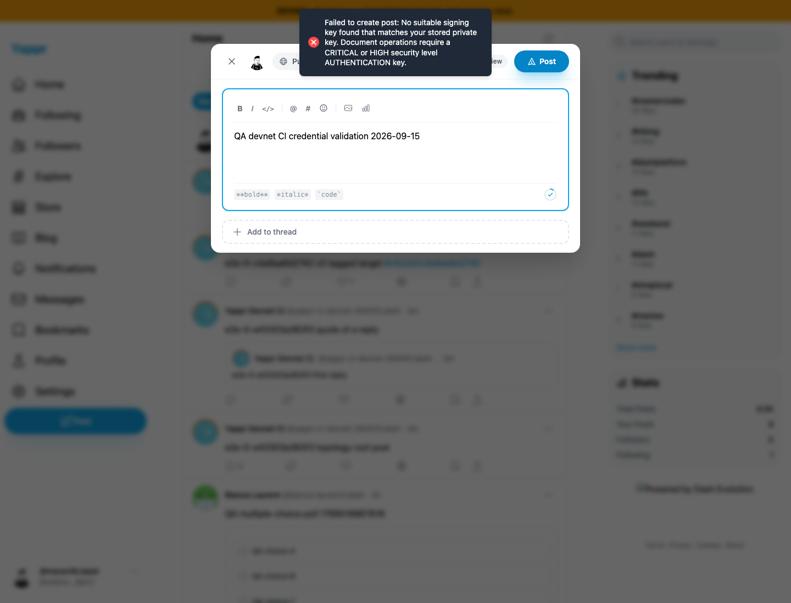
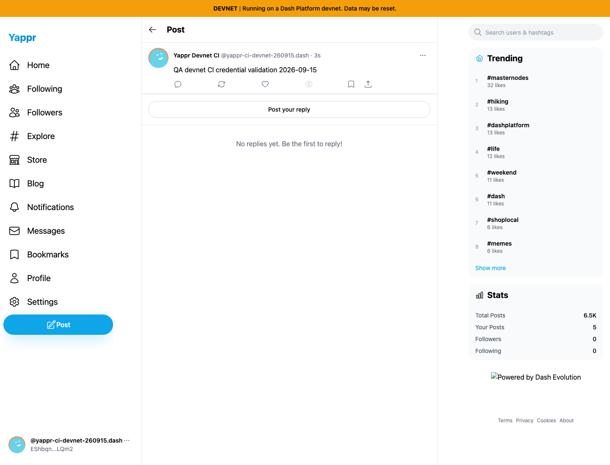

# Yappr PR #497 — QA98 devnet CI credential repair

Before: `cf0efbc10b8757137063113ebbd2061e8b87d8f7`. After: `bcd859dcac2e5d089d61857d8585548614b21cd5`.

Both screenshots run independent production builds on the real moutai devnet, with the same contracts, light theme, 1440×1100 viewport, en-US locale, America/Chicago timezone, and exact post text. Source revisions were verified in Settings → About before each capture. No network or DOM responses were mocked. Authentication restores browser storage programmatically; this does not claim interactive login coverage.

The identity and key deliberately change because that is the CI configuration being repaired: before uses original CI identity `9mE6YoGGuAfK3bC4jj3tq3jMzkELKsHnkF2ZWEmCBkP3` with the actual prior CI-injected credential, recovered privately from an old failure artifact. After uses the new dedicated `yappr-ci-devnet-260915.dash` identity `EShbqnfLdmctGWaUCnU3FNKMenYmxiQEiawY3q2pLQm2`; all five derived keys match its enabled chain keys. No key, seed, or trace is published here.

| Before — exact base | After — full PR head |
| --- | --- |
|  |  |

Successful post ID: `JAtagssAfxqfyyKCrobSoQTdTM2t9Ymr4MZdMAieQ2fZ`. It was tombstoned through the normal UI after capture; the cleanup receipt is included. Other surrounding feed/profile data naturally differs between identities and capture times. Screenshots establish the signing repair, not a cosmetic UI change.

Both original PNGs were opened and inspected at original resolution. The before image visibly shows the actual no-matching-key error; the after image visibly shows the persisted post. Public URL byte/type checks are recorded separately in the PR.

The committed devnet build and 265 unit tests pass. The original unmodified local topology run advances past all prior signing failures: 14 passed, 1 failed, 8 expected v4 skips, 5 not run. The failure is a separate pre-hydration Creators-tab test race tracked as QA108; this evidence does not claim a fully passing topology suite. CI's existing continue-on-error policy remains explicit in the documentation.

## Completed combined validation

The exact local integration `a6ced6ec7239de2e22de41d79daeb256b42b233d` combines the three separate PR heads listed in `combined-validation.json`. It passes all20 applicable topology tests (8 v4-only tests correctly skipped on v6), with retries and traces disabled, in1.7minutes. `topology-results.txt` lists each result. This covers real writes and proved readbacks; it does not claim all application user stories or standalone CI jobs pass. The temporary fixture credit shortfall was verified and replenished before this serial run. No signing credential changed.
