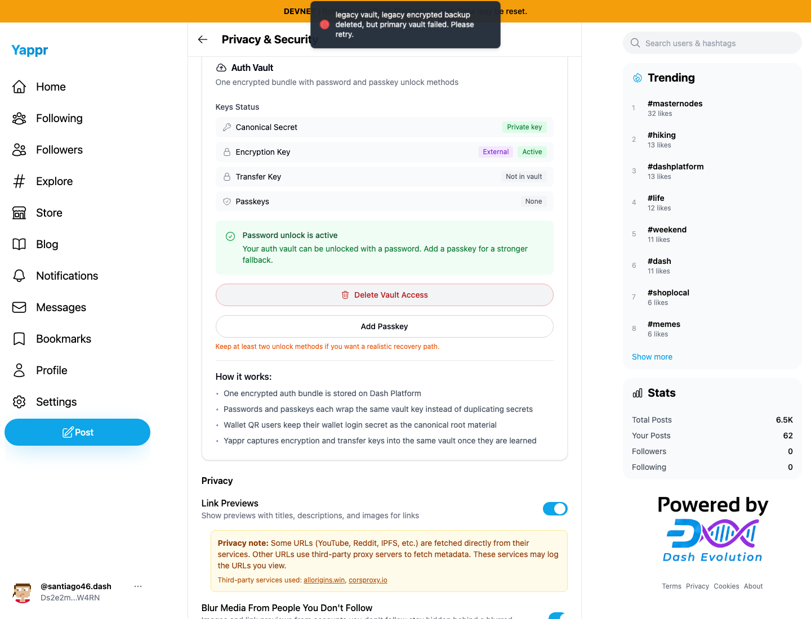
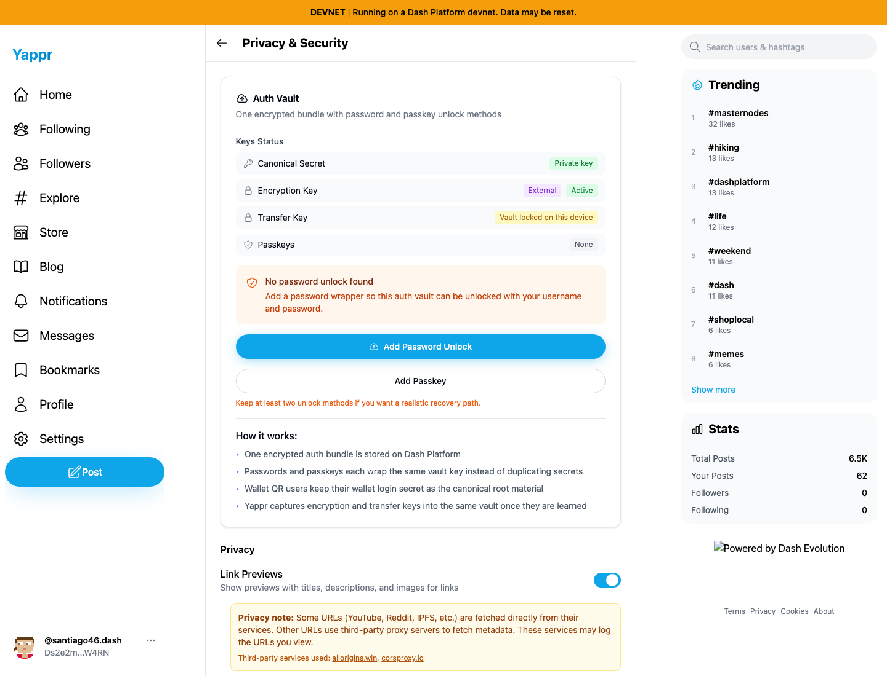
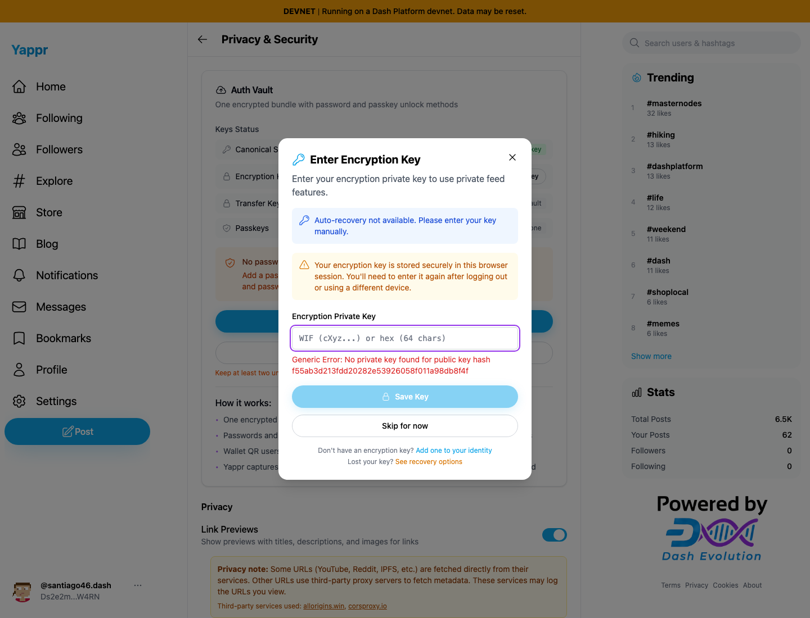
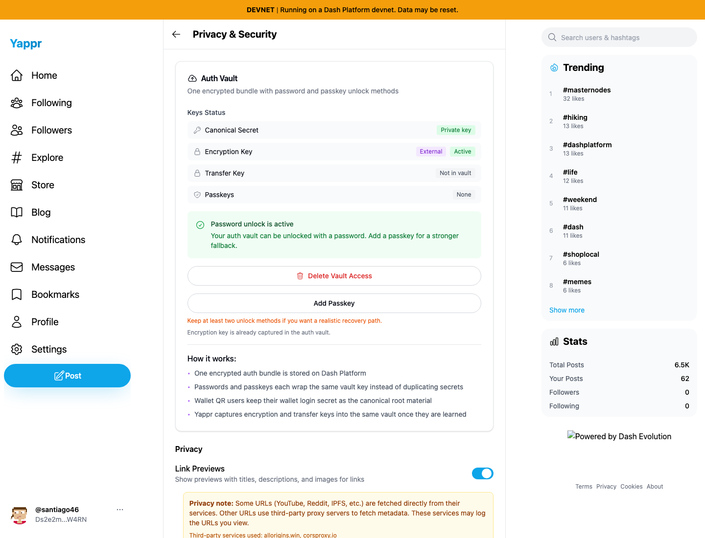

# Yappr PR #501 — uncompressed WIF signing (QA104)

Before: `cf0efbc10b8757137063113ebbd2061e8b87d8f7` (exact PR base). After: `3b2ee9f2d63dad7adeb09756542c6eb9d943c19b` (full signed PR head).

Both are independent local production exports with the same devnet configuration, Chromium at 1440×1100, light theme, and the same reserved test identity `Ds2e2mw5AXAgPDipvHed4wsYWgQdBPhMThQEXdmkW4RN` (`santiago46`). Ordinary UI interactions only; no injected auth, storage, DOM, or network responses. The same key2 scalar is encoded as a valid uncompressed testnet WIF for sign-in.

The same vault `3DzM5UGqMc88ZNcWN7GUrQpFud2Js3AkW8179H3bECq3` and password access `5UZuQ8anrkgEZnijv7n8XW8bH6z8JVeEG8tAsZzA8WwB` are used throughout, until the final successful deletion. These are disposable audit-owned devnet records.

## Delete Vault Access

Both sessions use the same uncompressed WIF and accept the native confirmation. Before, the primary vault fails to delete and password access remains active. After, the UI shows no password unlock; independent SDK reads confirm both document sets are empty. The native confirmation itself is not rendered by headless screenshots.

| Before — exact base | After — full PR head |
|---|---|
|  |  |

[Before documents](before-delete-state.json) · [After failed base deletion](after-failed-delete.json) · [After successful head deletion](after-delete-state.json)

## Save matching encryption key into the unlocked vault

Before: after creating the password wrapper, entering the identity's matching encryption key fails with `No private key found for public key hash`. The field was cleared via normal typing immediately after submission, before the asynchronous error rendered, so no populated credential field was captured. The background password status is stale from enrollment; the independent read confirms both records existed.

After: password login restores the original uncompressed authentication WIF from that same vault, and entering the matching encryption key succeeds. A separate fresh browser context then signs in with the password and restores the encryption key without re-entering it; the screenshot shows `Encryption key is already captured in the auth vault.` This distinguishes actual persisted replacement from session-only key storage.

| Before — exact base | After — full PR head, fresh password login |
|---|---|
|  |  |

[Read after merge](after-merge-state.json). Readbacks query public document IDs and key roles only; they do not publish ciphertext or secrets. Deletion does not invalidate previously unlocked sessions or exported backups.

## Validation and limits

- 270 unit tests passed, including both WIF encodings on both supported networks and rejection of unrelated keys and wrong networks.
- Lint, app TypeScript, E2E TypeScript, and production devnet build passed. Independent code review approved.
- After deletion, a fresh login lookup offers only a private key, disables submission of the former password, and reports no enrolled passkey. A fresh key login succeeds (normal backup prompt skipped).
- This is a Yappr signer-integration fix; it is not evidence of a general Platform/GroveDB deletion fault.
- Background sidebar/stat timing, username suffix resolution, scroll position, and the unrelated remote Powered by Dash image can vary between sessions. Captions claim only vault behavior. Mainnet is unit-tested, not funded or mutated.
- All published screenshots were inspected at original resolution. No credential values or private fixture files are published.
