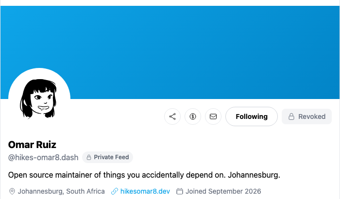
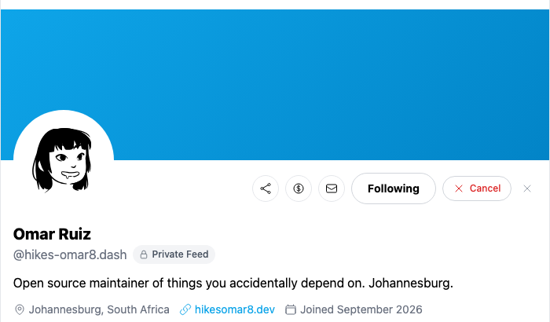
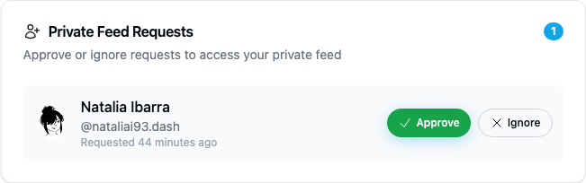

# Yappr PR502: preserve cancellation for an ungranted private-feed request

Source PR: https://github.com/PastaPastaPasta/yappr/pull/502

Before: `cf0efbc10b8757137063113ebbd2061e8b87d8f7` (exact staging base).
After: `75863edf38d589f347b080f5496405c9d3133564` (full signed PR head).

Independent production devnet builds, verified through each build's About page. Matching static-export mapping; fresh Chromium contexts, light theme, en-US, America/Chicago, device scale 1, desktop 1440×1200 and mobile 390×844. The screenshots are original captures and matching profile-header crops. Relative ages of existing posts and requests can advance with elapsed real time.

## Shared synthetic fixture

Requester: Natalia Ibarra, `nataliai93`, identity `4epjp48EuEG7UetQ7uExDsYNsoWLeVWU9Ym26sXb64WM` (QA persona 38).
Owner: Omar Ruiz, `hikes-omar8`, identity `9NFhqxW8upkFMVTE5h5VmYWLdSEJ26B2iMKdhCFgsWkd` (QA persona 39).

Both comparison revisions read the same retained requester-owned request from an earlier ordinary approve/revoke QA cycle. The owner starts at epoch 2 with zero private followers and one queued request; the requester has no grant. A temporary ordinary follow was restored through the normal UI. Sign-ins used the normal key 2 authentication flow. No injected authentication, browser storage, DOM state, or network responses were used. No private-content access, approval, new grant, or feed reset was attempted during this verification.

The original request was preserved until all eleven comparison screenshots had been inspected. It was then cancelled through the PR's normal UI. A second normal request/cancel cycle and final readbacks verified persistence and cleanup. The request and temporary ordinary follow were removed; the owner remained at zero requests, zero private followers, and epoch 2.

## Before — exact base

The feed-wide rekey timestamp makes the retained request appear Revoked, with no cancellation action even though the owner's approval queue still contains it.

[Full before overview](before-desktop-overview.png)

## After — full PR head

The same ungranted request is Pending. Opening Pending with Enter exposes an enabled Cancel action.

[Full Pending overview](after-desktop-overview.png) · [Full Cancel overview](after-cancel-desktop-overview.png)

## Cancellation lifecycle — both states on the PR head

These are successive states on `75863edf38d589f347b080f5496405c9d3133564`, not another source-revision comparison.

Before cancellation, the owner has Natalia's queued request:

After requester cancellation and owner reload, the queue is empty:

The requester can request access again:

## Mobile limitation

The existing profile action row overflows a 390px viewport on both revisions: document width is 488px for Revoked, 499px for Pending, and 506px with Cancel open. The unscrolled captures preserve the offscreen-control problem. Additional status captures use normal horizontal page scrolling (98px before, 109px after), which naturally clips the left side of the profile. These are status evidence, not a claim that this PR fixes mobile layout. Desktop is the primary comparison.

[Before, unscrolled](before-mobile.png) · [After, unscrolled](after-mobile.png) · [Before, scrolled to status](before-mobile-status.png) · [After, scrolled to status](after-mobile-status.png) · [After, Cancel open](after-cancel-mobile.png)

This layout defect is separately tracked as QA78 / [PR489](https://github.com/PastaPastaPasta/yappr/pull/489). Its exact head `29f8abe2305a0b53c5f3d549c761e2072f45c0aa` was separately verified with a fresh normal Pending request and exposed Cancel at 390px and 320px; both controls fit without horizontal overflow. That supplemental test's temporary request and follow were also removed.

## Validation

- Targeted lint, all three focused service unit tests, full application TypeScript, and the production devnet build passed. Independent source review approved.
- Unit tests cover a retained request predating a feed-wide rekey, no-request state after cancellation, and unchanged actual-grant/key recovery states.
- Actual UI: baseline Revoked has no Cancel; PR Pending opens enabled Cancel through Enter; status survives reload; no approved badge appears without a grant.
- Actual UI: original cancellation removes the request from both identities' refreshed views. A fresh request persists as Pending after reload, appears in the owner's queue, and can also be cancelled. Final ordinary-follow removal and owner readbacks verify fixture cleanup.
- Fourteen final PNGs were inspected at original resolution. Published files are independently fetched and compared against local status, content type, size, and SHA256; the rendered PR comparison is inspected after linking.

[Before assertions](assertions-before.json) · [After assertions](assertions-after.json) · [Lifecycle results](lifecycle-results.json) · [Fixture ledger](fixture-ledger.json) · [Evidence matrix](EVIDENCE_MATRIX.md) · [SHA256 manifest](SHA256.json)

The fixture ledger records final lifecycle flags, so `originalRequestPreserved`, `temporaryFollowCreated`, and `newRequestCreated` are false after successful cleanup. No credentials or browser authentication state are published.
