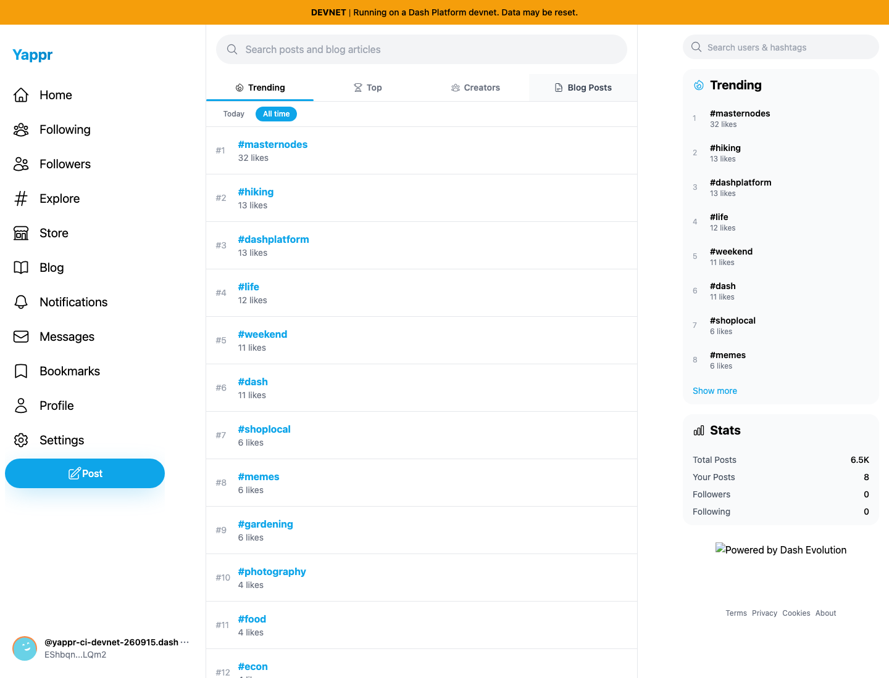
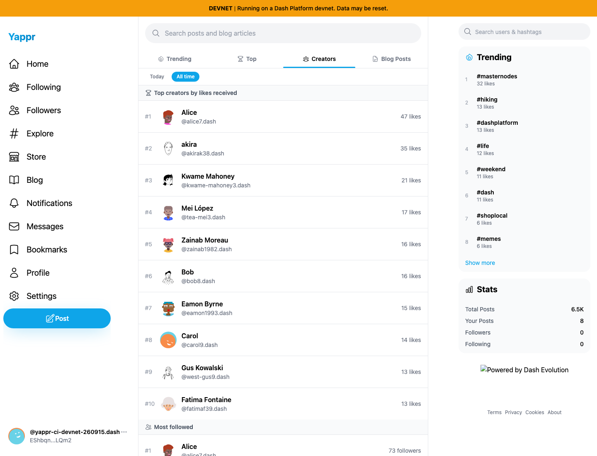

# Yappr PR #503 — QA108 Explore test readiness

Exact base `cf0efbc10b8757137063113ebbd2061e8b87d8f7`; exact head `a634847c16a7f664124ec2485eff0c912e8a3c77`. Each independently built application was verified through its Settings → About source stamp before capture.

The product's code and appearance do not change. The test changes when it clicks: before, immediately after DOMContentLoaded and tab visibility; after, when the initial trending loader has disappeared following the client effect. The screenshots show the resulting test interaction, not a cosmetic product fix. The actual isolated test fails before and passes after (see test-results.md).

Both use the same programmatically authenticated fixture `yappr-ci-devnet-260915.dash` (`EShbqnfLdmctGWaUCnU3FNKMenYmxiQEiawY3q2pLQm2`), real moutai devnet contracts, light theme, 1440×1100 viewport, en-US locale, and America/Chicago timezone. No DOM or network responses are mocked. The fixture is explicitly supplied to both test revisions to avoid the separate old CI credential mismatch.

| Before — early click ignored | After — click after client readiness |
| --- | --- |
|  |  |

Both original PNGs were inspected at original resolution. The recorded results include exact revision, selected-tab class and leaderboard visibility. No new chain writes were needed for this comparison. Full-resolution files are available directly in this directory.
