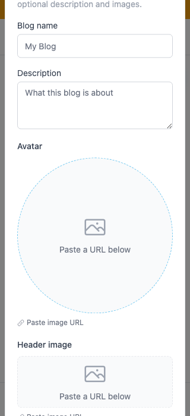
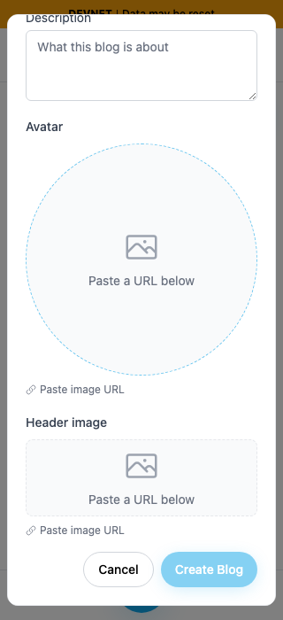
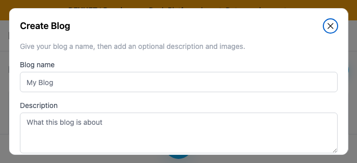
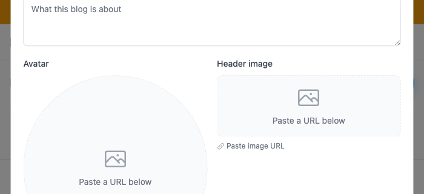
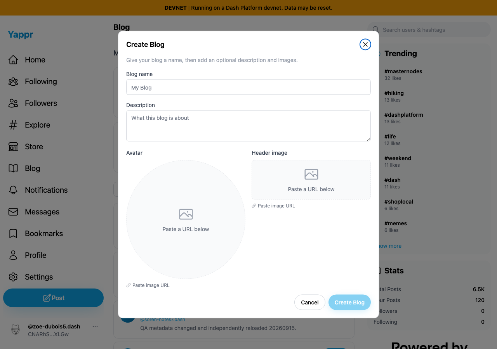

# PR506: reachable Create Blog controls after stacking on #494

[Product PR506](https://github.com/PastaPastaPasta/yappr/pull/506) depends on [PR494](https://github.com/PastaPastaPasta/yappr/pull/494). These images supersede the previous cf0/e186 comparison.

Before: exact dependency head `b859758af3926c76fba47a5dd149ff30ce8b7a5c`. After: complete signed head `40dfb424fe6f7314af6bb2e359e9d4195798263f`. Separate clean committed devnet production builds, verified using the visible About revision before capture. Light Chromium, device scale 1, same existing QA persona64 and empty unsaved Create Blog form. Seeded authenticated sessions are not login evidence. No blogs created, images uploaded, or network documents changed.

| State | Before | After |
|---|---|---|
|320×700: open|||
|320×700: wheel down|||
|700×320: open|||
|700×320: wheel down|||
|1280×900: open|||

The mobile dialog previously starts at y=-87.66 with height875.33; afterward it occupies y16–684 and scrolls207px. Landscape previously starts at y=-208.75 with height737.5; afterward it occupies y16–304 and scrolls450px. Desktop remains y79.5 with height741. The same wheel action cannot scroll the original panel. Disabled Create reflects the same empty form in both screenshots; a separate unsaved-name check enabled it and verified its on-screen bounds without submission.

Compatibility: at each of320×700,700×320,1280×900,24 forward/reverse keyboard steps stayed inside the dialog with the focused control visible. Escape, Cancel, Close and outside click each closed it and restored the Create Blog opener. Focus restoration already exists in the dependency and is preserved, not presented as this PR's visual delta. [Raw bounds](before-results.json), [after bounds](after-results.json), [keyboard/dismissal results](compatibility.json), [rebase provenance](rebase-provenance.json), and per-commit range-diffs record the comparison.

Validation: committed devnet production build, TypeScript, targeted ESLint,265 unit tests and independent review. Ten final original screenshots were visually inspected. Images are unaltered; hashes cover all published source files. Public byte/type verification and rendered PR comparison are performed after publication.
