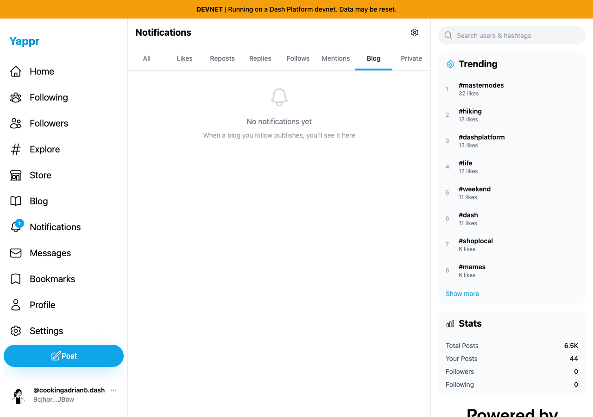
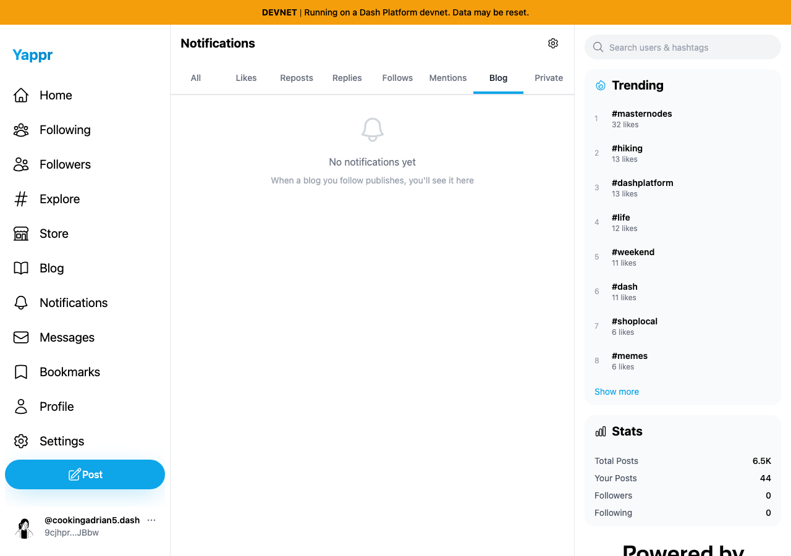
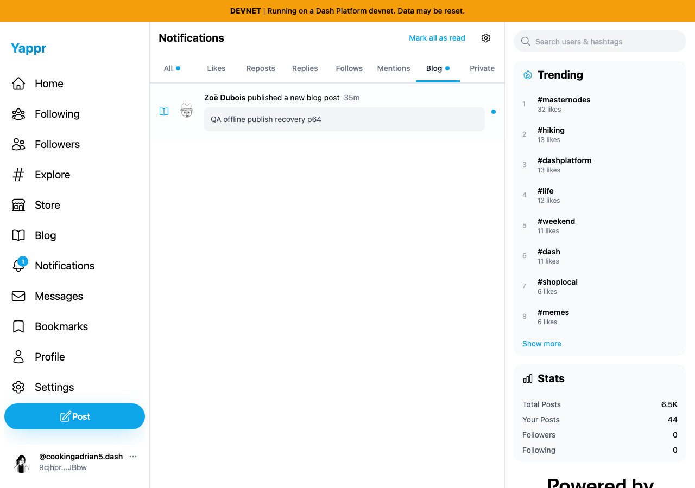

# Actual Blog notification preference and badge

Supplementary functional and visual evidence for [Yappr PR507](https://github.com/PastaPastaPasta/yappr/pull/507).

Before: exact staging base `cf0efbc10b8757137063113ebbd2061e8b87d8f7`, independent Devnet production build at3288. After: full PR507 head `70336915ff4bcc58f3e1f352e0dcc35de9b44ee0`, independent Devnet production build at3346; build ID70336915 verified. Both are1280×900, Light, fresh disposable Chromium contexts.

Shared real fixture: reader65 `9cjhprZAFUDVG71Fo8b5eCzHpwjo9Aj9npcRRpmCJBbw` (`cookingadrian5.dash`) follows owner64's secondary blog `SuUcVGu4Maz5NRv5XCBCQQp3oi9WaVtF24fzYYNrK41`. The same actual existing article `qa-offline-publish-recovery-p64` supplies the unread Blog event in each run. No synthetic notification data or additional article was injected. Relative age advances from34m to35m across captures.

Each run marks existing notifications read through normal UI, follows the blog, and waits for the completed Following toast. The actual article row appears. Turning **Blog posts** off in Settings hides it after a full reload. Turning the setting on restores the same unread row. Baseline badge sequence is **1→1→1**; fixed head is **1→0→1**.

| State | Before — exact base | After — full PR507 head |
|---|---|---|
| Enabled, actual unread Blog row |  |  |
| Disabled, full reload |  |  |
| Reenabled, same unread event |  |  |

All six original-resolution final images were opened and inspected. Settled tab animation visibly marks Blog. Full-resolution files are linked in the table. Raw assertions and cleanup are recorded in `before-results.json` and `after-results.json`.

Cleanup: ordinary Unfollow completed after each run; independent reload confirms Follow. Local preference restored on. Disposable contexts and their local read-state were discarded. The clearly named QA blog/article remain for other controlled tests. Seeded session setup is not login evidence. No keys, passwords or authenticated storage are published.
