# Yappr #509 — refuse unsupported private-feed resets before mutation

Exact historical staging base `cf0efbc10b8757137063113ebbd2061e8b87d8f7`; full signed PR head `14217bea918e4676cd8e4c0c13d059561295c4d2`. Separate production devnet exports, compiled hashes checked in Settings About, served at ports 3288/3299 with identical root/subpath asset mapping. Fresh Chromium contexts, light theme, en-US, America/Chicago, scale 1; desktop 1440×1200, mobile 390×844 and 320×800. Same synthetic owner 61 `8yBzzwur8s7BirZDX1yq3NCkv3HM3cgjsL3PZVjeVdSd` / `codes-esperanza7`, normal authentication-key 2 sign-in. No state injection, network mocks, or credential artifacts.

## Confirmed problem and scope

The live devnet social contract `CdUkSHkQwGXXAkzKqrcrjUWLsj7qErK9XAZmLzJEhirU` v1 declares `privateFeedState.documentsMutable=false`, `canBeDeleted=false`, and a unique owner index. The old Reset path deletes grants and rekeys before attempting an unsupported replacement of that owner state. A batch API cannot make the forbidden replacement/deletion valid.

During the earlier QA82 empty-feed cycle at `471094556c8d5d9457676f205dfe4df2a0742117`, normal approval/revocation produced epoch 2 / one revocation. Reset then failed, and a fresh UI read showed epoch 1 / zero revocations. The state-replacement error was recorded from the real dialog. That reset implementation is byte-identical to this PR's exact cf0 base (source blob `cbee470b875397a2dc829dcf8c440008803455e7`). The earlier [revoke comparison](https://github.com/PastaPastaPasta/dash-ui-artifacts/blob/c54f0d4f7baf2dcbd14207a19a61116e324c6838/yappr/pr-493/README.md) explicitly excludes reset success. No populated-feed data-loss experiment was performed: this owner had no grants or private posts before reset. The ordinary residual request/follow were later removed through the UI.

For this exact-base comparison, fresh read-only checks confirmed zero grants, zero rekeys and zero private posts, with 78 public seed posts. One authorized controlled empty retry reproduced the real error below. The screenshot captures only the error element; its bounds were checked not to intersect any populated secret input. No credential or populated secret field is shown.

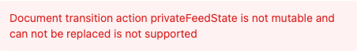

The fix prevents partial mutation. It does **not** implement reset: the service now refuses before any SDK write or local-key mutation, and the UI explains the supported original-key recovery path without a reset form.

## Settings

| Before — exact base | After — full PR head |
|---|---|
| 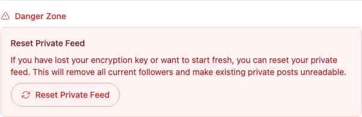 | 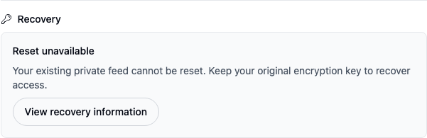 |

## Desktop dialog

The before form is empty for privacy; the separate error capture above proves the actual submitted result. The after dialog has no key or confirmation fields and no reset submission.

| Before — exact base | After — full PR head |
|---|---|
| 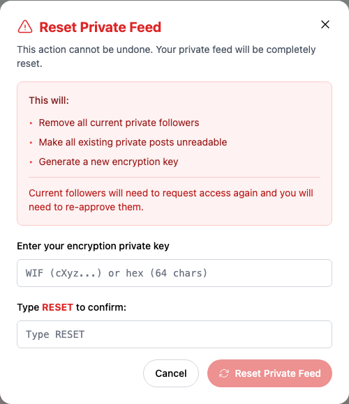 | 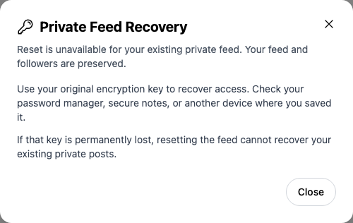 |

## Lost-key help

| Before — exact base | After — full PR head |
|---|---|
| 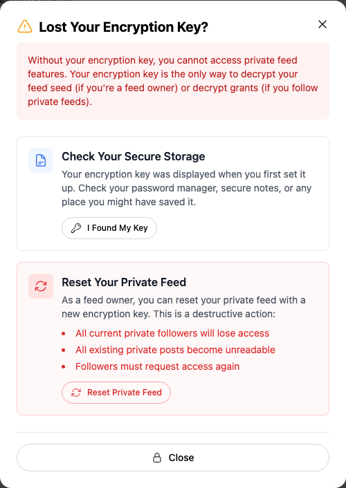 | 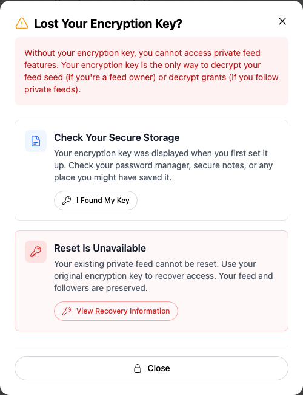 |

The existing “I Found My Key” path returns to manual key entry and Skip closes it. The help-to-settings navigation correction is separate PR #482; these screenshots inspect the help content, not that destination callback. The direct `/devnet/settings/?section=privateFeed&action=reset` route was independently opened on this head and displayed only safe information.

## Mobile

| Before —390px | After —390px |
|---|---|
| 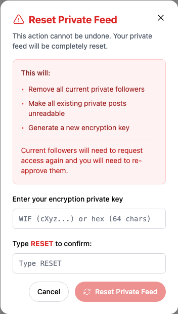 | 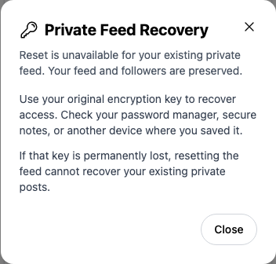 |

| Before —320px | After —320px |
|---|---|
| 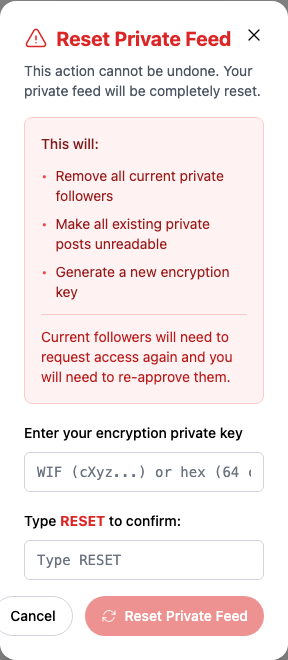 | 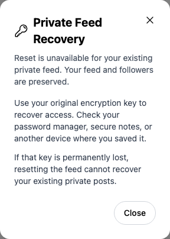 |

## Recovery compatibility and persisted-state proof

Normal manual entry of the registered original encryption key still succeeds and survives reload:

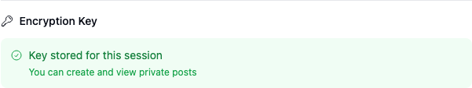

No private-post decryption claim is made for this empty fixture. The three read-only snapshots — before the controlled empty retry, after that retry, and after the fixed UI plus original-key entry — have identical document inventories. Private-feed state `CVcE2hV6s1XAZGRnPeaZKZrWjSCedmQ5XPCSEyco6wNu`, revision 1, retains SHA-256 `802eec4f6002b8e1ab757c960dfa056a5e09af7eeac2dbe7ae191b88301f2681`; grants/rekeys/private-post counts stay 0, and all 78 public-post IDs match. See `metadata-verification.json` and the three snapshots.

Targeted ESLint, full TypeScript, production devnet build, and independent source review passed. The offline no-writes regression fails against the exact base after its mocked grant/rekey deletion calls; it passes on the head and asserts no delete/update/create or local-key clearing/reinitialization. The live head checks cover informational dialog dismissal, direct reset-query navigation, desktop/mobile text, no secret inputs, and successful original-key Save plus reload.

All 12 final PNGs were inspected at original resolution. Early captures during dialog animation were discarded and replaced after both animation and statistics loading settled. Native element captures are not resized or annotated. The earlier cleared-input screenshot that lost its inline error is not included; the authoritative error-only capture above preserves the actual displayed error.

Integration: this removes the reset-form portion of #483's labels while keeping its Enable-label fix useful, and removes #493's reset callback while its Enable/Revoke refresh remains useful. Those removals follow from the unsupported reset feature being disabled.

## SHA-256

- `281575b999ba40951c5879f2db0e4843e40b7b8c1f9389b56f316b402a46b6b9` — `EVIDENCE_MATRIX.md`
- `34f87649d5fad86be9c6c5c13b7edc1e26007c46b1b068168128ed51f9ef5dd6` — `after-assertions.json`
- `f0a080f313c6042e6c8525d8236aab97b134a75f15c4dd448472b75f63d8c2dd` — `after-empty-retry.json`
- `fa032a479b82e399faeeafd4d8dd8a816fffa987c10b2e20af7f4b4df57b9471` — `after-head.json`
- `ce625ca30654cd58a9c982e8732dca3567925a39da1f765498b0e42575d84475` — `before-assertions.json`
- `b553ceac972d66c79584b411e802131a86f94b78ac9104fbeb4c2717fd356344` — `before-metadata.json`
- `3ed8e4c98aedcb17efd20ff11cd81a06394fc7089eec81395112c8ceb8ab9226` — `before-ui-assertions.json`
- `0df89cb2f11eb36c0d397ef546d5b9e1da8cbaa6724a1a0ccd824bfba109251d` — `comparison/after/dialog-320.png`
- `6d473a0e227194b6d40fe869a7764e3984e2e4be60ce163efc2600f6a588275e` — `comparison/after/dialog-390.png`
- `46a2037136c7fb00c3abb9aa397ca151fcd5051bd6a68d4ec16cb755df940d2a` — `comparison/after/dialog-desktop.png`
- `2b112f33072575133ccb714413269a436d390f53f8482945ebbbff21edef0945` — `comparison/after/lost-key.png`
- `87ed53441415f1254ec1b9c1af48731153a2e9bb215ea8d53b325291b4a07575` — `comparison/after/original-key-recovery.png`
- `25d6bd500300447a44982437ae527dbb67a2ff9950eb820d21284588fdac2099` — `comparison/after/settings.png`
- `99f275986d863b8abe455ca598d94c8c5633017777687f54424735d88fe68cdf` — `comparison/before/actual-error.png`
- `7e60faddd9556cdd84150b05bedbea148714b00c99b160387eb18a36ac58e3e3` — `comparison/before/dialog-320.png`
- `5bd3874f4afc29dac11548833fbc7e09f7e1dfa0393a10d3289ea6852cdfbbb4` — `comparison/before/dialog-390.png`
- `5b99d8bd0b30e05aa3839d1b21cbfa302fd3866d9678cd73defb1e70e9f042d9` — `comparison/before/dialog-desktop.png`
- `e57fe2d1505eb8132ad10d104bdcfbfc57dcc6a8591a7e2d4733048f09ba763a` — `comparison/before/lost-key.png`
- `aac43efcc8295ff4d21c2a9fdd255f23b9be18b3b8907e599a70656129e19cec` — `comparison/before/settings.png`
- `41b2d6a3c0012ab600b168338fad71539954d34c19c5bc0ad480a2e10c52d3ed` — `live-contract.json`
- `8da9372e3fe306d4a3ebed518abd37cef5ca8adf9c2f8261aeb8c9e88b58f32a` — `metadata-verification.json`
