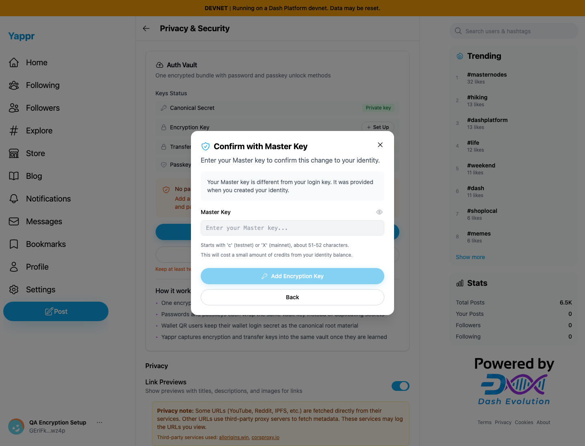
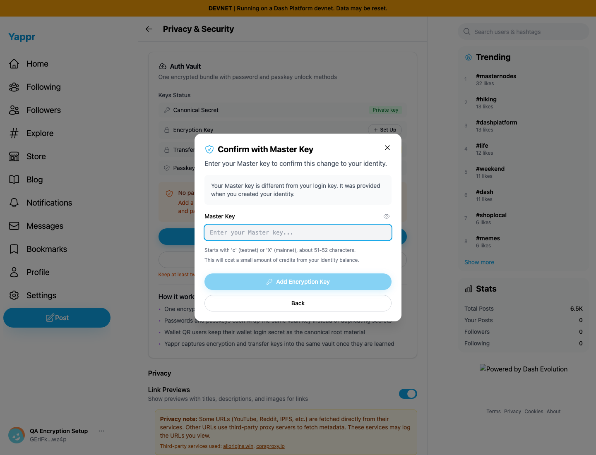

# Yappr PR #513 — master-key setup accessibility (QA118)

Before exact base: `cf0efbc10b8757137063113ebbd2061e8b87d8f7`. After full signed PR head: `9dba5142b309bae0c35a4a1e10919a53c16fd4c7`.

Both independent production exports used the same real devnet identity `GEriFkuaUndk4zoBwCJ36Qn9Jy7NgjKsZbJauNdywz4p` (QA Encryption Setup), login key, deterministic generated encryption key, 1440×1100 Chromium viewport, light theme and empty Master Key field. The fixture had no encryption key registered during either comparison. Both reached the form through Privacy & Security → Set Up → Create Encryption Key → secure backup → Continue. No storage, DOM, auth or network responses were injected. No identity transition was submitted during this comparison.

In both runs, focus Back and click the visible Master Key text. Before, it does not focus the field. After, the input receives focus and its blue ring is visible. Screenshots capture the actual state after the same action; all credential fields are empty. The unrelated remote Powered by Dash image differs between origins; no claim depends on it.

| Before — exact base | After — full PR head |
|---|---|
|  |  |

The actual [before ARIA snapshot](before-dialog-aria.txt) shows unnamed close/visibility buttons and a textbox named by its placeholder. The [after ARIA snapshot](after-dialog-aria.txt) shows `Close encryption key setup`, `Show master key`, and textbox `Master Key`. Named show/hide buttons changed the empty field type to text and back to password; the named close button dismissed the dialog after its exit animation. [Recorded UI assertions](ui-results.json).

Lint, application TypeScript, E2E TypeScript and production devnet build passed; independent review approved. No new unit tests were added for this label-only change: the actual browser focus, accessible-name, visibility and dismissal checks cover the behavior. Both original PNGs were inspected at full resolution before publication.
