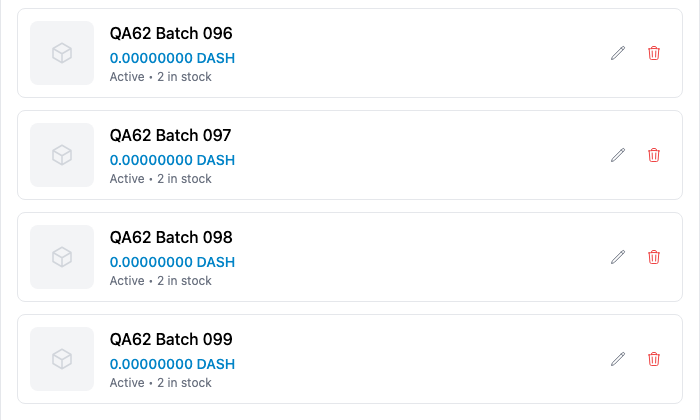
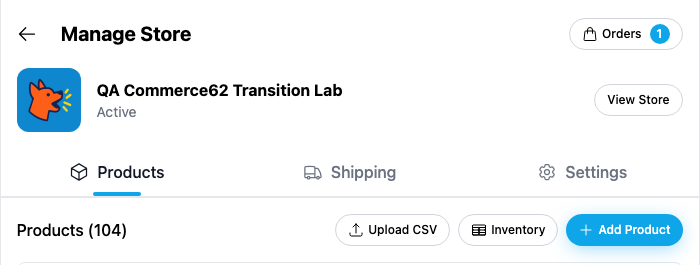
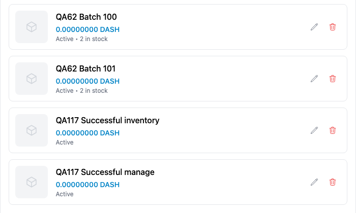

# Yappr PR522: load every product in Manage Store

Source PR: https://github.com/PastaPastaPasta/yappr/pull/522

Before: `cf0efbc10b8757137063113ebbd2061e8b87d8f7` (exact staging base).
After: `02e43a8a6ebd3c4cc376c506009fd510422fea4d` (full signed PR head).

Independent production devnet builds, each verified through About, with matching static-export mappings. Fresh Chromium contexts restored the same existing merchant QA authentication snapshot privately at the local origin; the fixture helper retained its DPNS skip flag. No product, DOM, request, or response data was injected for the main comparison. Desktop 1440×1200, mobile 390×844, light theme, en-US, America/Chicago, device scale 1.

Original overview images are unmodified captures. The focused count crops are x333/y40/700×265; focused list-end crops are x333/y780/700×420, taken from the corresponding full-resolution desktop images. Both revisions are scrolled to their respective list ends, so the end images show different final products, as expected. No rescaling or annotations were added.

## Shared synthetic fixture

Merchant: QA persona 62, `selin-loops9`, identity `pE4KifoG3Jrvwkse3kng9vJ8wK1M2kBDC9FEeQgfRLC`.
Store: `QA Commerce62 Transition Lab`, ID `CP3dEXrdMEbbiFNHakoRkC86DonfVftuzUyaY4ngrnQb`.

Both builds read the same 104 public product documents. The first 100 are identical and in the same creation order. The four missing from baseline Manage Products are:

- `QA62 Batch 100`, `BjZVMrWEbVyXxk16v3vtpLN761JmzRybZubkEbKj2oa5`
- `QA62 Batch 101`, `GA7fPnGmF6fgQfeMLQ3uetFw96GrspYRPMaJaxXGxYXr`
- `QA117 Successful inventory`, `2j26J7FfWDtFDntxs9rPLgQ6rx1QNEGwHL35rKdigNSL`
- `QA117 Successful manage`, `AnUnxLK1UgWCarrxV9aabGdKG8UsFXwQBXaFDdqx7Qmp`

[Full public fixture manifest](fixture.json). The last two products were created by the separate upload-result QA before this comparison. This task performed only reads and navigation; no uploads, edits, saves, or deletions. Commerce QA owns fixture creation and coordinated cleanup after all dependent comparisons are secured. Credentials and browser state are not published.

## Before — exact base

Manage Products shows 100 and stops at QA62 Batch 099, with no Load More action.

[Full count overview](before-desktop-overview.png) · [Full list end](before-desktop-end.png) · [Mobile list end](before-mobile-end.png)

The same base's separate Inventory page already sees all 104, including the successful uploads. This is fixture context, not another revision comparison:

[Full Inventory showing 104 of 104](before-inventory-context.png)

## After — full PR head

Manage Products reads all pages and shows all 104, including the four previously missing products.

[Full count overview](after-desktop-overview.png) · [Full list end](after-desktop-end.png) · [Mobile list end](after-mobile-end.png)

## Later-page failure and retry — both states on PR head

A separate bounded local failure check allowed the real first product page, then aborted only getDocuments reads for storeItem with cursor `3CEdyUvReXMngUbRGHMZbT5Jy6pA22Dv9NEZ7wjy32u2` (the last product on page one). Four reads were aborted, including SDK retries. No server was changed and no response data was fabricated. Other queries proceeded normally.

The UI showed an alert and Retry products without claiming Products (0) or No products yet:

[Desktop failure state](after-later-page-error.png) · [Mobile failure state](after-later-page-error-mobile.png)

Restoring reads and pressing Retry recovered all 104 products in order, with no duplicates, and cleared the alert:

[Recovered list after Retry](after-retry-recovered.png)

Interception was removed when the browser check finished. These screenshots are successive states on the full PR head, not a source-base comparison.

## Validation and limits

- Five service tests passed: 104 products, exact-100 exhaustion, empty store, later-page failure propagation, repeated-cursor termination.
- Targeted lint, full TypeScript, production devnet build, and independent source review passed.
- Actual browser verified the baseline cap, corrected 104 unique rows, exact fixture ordering, reload persistence, mobile list end, and the newest product's edit route/title followed by Back to the 104-product list. No fields were changed or saved.
- Actual browser verified the bounded second-page failure, accessible alert, absence of a misleading empty state, visible mobile retry control, and successful recovery to all 104.
- Upload refresh uses the same tested complete-list loader. Existing rows are replaced only after success, so a failed refresh retains them. This branch was source-reviewed; this task did not perform another upload or fabricate an upload-complete callback.
- Existing Manage Products toolbar overflow on narrow screens is independently tracked as QA120 and is not changed here. Mobile list-end evidence is supplemental; some long product titles naturally truncate. Desktop images make the full titles readable.
- Complete loading requires one query per 100 products, plus an empty final query when the total is an exact multiple of 100. Large stores therefore take more reads than the former silently truncated list; no total-count limit is introduced.
- Fourteen final PNGs were inspected at original resolution. All public artifact files are fetched and checked against local status, content type, byte size, and SHA256; the rendered PR comparison is inspected after linking.

[Before assertions](assertions-before.json) · [After assertions](assertions-after.json) · [Failure/retry results](failure-retry-results.json) · [Read-only edit navigation](edit-read-results.json) · [Evidence matrix](EVIDENCE_MATRIX.md) · [SHA256 manifest](SHA256.json)
