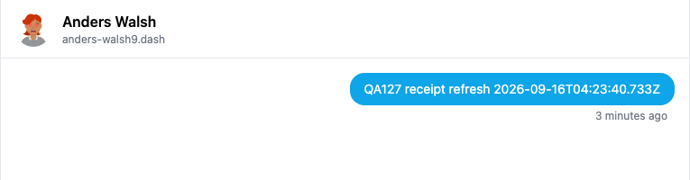
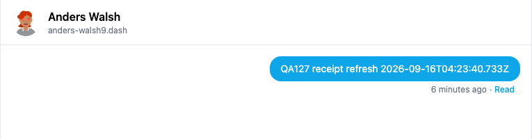

# Yappr PR #523 — live direct-message read receipts (QA127)

Before exact base: `cf0efbc10b8757137063113ebbd2061e8b87d8f7`. After full signed PR head: `66ebbcad32d95cbac8e763acd7c905e4912b2183`.

Both independent production exports use real devnet, separate browser contexts, ordinary identity/WIF login, light theme and a 1440×1000 Chromium viewport. Sender `1R7KNEEbzqg3574bybNCTJjvctH1jFg76vNc6PsWVet` (programmanika5) and recipient `Da8ywZo3CcJadx7xJ3WK2kgzP8u4c1VrKN7DaBtdPXve` (Anders Walsh) are dedicated QA identities. The exact same message `6gKVSiGm1Apn5pmkFdmQgUBccizCo4q8EWe7wtQnX8DY` in conversation `cQ9tSFpscD/RFA==` appears in both builds. No storage, DOM, auth or network response injection was used.

The recipient first disabled Read Receipts in Settings and opened the message. An independent SDK public metadata read found no receipt; neither sender session showed Read. Both sender conversations remained open while the recipient enabled receipts and reopened the conversation. Independent readback then found receipt `2hjvRC4HgxKgMRk1VNcj4nia4CaGdD8QxnhTfK4N2hGa`, timestamp later than the message. After 68.6 seconds, the original build still showed no Read; the fixed build had updated through its regular poll, with no sender reload or new message.

| Before — exact base | After — full PR head |
|---|---|
|  |  |

These detail images are matching crops of the original screenshots. The baseline's relative timestamp remains at “3 minutes ago” until another render, while the head displays “6 minutes ago”; this unrelated render-dependent label is not the evidence claim. Message content and identity are identical. Full-resolution originals: [before](before-live-unread.png), [after](after-live-read.png).

After capturing the pair, reloading the baseline displayed Read for that same message ([control screenshot](baseline-reload-control.png)), confirming the original bug is the missing active refresh. [UI assertions and exact provenance](live-test.json), [privacy-disabled public readback](privacy-off-readback.json), [published receipt public readback](published-receipt-readback.json), and [evidence matrix](matrix.md) are included.

Validation: 265 unit tests, lint, application/E2E TypeScript, production devnet build, and independent review passed. The patch adds one receipt read per three-second active-conversation poll; publication/privacy semantics are unchanged. All final images were inspected at original resolution before publication. The recipient setting was restored to enabled. One audit-labelled DM remains because the ordinary UI has no deletion control.
