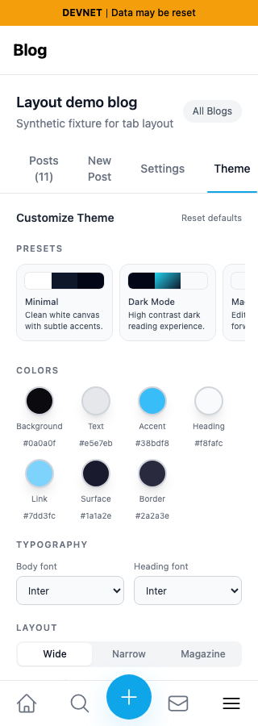
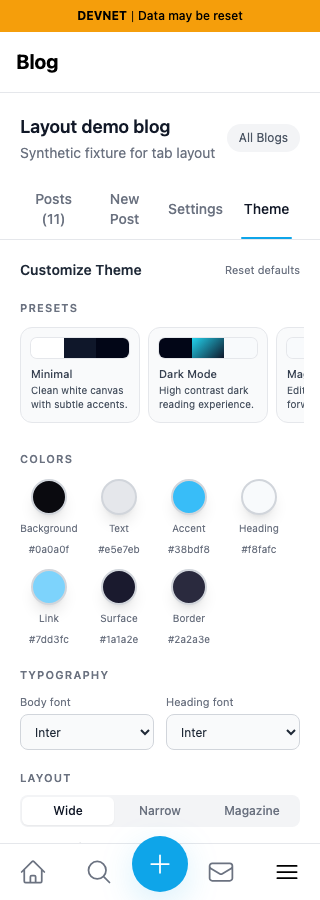
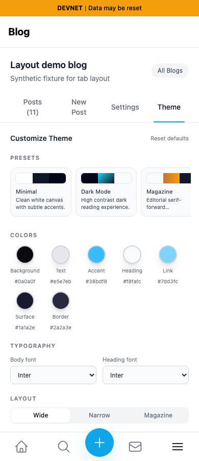
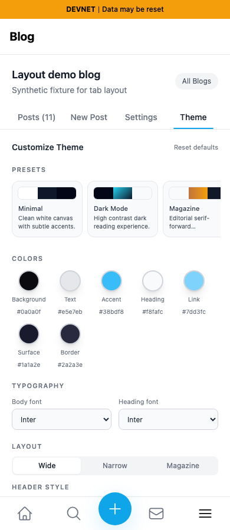
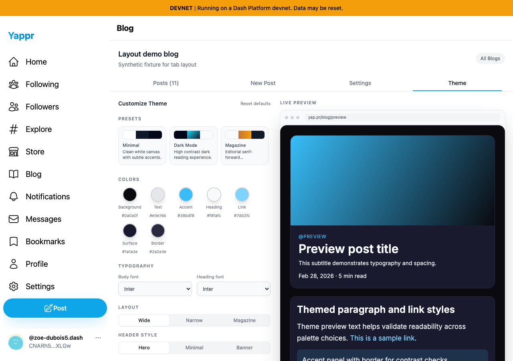

# Blog dashboard tabs fill the available width

This comparison supersedes the earlier 360px-only implementation and its screenshots in PR #525.

Before: exact PR base `cf0efbc10b8757137063113ebbd2061e8b87d8f7`.
After: full signed PR head `a82fdfc7f0b437f93a5de4fa859a9efc1087b233`.
Both are independent Devnet production builds. The clean source revisions, `.next/BUILD_ID`, and served HTML build IDs were checked before capture.

All four tabs occupy equal columns and collectively fill their content container, including the three 4px gaps. The font remains 14px. Labels wrap when necessary instead of overflowing or becoming smaller. At 320px, wrapping remains readable and the Theme control stays inside the row; at 390px, all labels fit on one line. Desktop tabs distribute across the full content width instead of clustering on the left.

| Viewport | Before — exact base | After — full head |
|---|---|---|
| 320px |  |  |
| 390px |  |  |
| 1280px |  |  |

These are actual application renders with **synthetic blog/article service reads** in disposable browser sessions. The previous live devnet fixture now fails to load, so both builds use the same `Layout demo blog`, description `Synthetic fixture for tab layout`, and 11 articles named `Layout demo article 1` through `Layout demo article 11`. The public owner ID is `CNARhSLcQRfdxLZXTrvDVtVGKg1RHXjwJTpGSd2DXLGw`; the blog ID is `BdMQRKM6xT8jx4bKbkhP3wYo7V835pDjcEWTbN5PMNRU`. Fixture dates are fixed to September 15, 2026; theme configuration uses application defaults. Theme is selected, light app theme, 900px viewport height, device scale factor 1. No source, component, markup, or CSS overrides; only blog/article read results are replaced in the browser. No backend writes were made. This evidence verifies layout and local navigation, not login or backend availability.

Validation: Devnet production build, full TypeScript, targeted ESLint, and diff whitespace checks passed. Browser geometry assertions verify equal tab widths, complete row coverage, no document or tab overflow, and 14px fonts at 320, 360, 375, 390, 430, 639, 640, 768, 1024, and 1280px. Native Tab focus stays visible and Enter opens Settings, Theme, Posts, and New Post at 320, 390, and 1280px. Raw measurements are in the results JSON files. All six final screenshots were inspected at original resolution.
