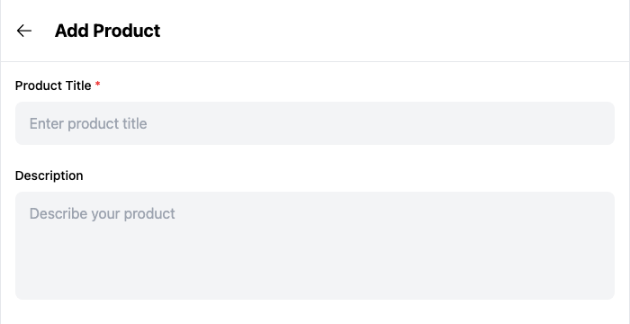
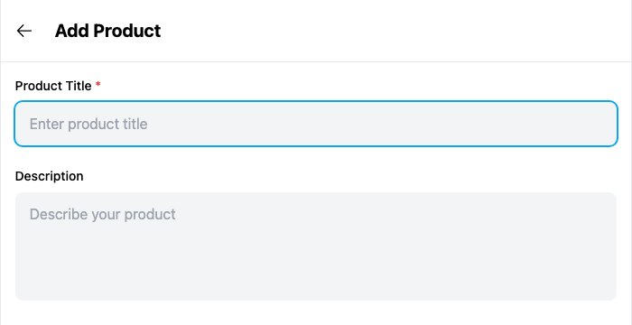

# Yappr PR529: product form labels and accessible control names

Source PR: https://github.com/PastaPastaPasta/yappr/pull/529

This refreshed R8 comparison supersedes the earlier staging-base evidence. PR529 is now stacked on PR475. Both sides retain PR475 currency-aware Price labels and flat price input padding.

Before: `0fa8e37b33a2b4fd63cb2a5b75d5c86ae7884671` (exact PR475 parent).
After: `751a93ea44418581229b2abd744b70f5d3872af3` (full signed PR head).

Independent production devnet builds, each verified through About, matching static-export mappings. Fresh Chromium contexts restored the same existing merchant QA authentication snapshot privately at each local origin; the helper retained its DPNS skip flag. No product, DOM or network data was injected. Desktop 1440×1200, mobile 390×844, light theme, en-US, America/Chicago, device scale 1. Screenshots are unmodified full captures and matching x333/y40/700×360 form-header clips. No annotations or rescaling.

## Shared synthetic fixture

Merchant: QA persona 62, `selin-loops9`, identity `pE4KifoG3Jrvwkse3kng9vJ8wK1M2kBDC9FEeQgfRLC`.
Store: `CP3dEXrdMEbbiFNHakoRkC86DonfVftuzUyaY4ngrnQb`.
Simple product: QA62 Amber Single, `GWgJbLzxK5XfyNnVNdy7k8fyiBmUziSTSRQ5XtkExCWK`.
Variant product: QA62 Cobalt Matrix, `6D8xaKcFCkhaNdVELKvyWHCNrfMBSmoSmzjEMZu5sqFF`.

Blank Add Product screenshots contain no entered text. Existing-product screenshots show public synthetic product data. Only unsaved local variant/currency drafts were changed, followed by Back navigation; Create/Save was never submitted. A final fresh browser context verified the original saved values remained unchanged. No uploads, product deletions, or Platform writes. Credentials and browser authentication state are not published.

## Before — exact base

Clicking Product Title leaves its field unfocused; the visible label is not associated with the control.

[Full desktop overview](before-title-desktop-overview.png) · [Mobile](before-title-mobile.png) · [Existing-product title](before-edit-title-focus.png)

## After — full PR head

The same label click focuses its field and shows the native blue focus ring. This also works for Description, Category, Price, Currency, and Stock Quantity.

[Full desktop overview](after-title-desktop-overview.png) · [Mobile](after-title-mobile.png) · [Existing-product title](after-edit-title-focus.png)

## Accessible names — nonvisual behavior

The form's Back, URL-add, image-removal, and variant-removal buttons gain descriptive names. New-axis inputs and each variant's price/stock input gain names; variant price names include the selected currency. Existing image-upload component internals are unchanged.

For the same Color axis, the browser ARIA snapshot changes from `text: Color` followed by an unnamed `button` to `button "Remove variant option Color"`. Price and stock controls become `Price for Small / Blue (DASH)` and `Stock for Small / Blue`. Changing the unsaved currency to USD updates the price name accordingly.

[Before variant context](before-variant-context.png) · [After variant context](after-variant-context.png)

These variant screenshots supply visual context, not a claimed appearance change. The table's narrow price/stock inputs visibly clip long values/placeholders on both revisions; that separate layout concern is tracked as QA142, not fixed here.

## Validation

- Targeted lint, full TypeScript, production devnet build, and independent source review passed.
- Actual browser: all six visible label clicks failed to focus their fields before, and focused the associated controls after. After controls also have the expected accessible names.
- Actual browser: blank Create Product remains disabled; desktop/mobile title focus is correct; existing Amber title and price stay intact; image/URL/navigation control names are verified.
- Actual browser: Cobalt axis removal/re-addition recomputes unsaved combinations; Back and fresh readback preserve the saved prices/stocks. The variant Currency label is associated, and price accessible names follow draft currency. Final fresh context verifies saved Cobalt currency DASH, Small/Blue price 0.01000000 and stock 0, plus Amber title and 0.02000000 price.
- Ten final PNGs were inspected at original resolution. All published files are fetched and checked against local status, content type, byte size and SHA256; the rendered PR comparison is inspected after linking.

[Before assertions](assertions-before.json) · [After assertions](assertions-after.json) · [Evidence matrix](EVIDENCE_MATRIX.md) · [SHA256 manifest](SHA256.json)
