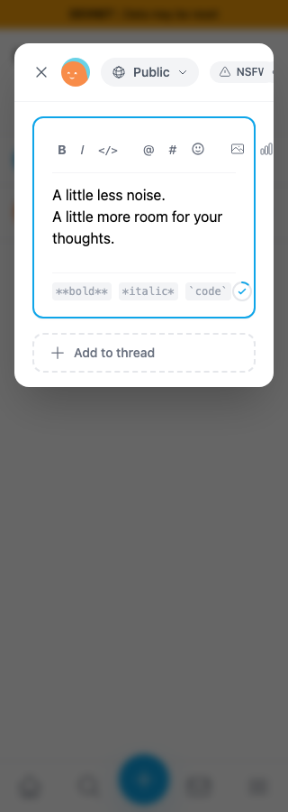
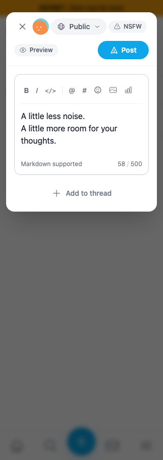
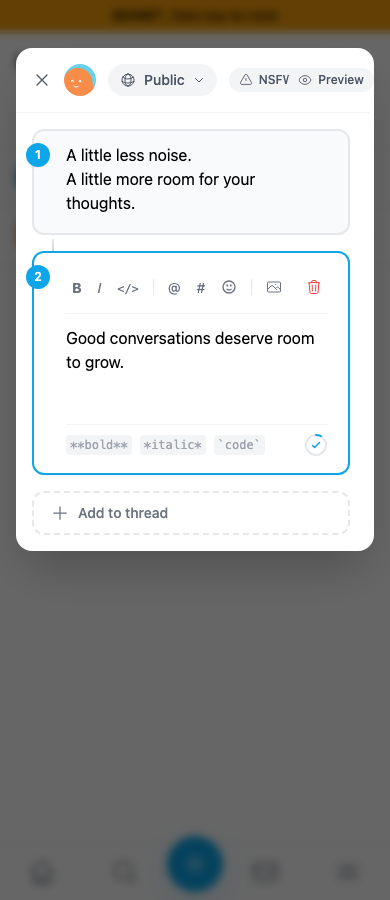
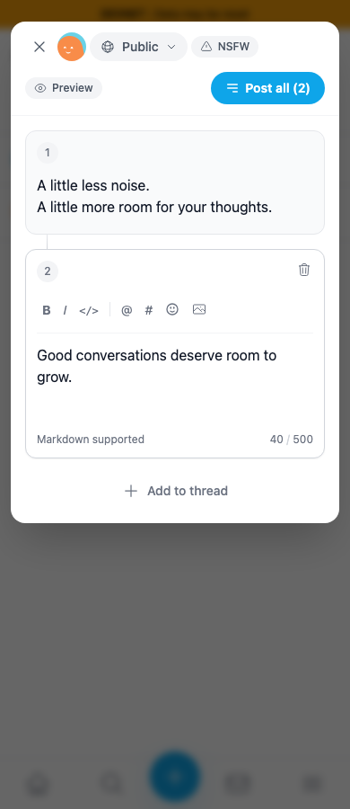
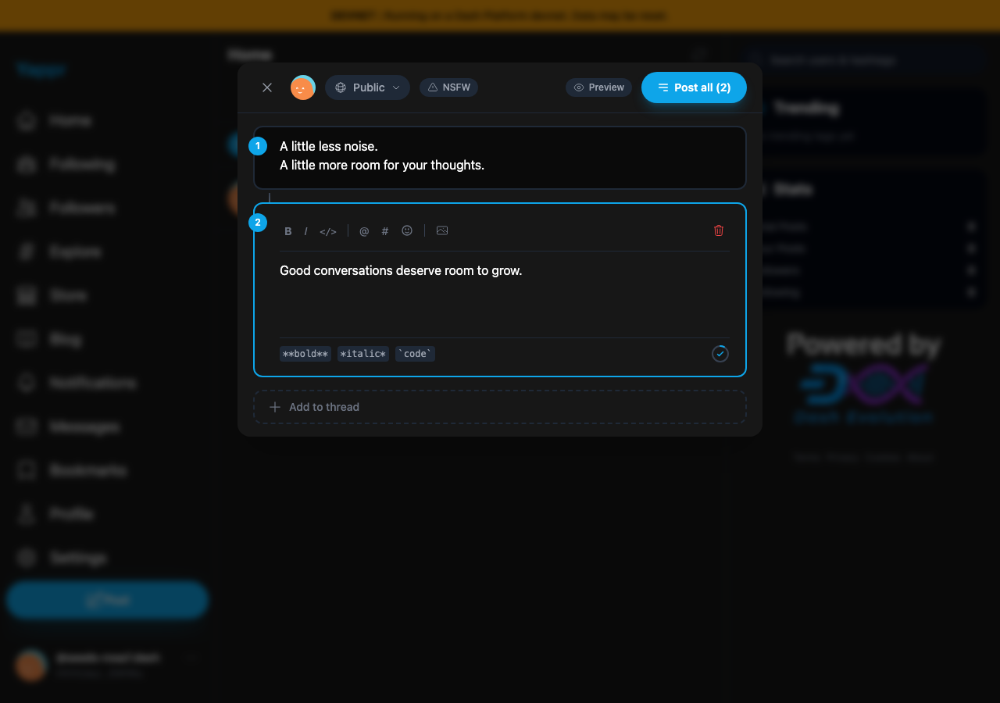
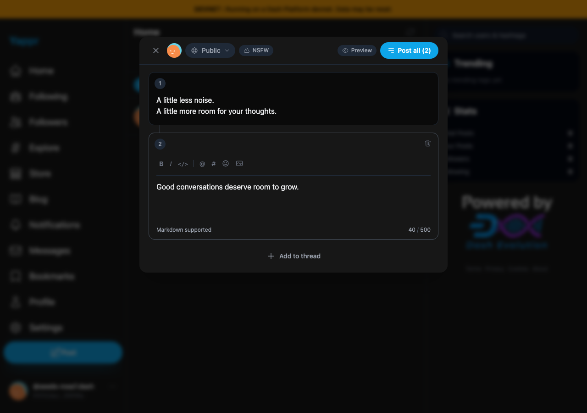

# PR #541 — responsive composer rework

This comparison supersedes the original footer-only screenshots on PR #541.

Before: exact PR base `cf0efbc10b8757137063113ebbd2061e8b87d8f7`.
After: full signed PR head `4e638ba4d2a181f2d6191ee787d5c679de4b19e8`.

Both are separate local devnet production exports. Capture verifies the visible About commit before opening the composer. Shared fixture: seeded QA persona 55, identical unsaved drafts, Chromium at 320×900 and 390×900 in light mode, and 1280×900 in dark mode. Theme is persisted and the page reloaded before capture. Authentication is seeded locally; these are not login, upload, or post-submission tests. Background feed contents can vary and are obscured by the modal overlay.

| Surface | Before — exact base | After — full PR head |
|---|---|---|
| 320px single post |  |  |
| 390px thread |  |  |
| Desktop, dark mode |  |  |

The toolbar, header, card treatment, numbering, add-to-thread action, and character counter are redesigned together. A plain count replaces the progress ring and formatting chips. Count turns amber near the limit and red when exceeded; attachment URL cost still contributes. The desktop header stays in one row; narrow viewports give Preview and Post their own row.

Validation: production build including TypeScript and lint passed; targeted ESLint passed; 265 unit tests passed. Browser checks cover 30 states per revision: 320/390/1280px × single/thread × 0/450/480/500/501 characters. After-state checks verify buttons and editors remain inside the dialog, exact counts, submission disabling for empty single posts and over-limit text, keyboard bold, Preview/Edit draft preservation, and thread removal. See `before.json` and `after.json`.

`isolated-image-counter.json` separately covers the real editor/counter with 499 text characters and attachment URL lengths 100, 2048, and 1,000,000 at all three widths; unrelated markdown/autocomplete/emoji children are stubbed. This verifies layout and arithmetic, not storage-provider integration.

Code-review-validator review of the three-file diff: APPROVED, no blocking findings. Publication and attachment logic are unchanged; network writes were deliberately not exercised. No capture code or fixtures were added to the product checkout.

All six final original images were inspected at full resolution. `SHA256SUMS` records the published originals and measurement files; public downloads are checked byte-for-byte against these hashes.
