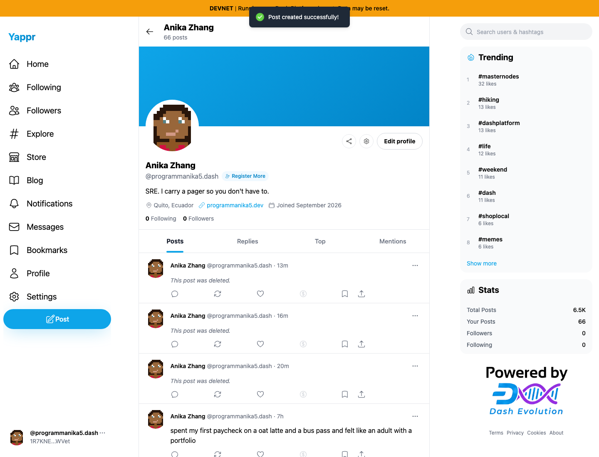
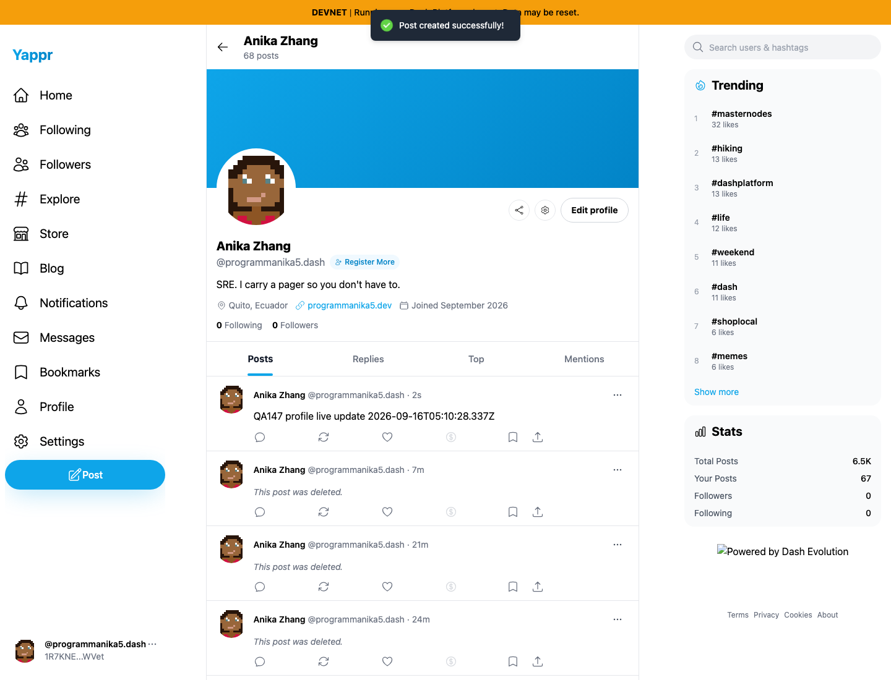

# Yappr PR #932 — show newly published posts on the active profile (QA147)

Before exact base: `cf0efbc10b8757137063113ebbd2061e8b87d8f7`. After full signed PR head: `932d56e6ca5da34a030417a0e4cc7432f4786423`. Both are independent production devnet exports, separate Chromium contexts, 1440×1100 light theme and ordinary visible identity/WIF login as `1R7KNEEbzqg3574bybNCTJjvctH1jFg76vNc6PsWVet` (programmanika5). No storage, DOM, auth, SDK or response injection was used.

While viewing the owner’s Posts tab, the same ordinary global Post composer published `QA147 profile live update 2026-09-16T05:10:28.337Z`. On the exact base, the success toast appeared but the profile remained at 66 posts and showed no new card for seven seconds. Reloading then showed the post and 67 posts. On the PR head, the canonical post is inserted after its real document becomes readable, the count updates to 68, and the post appears without reload. The hook keeps the event post separate from the paginated initial load so late history cannot erase it.

| Before — exact base | After — full PR head |
|---|---|
|  |  |

The matching full screenshots show the same owner profile, success toast, Posts tab and 1440×1100 framing. The baseline screenshot visibly has no QA147 card and still reads 66 posts; the head screenshot shows the QA147 card and 68 posts. The [baseline reload control](baseline-reload-control.png) shows the original behavior after reload (67 posts), confirming the defect is profile freshness rather than publication. Exact UI and public readback ledgers are included.

Additional head controls loaded more than 50 history cards before publishing, then verified every loaded card ID remained after the new card was inserted. Publishing while Replies was selected left Replies selected; switching back to Posts showed the new root post. Viewing another profile while publishing left that profile’s route, count and cards unchanged; the post appeared only on the owner profile. These controls are recorded in [head.json](head.json), with all resulting test posts deleted through the ordinary owner UI and final [tombstone readback](final-cleanup-readback.json). The SDK readback confirms the created documents and cleanup; no Platform/GroveDB defect was found.

Validation: 265 unit tests, lint, application TypeScript, E2E TypeScript and production devnet build passed. The new listener filters by owner, canonicalizes with bounded reads, deduplicates and sorts the event post, preserves pagination and selected tabs, updates counts with cancellation/out-of-order guards, and drops stale results on profile changes. All final images were opened and inspected at original resolution before publication.
