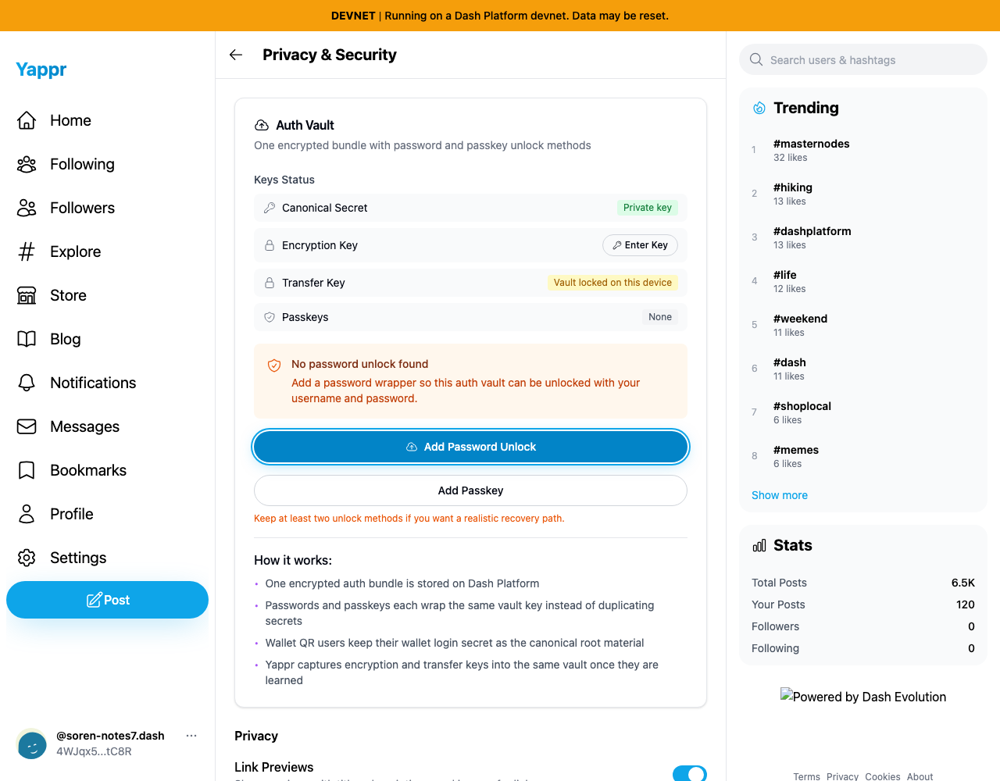
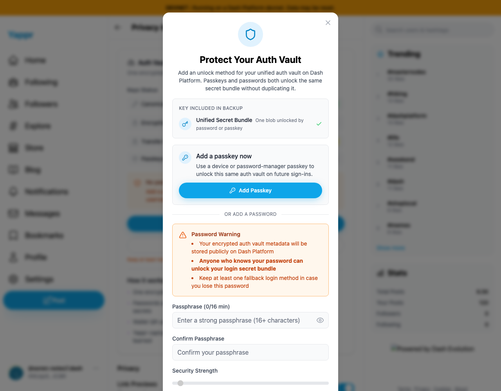
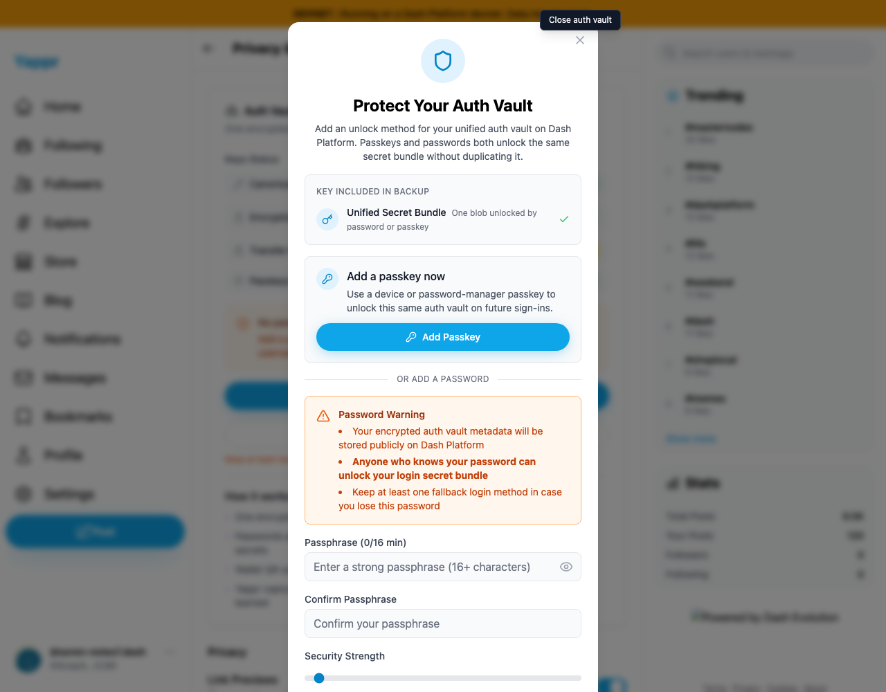
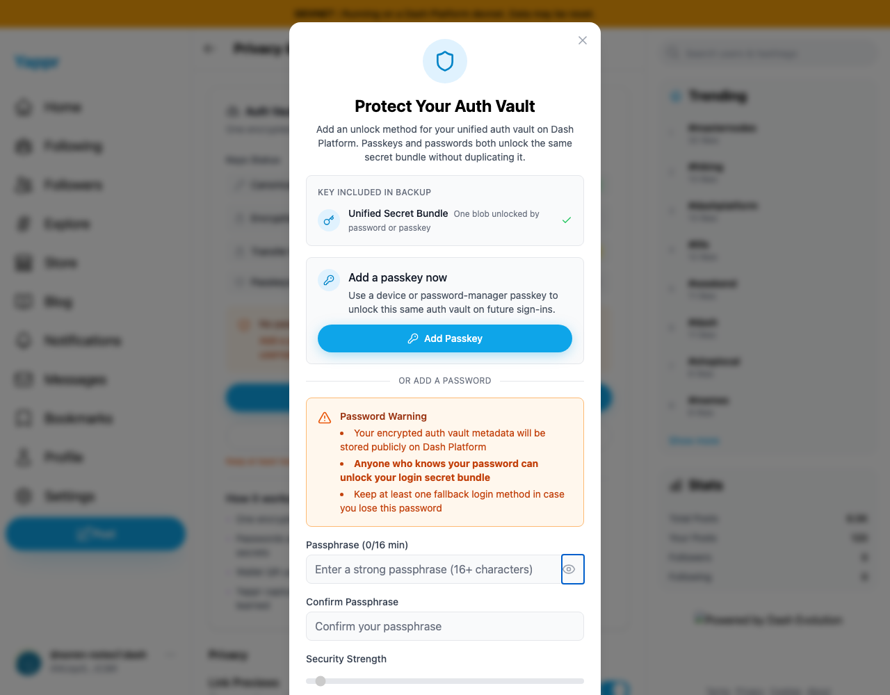
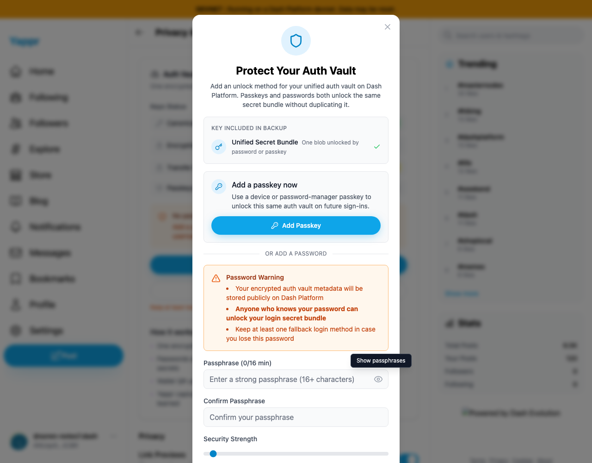
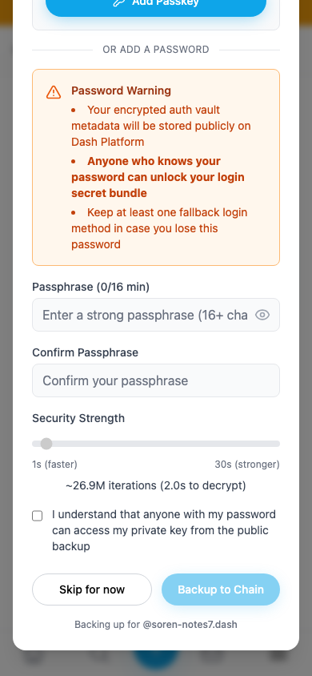
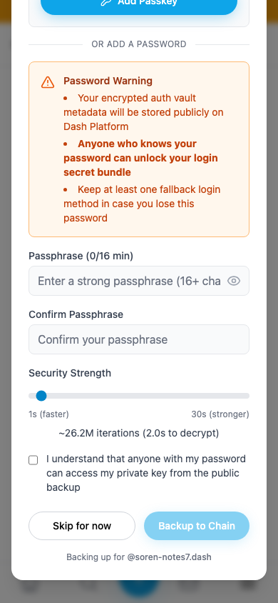

# Auth Vault dialog accessibility

| Surface | Before — exact base | After — full PR head | Shared fixture | Expected delta |
|---|---|---|---|---|
| Password unlock dialog | 4105c5d1c914f5d0838619da93c3b8d28b4a780e | 4a7c77316c0fe6a89d8c75eb77517d1094eb6d66 | Persona44 / 4WJqx5yBKTW3v6FbkvwNZpGvWyafDzTjMSZLZEYwtC8R, Add Password Unlock from Privacy & Security | Named dialog/controls, focus confinement and return, Escape dismissal |

Independent production devnet builds, live data, disposable seeded sessions, light theme. Desktop1280×1000 and mobile390×844. Secret fields remain empty; no enrollment was submitted. This is dialog accessibility testing, not a new cryptographic or enrollment certification.

| Gesture | Before — exact base | After — full PR head |
|---|---|---|
| Focus empty Passphrase field; press Escape once |  |  |
| Focus close control |  |  |
| Focus visibility control |  |  |
| Mobile lower controls; click Security Strength label |  |  |

Browser assertions, desktop and mobile:

- Accessible named dialogs0→1.
- Keyboard stops outside the panel during18Tab presses11→0.
- Security Strength label focuses slider:false→true.
- Escape closes dialog and returns focus to opener:false→true.
- Empty-field visibility toggle still changes both passphrase fields correctly.
- Tall mobile form can scroll to consent and submit controls.

Accessibility-tree snapshots and gesture results are in the JSON files. Screenshots show tooltips, label-focus state, and Escape result; focus confinement and accessible naming are also verified semantically. Source lint, TypeScript,145unit tests, committed-head devnet build and independent source review passed.

All eight published PNGs were inspected at original resolution. Calibration runs naturally yield different iteration estimates; the algorithm is unchanged. Public feed counters may vary with concurrent QA. The local base-path-only server lacks the footer logo; this is a capture-server artifact, not a live deployment issue. A temporary local IPv4 port collision was detected before publication; final head captures were rerun against the verified IPv6 listener serving the exact committed build. No collided-server capture is included.
