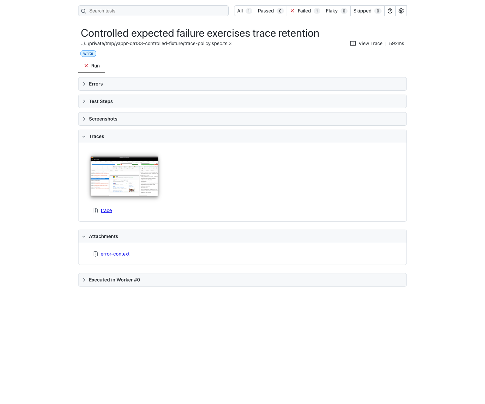
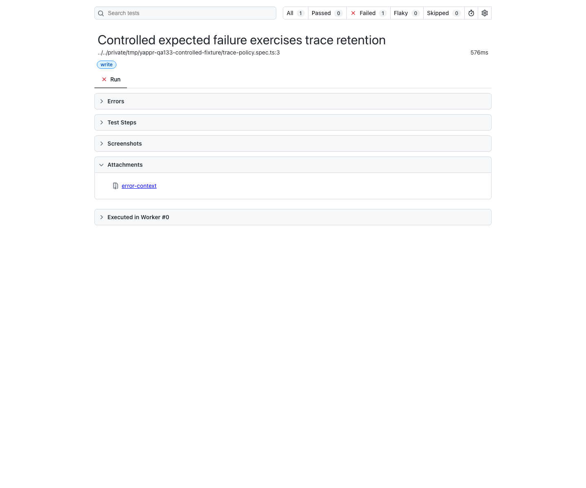

# QA133: authenticated test trace policy

Before source: `cf0efbc10b8757137063113ebbd2061e8b87d8f7` (exact staging base).
After source: `d1f204d050a97a793d3832978f4e60eb012987f3` (full signed PR head).

The authenticated write test project now disables tracing. Authentication fixtures pass private signing keys to browser initialization; traces can record those arguments. Smoke-project tracing remains unchanged. This evidence demonstrates artifact policy, not an application UI change.

Both runs import the actual repository Playwright configuration and override only the test location, report/output destination and application web server. The identical controlled test passes the public, non-secret marker `QA133_PUBLIC_NON_SECRET_MARKER` to browser initialization, opens a harmless local data URL and intentionally fails a missing-heading assertion. No credential environment, real account, application session, SDK or network endpoint is used. Both tests are expected to fail to exercise failure retention. No trace archive or full report is published.

| Before — exact base | After — full PR head |
| --- | --- |
|  |  |

The compact comparison collapses the same Errors, Test Steps and Screenshots sections using the report's own UI. The full screenshots show these sections expanded: [before](before-report.png), [after](after-report.png). All four originals were visually inspected at full resolution.

The browser, viewport (1440×1200), light theme, en-US locale and America/Chicago timezone are identical. Execution timings differ naturally; no timing claim is made. The reports show the same test ID and same expected assertion failure.

Machine-checked result: before retains one trace containing the harmless marker and one screenshot; after retains zero traces and one screenshot. See [results.json](results.json). Both runner exit codes are the expected 1. This is a successful negative regression check, not a passing application test.

Validation also includes E2E TypeScript, diff whitespace checks and the committed testing build (`BUILD_ID=d1f204d0`). Independent actual-diff review approved the one-file change. No testnet or devnet credential is changed.
