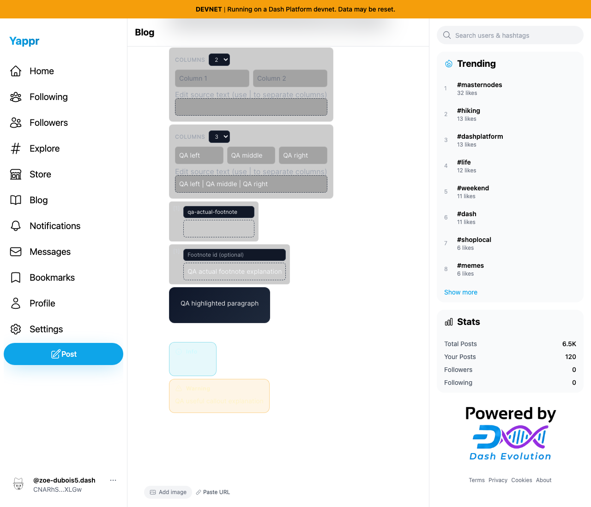
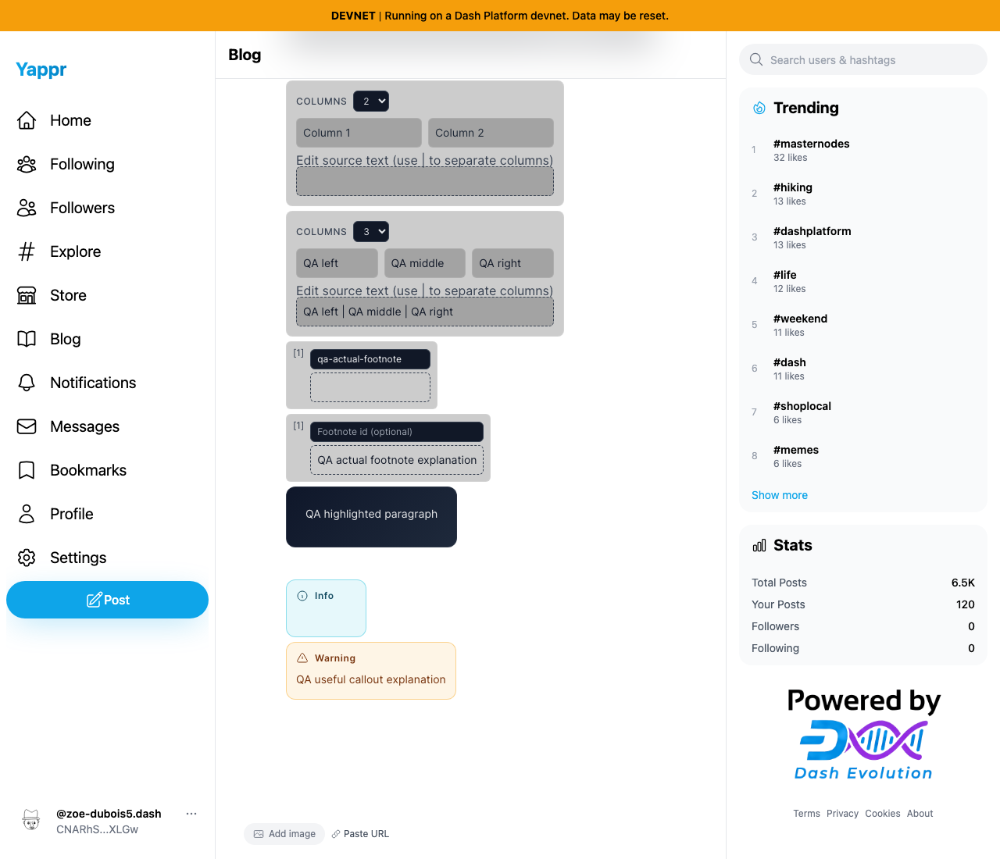
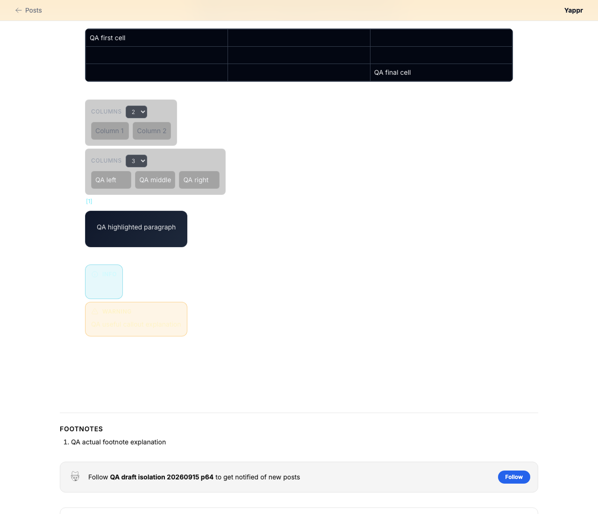
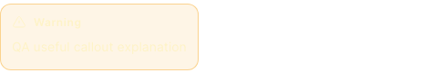
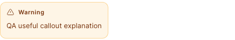
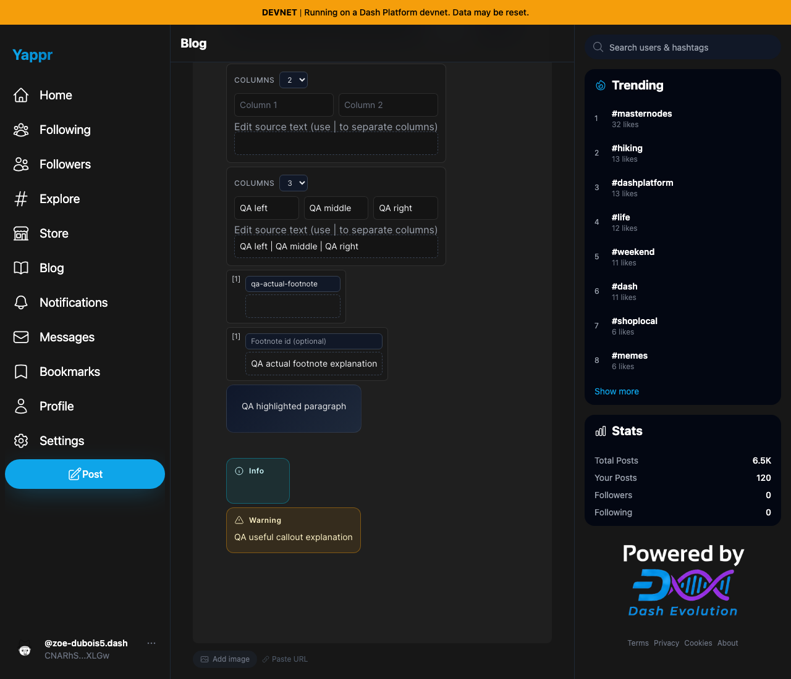

# Readable blog custom blocks in Light mode

QA140. Exact before base `cf0efbc10b8757137063113ebbd2061e8b87d8f7`; full signed after head `3d5e5c45031f6a9de1579ddd66f9256b50304cea`. Independent Devnet production exports at3288/3347. Head build ID3d5e5c45 verified after restarting the server following the final build. Earlier local c56875f9 captures were incomplete and replaced before any publication.

The custom editor/reader blocks used pale foregrounds on pale surfaces. Light colors now provide readable callouts, TOC, columns and footnotes. The reader's BlockNote theme follows the resolved application theme, matching the existing editor, so its formerly hardcoded nested dark class no longer defeats Light colors. Existing Dark foregrounds are retained.

Shared real fixture: owner64 `CNARhSLcQRfdxLZXTrvDVtVGKg1RHXjwJTpGSd2DXLGw` edits secondary blog `SuUcVGu4Maz5NRv5XCBCQQp3oi9WaVtF24fzYYNrK41`, article `qa-offline-publish-recovery-p64`; independent reader65 `9cjhprZAFUDVG71Fo8b5eCzHpwjo9Aj9npcRRpmCJBbw` reads the same saved article. Content was populated through normal editor controls and independently saved/read before capture.1280×1100, disposable Chromium contexts, Light/Dark OS setting for editor and actual Aa palette buttons for reader. The four editor callout variants changed only in an unsaved form; the saved reader variant remains Warning. No network data writes occurred during comparison. Seeded auth setup is not login evidence.

| Surface | Before — exact base | After — full PR head |
|---|---|---|
| Light editor — columns, footnotes, callout |  |  |
| Light reader — same saved custom content |  |  |
| TOC editor placeholder |  |  |
| Info callout |  |  |
| Warning callout |  |  |
| Tip callout |  |  |
| Note callout |  |  |
| Dark editor compatibility |  |  |

All16 original-resolution final PNGs were opened and inspected. Table images link to full-resolution originals. Visible light editor column placeholders and text, footnote marker/text, all four callouts, and reader warning/reference are directly represented; individual computed measurements cover the remaining reader TOC title/link. Gradiented background-section colors are unchanged and outside the foreground claims.

Contrast uses computed foreground colors and alpha-composites every ancestor background before WCAG relative-luminance calculation. All16 measured Light targets meet4.5:1 at the final head; minimum4.525:1. All16 Dark measurement objects are identical before/head. This is a scoped measured-block claim, not a claim that the whole application meets WCAG.

| Light target | Before ratio | After ratio |
|---|---:|---:|
| toc | 1.72:1 | 6.99:1 |
| column-label | 1.58:1 | 6.42:1 |
| column-text | 2.29:1 | 7.05:1 |
| column-placeholder | 1.92:1 | 5.83:1 |
| column-source | 2.29:1 | 7.05:1 |
| column-help | 1.58:1 | 6.42:1 |
| footnote-marker | 1.09:1 | 6.42:1 |
| footnote-text | 1.46:1 | 11.05:1 |
| info-callout | 1.02:1 | 8.31:1 |
| warning-callout | 1.03:1 | 8.41:1 |
| tip-callout | 1.03:1 | 8.85:1 |
| note-callout | 1.05:1 | 9.69:1 |
| reader-toc-title | 1.58:1 | 6.42:1 |
| reader-toc-link | 1.11:1 | 4.53:1 |
| reader-footnote-reference | 1.45:1 | 7.27:1 |
| reader-warning-callout | 1.03:1 | 8.41:1 |

Validation: targeted ESLint on both changed files, full TypeScript, committed Devnet production build, independent final two-file source review APPROVED. Browser regression covered two real articles × Author/Light/Dark/Sepia at each revision; heading/prose/list/code/table/custom content and image inventory, measured block geometry and wrapper styles remain identical. Sepia survives a full reload and Reset restores Author. The initial test assumed Author was Light; actual saved default author palette is Dark, and the corrected expected palette passed. No app defect inferred from that harness assumption. Raw results and compatibility comparison are included.

Product worktree contains only the two intended source changes; capture machinery and artifacts remain outside it. No credentials or authenticated storage are included.
