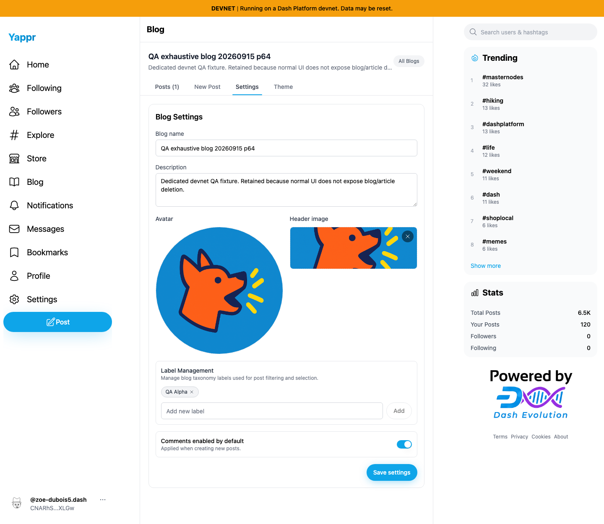
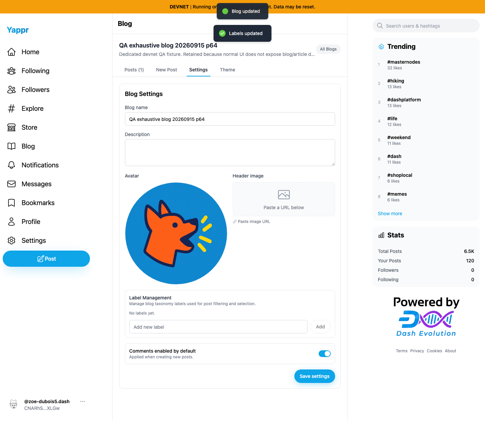
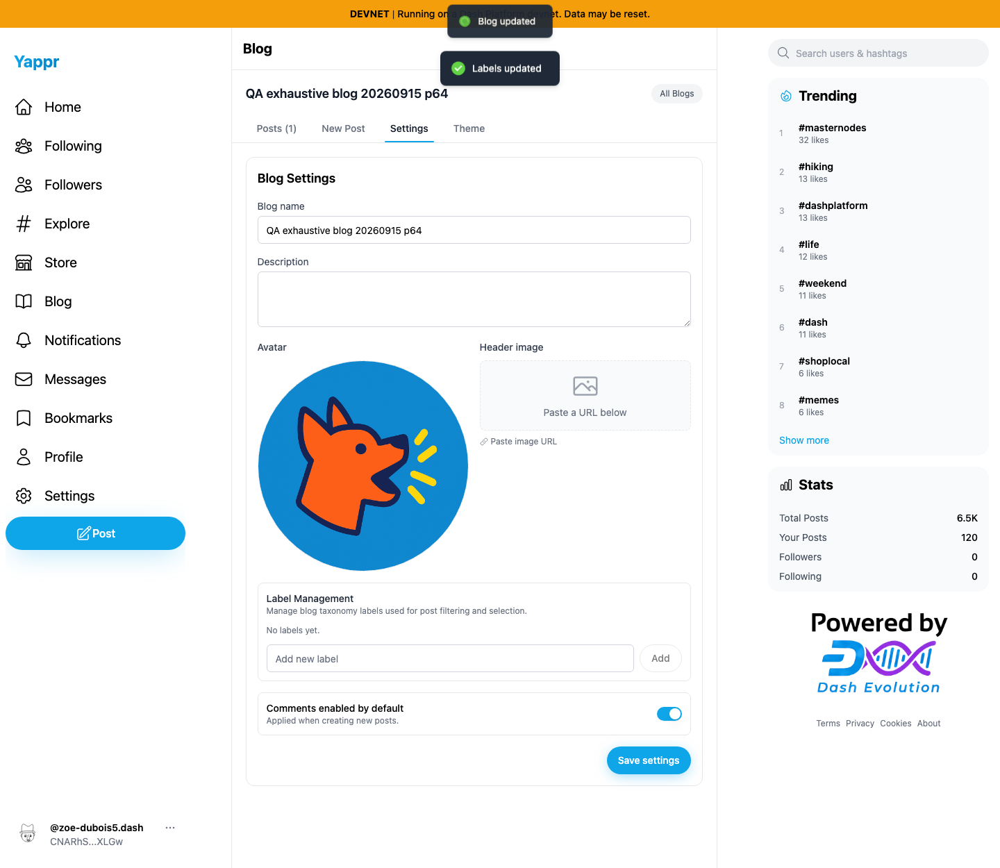
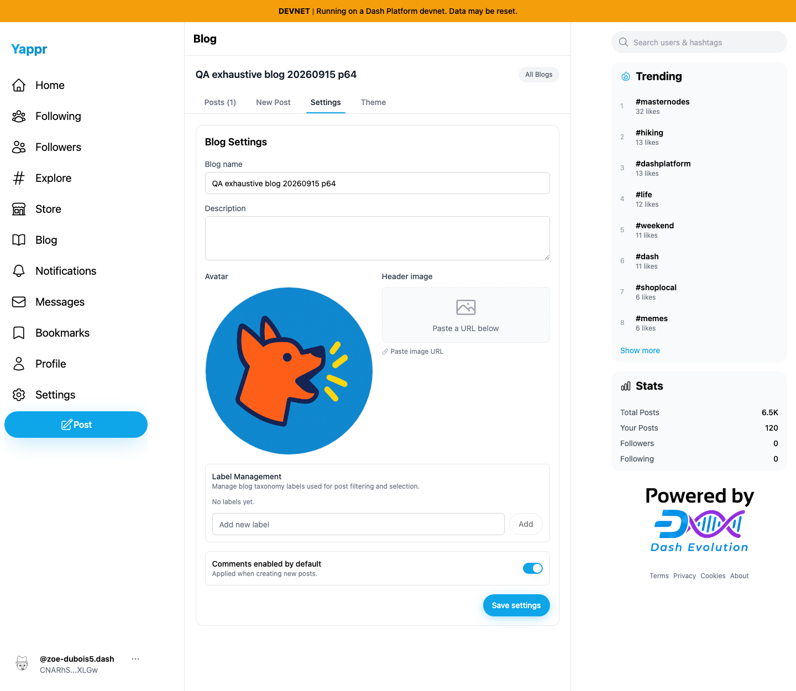
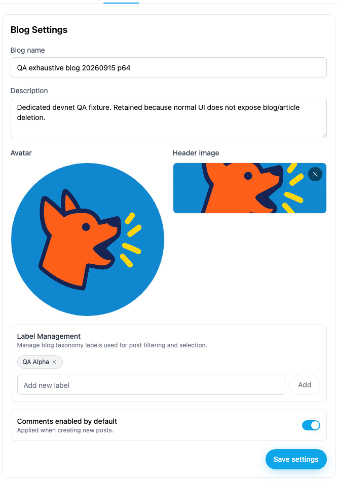
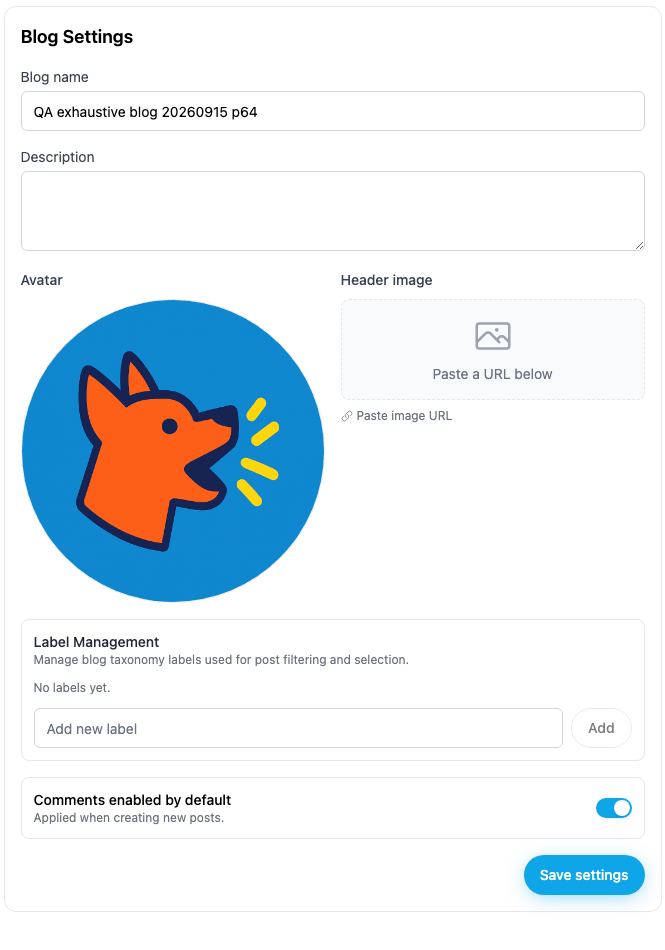

# Blog optional settings persist after clearing (QA89)

On staging, clearing Description, removing Header image, and removing the final taxonomy label all report success, but saved values return after a fresh reload. This fix preserves explicitly undefined fields through the blog service so the existing document replacement code can remove them. Omitted fields remain unchanged.

## Exact provenance

- Before: staging base `cf0efbc10b8757137063113ebbd2061e8b87d8f7`, independently built static export on port 3288.
- After: full PR head `dc951d9a6c0f23ddf3d6eca9dfbb1cc4a5e3d22e`, independently built static export on port 3306.
- Both use the same Python static-export adapter, devnet deployment, Chromium 1440 × 1250 viewport, light appearance and dedicated persona64. Each revision starts in a fresh browser context; authentication is restored from the private QA fixture without displaying credentials. Product UI, network responses and document contents are not mocked.
- Blog: `BdMQRKM6xT8jx4bKbkhP3wYo7V835pDjcEWTbN5PMNRU`; owner: `CNARhSLcQRfdxLZXTrvDVtVGKg1RHXjwJTpGSd2DXLGw`; name: **QA exhaustive blog 20260915 p64**.
- Both runs start with the same description, header `https://yap.pr/yappr.png`, sole label **QA Alpha**, unchanged avatar and enabled comments. These are temporary ordinary-UI settings on an existing dedicated QA blog, not production content.

## Matching starting state

| Before — exact base | After — full PR head |
| --- | --- |
|  |  |

## Both revisions report success

Remove the final QA Alpha label and wait for **Labels updated**. Empty Description, use Header image's remove button, then click **Save settings** and wait for **Blog updated**. Both forms show blank fields and no labels at this stage. Label removal writes immediately; the full settings save follows.

| Before — exact base | After — full PR head |
| --- | --- |
|  |  |

## Fresh reload exposes the bug and confirms the fix

Reload the page, reopen the same blog and select Settings. Before, Description, Header image and QA Alpha return. After, Description and Header image remain empty and **No labels yet.** persists. The blog subtitle also disappears after a successful clear, so the after form begins slightly higher.

| Before — exact base | After — full PR head |
| --- | --- |
|  |  |

Focused views of the same final reload screenshots preserve the settings card at readable resolution. Only cropping was applied; these are not reconstructed or edited UI states.

### Before — saved values returned

### After — cleared fields remain empty

All eight final PNGs were opened and inspected at original resolution. The captures wait for Posts (1) and the sidebar logo to settle. An earlier local capture attempt with mismatched static adapters was discarded before publication.

## Validation and limits

- Four regression cases (description, avatar, headerImage, labels) fail on the base. All seven new blog tests and five existing profile tests pass on the final source. The tests exercise the actual document merge/replacement code with SDK and transition endpoints mocked; the screenshots and fresh readbacks provide the separate live devnet persistence evidence.
- Compatibility cases cover omitted optional fields, rejected replacement errors and creation with unset fields. Full lint, TypeScript and exact-head devnet build pass. An independent source review and provenance/validation audit found no blocking issue. The build retains existing static-export header warnings and a server-rendered cart localStorage diagnostic.
- Avatar clearing has service regression coverage but is **not live-UI screenshot-covered here**: the separate QA90/#472 defect prevents ordinary removal of the circular avatar. The existing avatar remains unchanged in every comparison; this PR does not contain that UI fix.
- Final fresh readback restored the fixture's original description, both QA Alpha and QA New labels, absent header, original avatar, name and comments setting. The existing article and theme were untouched. Safe before/after/restoration values are in [results.json](results.json).

This establishes a Yappr service bug. It does not establish a Dash Platform or GroveDB persistence defect.
