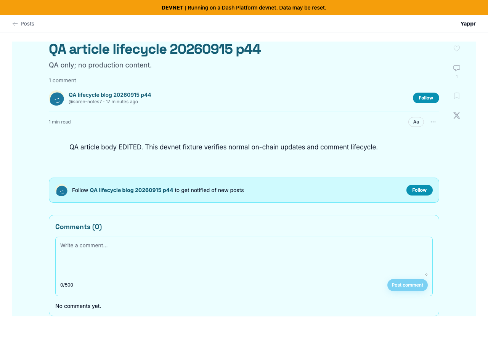
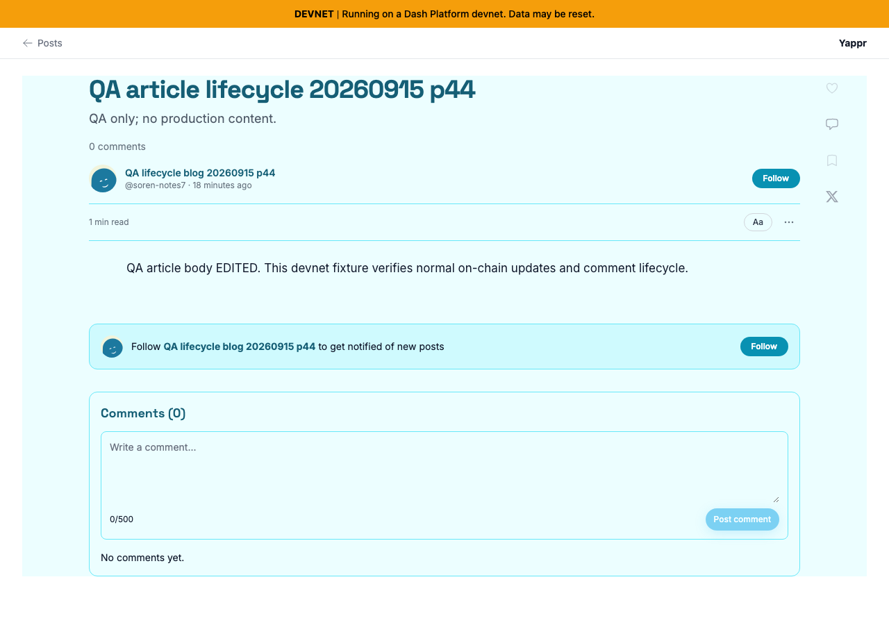

# Article comment count after deleting own last comment

| Surface | Before | After | Shared fixture | Expected visible delta |
|---|---|---|---|---|
| Published article after own-comment deletion | 4105c5d1c914f5d0838619da93c3b8d28b4a780e | 071fe2fcff24b69b641dea356c95b7ca88186d67 | Blog GZkg15HyWHb3L4QjcnE6xU2AqkPBtxSYhC76qVHSu1rz; article qa-article-lifecycle-20260915-p44; persona45 | Before header/rail retain1 while Comments(0) is empty; after header/rail clear immediately |

Actual independent production builds on the same devnet,1280×900, Ocean blog theme, light app appearance. Disposable seeded sessions authenticate the same QA viewer. Each run creates and deletes a different owned comment with identical text through normal UI; comment IDs differ. The article/blog/viewer are identical. Both runs start and finish with fresh, completed No comments yet reads. No responses or visible page state are fabricated.

| Before — exact base | After — full PR head |
|---|---|
|  |  |

Both final images inspected at original resolution. The one-minute relative timestamp difference reflects sequential captures. Source lint, standalone TypeScript and production devnet build passed; independent review approved. Browser assertions confirmed the stale base state and corrected head state, with fresh owner readback verifying cleanup after each run. This preserves the current loaded/filtered-comment count semantics and100-comment fetch limit.
