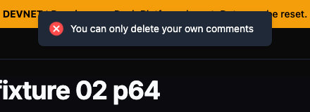
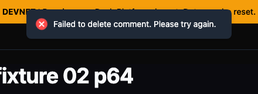
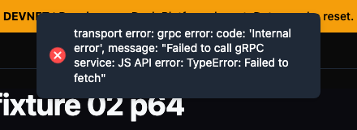
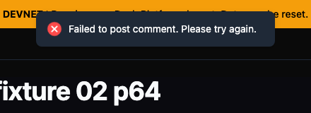
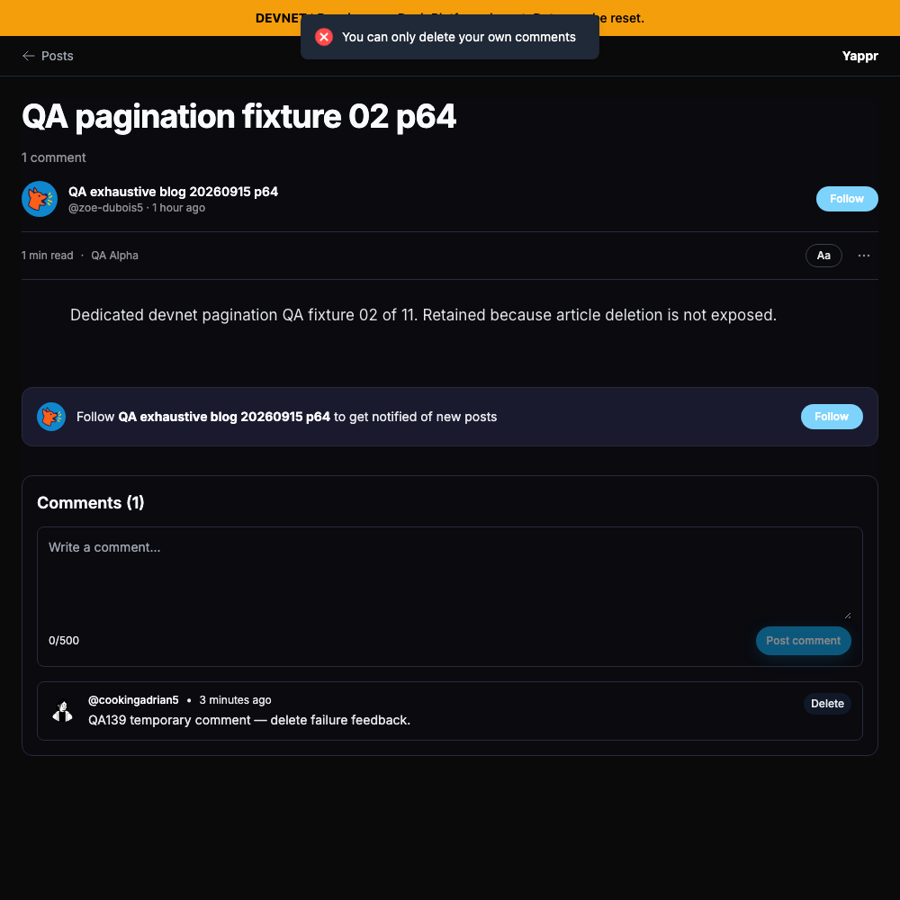
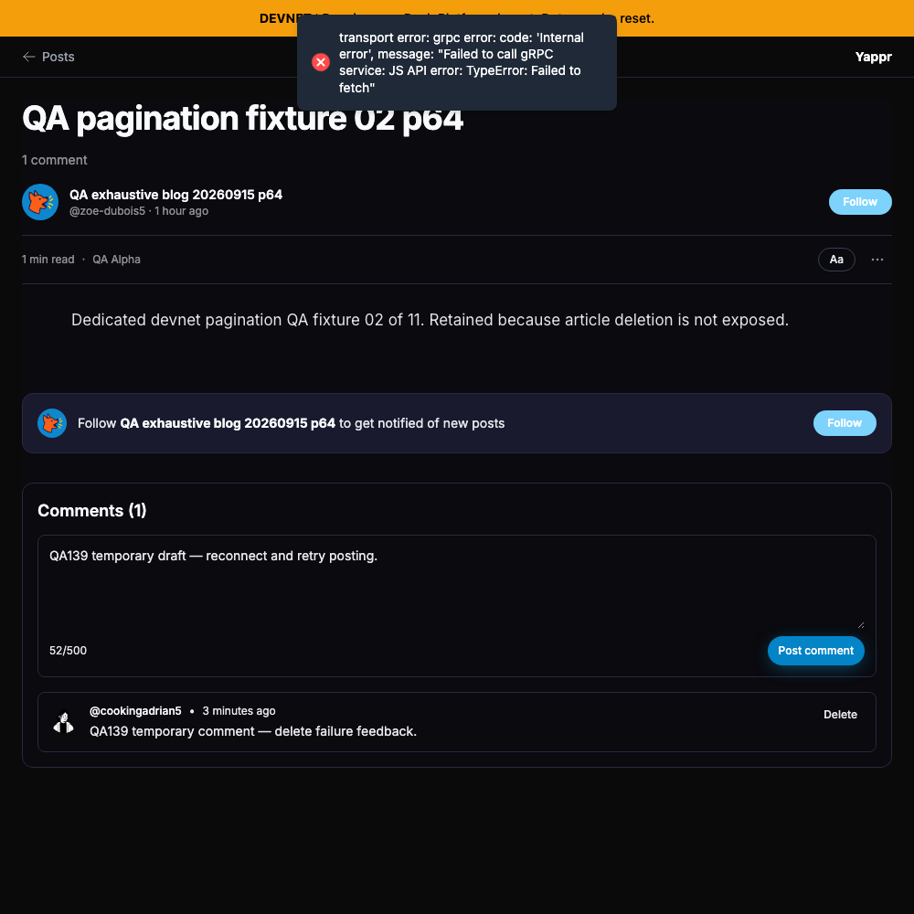
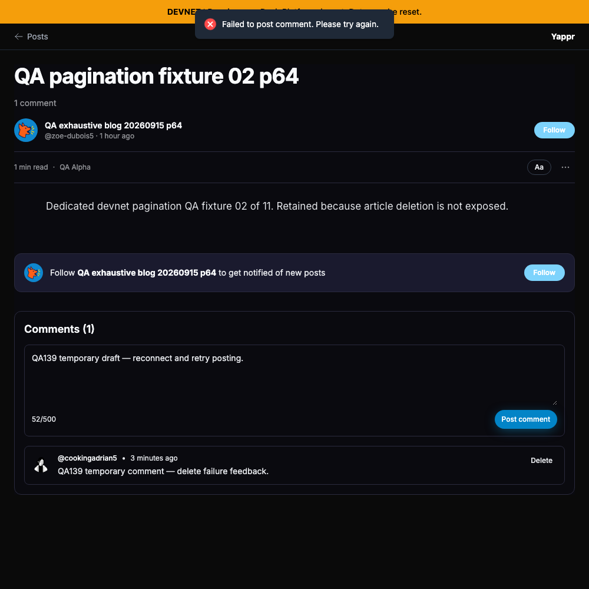

# QA139 — accurate blog-comment mutation errors

Before: exact staging base `cf0efbc10b8757137063113ebbd2061e8b87d8f7`.
After: signed full head `1abae6535f769005f7d73cb209e7b12b54dc5188`.
Both independently built as production devnet exports. `provenance.json` verifies each source head against its local build ID and the build ID read from served HTML.

## Shared fixture

- Blog: `BdMQRKM6xT8jx4bKbkhP3wYo7V835pDjcEWTbN5PMNRU`.
- Article: `GYHfwBcMLfbUP7cKovkKPYiScN4d2g2fTF8H3Gm9KZN`, slug `qa-pagination-fixture-02-p64`.
- Reader/comment owner 65: `9cjhprZAFUDVG71Fo8b5eCzHpwjo9Aj9npcRRpmCJBbw`.
- Same actual comment on both sides: `HKkWjeo4JTfQVXzL7wEXY3HRVzk8eKW7XD93Yt3HvDx9`, text `QA139 temporary comment — delete failure feedback.`
- Same draft: `QA139 temporary draft — reconnect and retry posting.`

The comment was created through the ordinary UI and confirmed by a reload plus an independent SDK read. Both comparisons use fresh browser contexts with the same seeded identity session (not login-flow evidence), 1000×1000 viewport, current dark author palette, and the same article. Only the browser's normal offline setting simulates disconnection; no response or DOM injection. Both final pairs display the same three-minute comment timestamp. First attempts captured during toast entry animation were rejected before publication and replaced with settled captures.

## Error messages at readable size

These are unchanged-pixel crops `(280, 0, 720, 160)` from the complete screenshots below; nothing was redrawn or annotated.

| Failure | Before — exact base | After — full PR head |
|---|---|---|
| Offline deletion of the reader's own comment |  |  |
| Offline posting |  |  |

## Complete UI context

The existing comment remains after failed deletion, and the same draft remains after failed posting. Controls are enabled for deliberate retry.

| Failure | Before — exact base | After — full PR head |
|---|---|---|
| Offline deletion, same owned comment |  |  |
| Offline posting, same retained draft |  |  |

## Validation and cleanup

Target ESLint, full TypeScript, and the committed production devnet build passed. Independent actual-diff code-review-validator APPROVED. Service ownership checks are unchanged; actual errors remain in the logger.

Actual browser assertions confirm correct before/after toast text, retained own row or draft, and enabled controls after each failure. On the final head, reconnecting and retrying deletion removes the same owned row; a fresh reload confirms zero. Retrying the retained draft online creates exactly one comment after reload. That temporary comment is then deleted and fresh reader/owner reads return to zero; independent SDK metadata is included to confirm cleanup.

See before/after result JSON, recovery JSON, SDK metadata, and scripts for exact assertions. This fix changes feedback; it does not claim offline writes succeed or alter authorization behavior.
