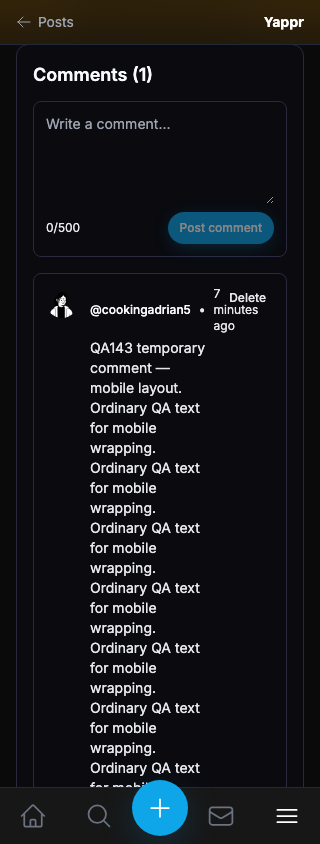
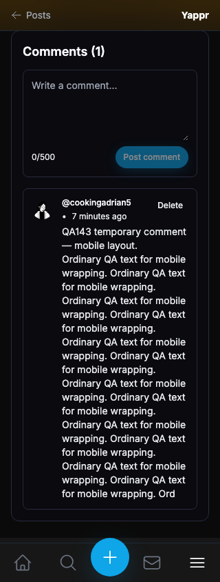
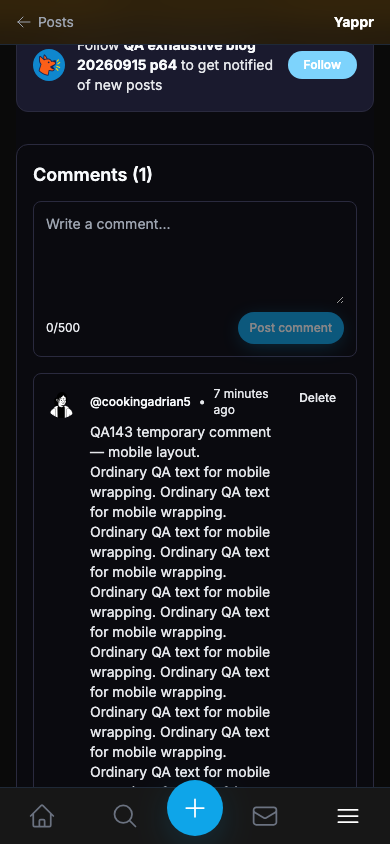
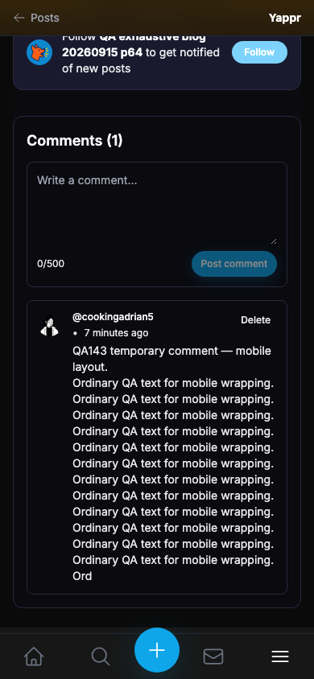
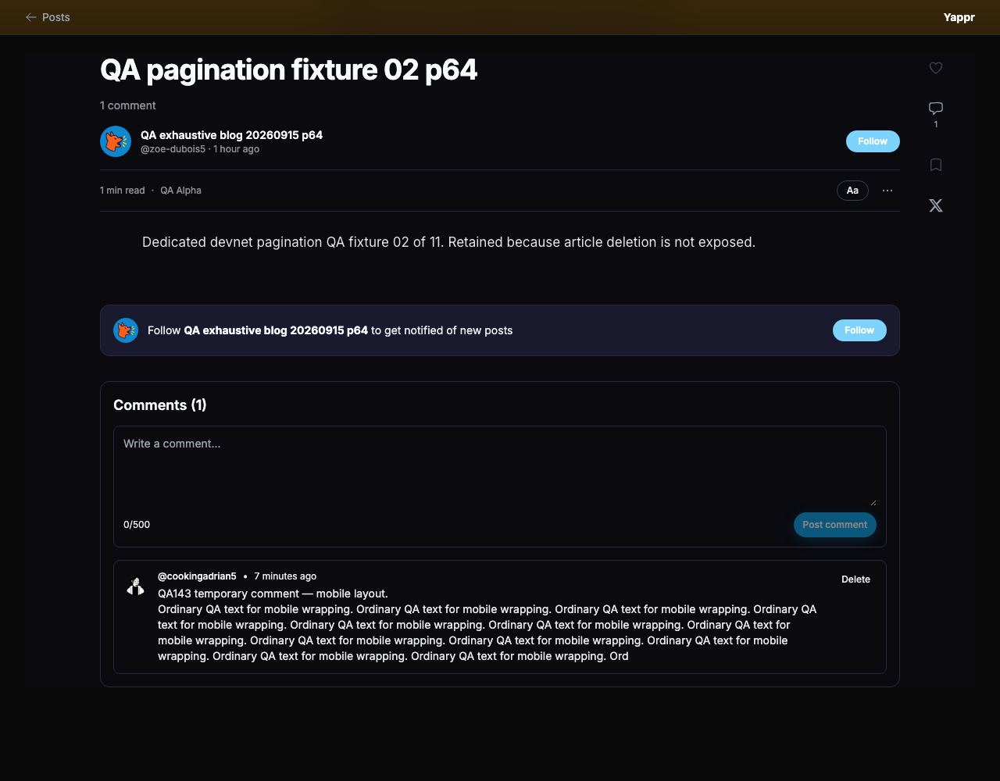
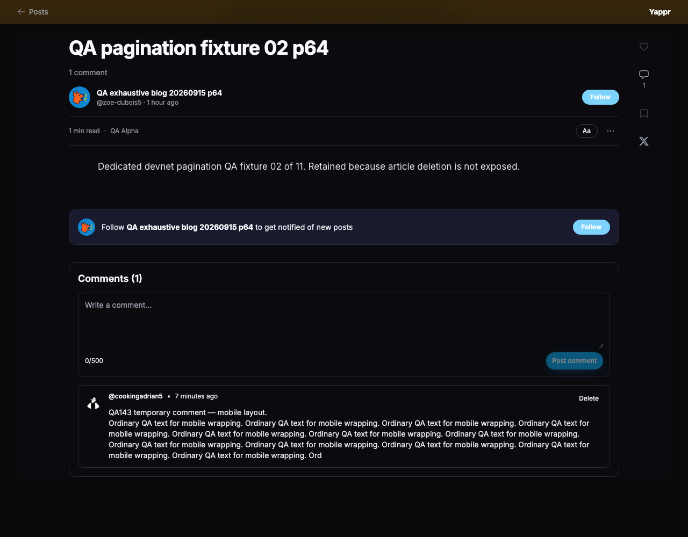

# QA143 — separate mobile comment metadata and actions

This PR is stacked on QA139 / PR #535. Before is its exact signed head `1abae6535f769005f7d73cb209e7b12b54dc5188`; after is signed full head `3a952e8e3d0522c04a3bb8437320e72e33e34345`. Both are independent production devnet builds. Served HTML build IDs match source and local build IDs in `provenance.json`.

## Shared fixture and framing

Both sides use the same actual reader 65 comment `BvTdTyCtF3FQxF3t9m35RVFAEMe1StpMpchqaUHpwP6b`, owned by `9cjhprZAFUDVG71Fo8b5eCzHpwjo9Aj9npcRRpmCJBbw`, with the same 500-character multiline content beginning `QA143 temporary comment — mobile layout.` The comment was created through the ordinary UI and verified after reload and with an independent SDK read.

Blog: `BdMQRKM6xT8jx4bKbkhP3wYo7V835pDjcEWTbN5PMNRU`.
Article: `GYHfwBcMLfbUP7cKovkKPYiScN4d2g2fTF8H3Gm9KZN`, slug `qa-pagination-fixture-02-p64`.

Fresh browser contexts, same seeded reader session (not login-flow evidence), current dark author palette, viewport widths 320/390/1280. At each width the comment begins at the same screen Y on both sides, chosen to fit the shorter after row; the before text continues below the viewport where necessary. Final captures all show the same seven-minute timestamp. These are viewport captures, not tall full-page captures containing hidden mobile navigation sheets. No DOM, network-response, data, or clock injection.

| Surface | Before — exact stacked base | After — full PR head |
|---|---|---|
| 320px: timestamp shares the Delete column and wraps into three lines; after it wraps below the author, separate from Delete |  |  |
| 390px: wrapped metadata remains readable and body gets the available width |  |  |
| Desktop: same author/time/action, body below the header |  |  |

## Verification

- On the exact before build, timestamp and Delete bounding rectangles overlap at 320px. On the final head, name/time/Delete do not overlap at 320/390/1280; all rows remain within the viewport without horizontal overflow.
- At320px, body width increases from 119.2px to 184px. The same 500-character row shrinks from 858px to 466px tall. At 390px, body width increases from 189.2px to 254px. The screenshots intentionally show this related layout change.
- Separate real owner 64 and guest reads at 320px have no Delete control and no row/document overflow. The ownership guard is unchanged.
- In the final head, Tab from the empty comment textarea reaches the native Delete button. Enter deletes the own comment. A declared 250ms browser network latency makes the normal Deleting state observable; its longer button label still does not overlap the author. Network responses were not modified. Fresh reader reload confirms zero; final independent cleanup metadata is included.
- Target ESLint, full TypeScript, and committed production devnet build passed. Independent actual-diff code-review-validator APPROVED. Only the layout in components/blog/blog-comments.tsx changes relative to the stacked base.

Result JSON includes actual rectangles, content, and focus/cleanup assertions. All temporary comments are removed after testing.
