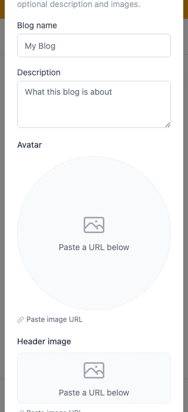
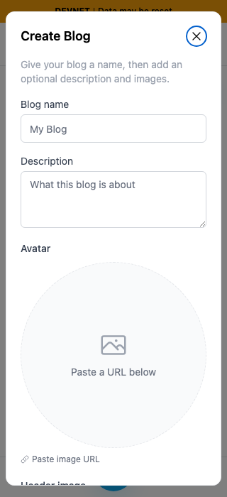
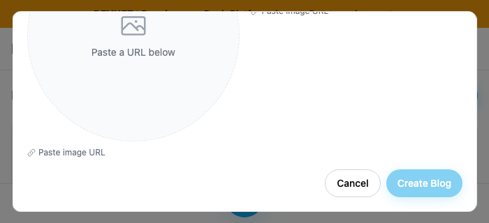
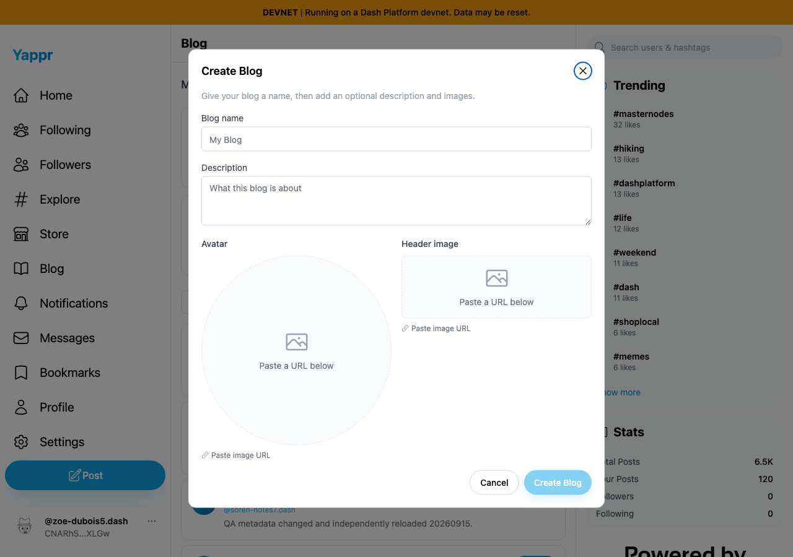

# Create Blog dialog remains reachable on small screens

Before exact base: cf0efbc10b8757137063113ebbd2061e8b87d8f7. After full signed head: e18682a89e16308e261ef38cf06ef5270fcf80f7. Independently built devnet production exports, Chromium, light appearance, fresh seeded persona64 sessions. This is dialog validation, not authentication or publication testing. Same empty unsaved form; no blog write submitted.

At320×700 the base dialog is875px tall, starts above the viewport, and wheel scrolling cannot reveal the footer. The head stays within16px margins and scrolls internally207px to expose Cancel/Create. At700×320 it scrolls450px; at1280×900 the original741px layout remains unchanged. A valid temporary name enables Create; keyboard focus scrolls the footer into view; Cancel and Escape remain usable. The independent opener-focus defect QA91 is unchanged by this layout fix.

| View | Before — exact base | After — full PR head |
|---|---|---|
|320×700 initial header|||
|320×700 after same wheel gesture|||
|700×320 after same wheel gesture|||
|1280×900 desktop compatibility|||

All eight final PNGs were opened and inspected at original resolution. Earlier capture attempts using a static server without root public assets were rejected and replaced before publication. The final servers serve the same assets consistently. Runtime sidebar counts are incidental; no claim depends on them. No page markup or visible data was injected.

Targeted ESLint, TypeScript and the committed devnet production build passed. Independent actual-diff review approved the bounded dialog scrolling and focused-control scrolling change. Source dependencies/lock/vendor were confirmed equal before reusing the existing installed dependency tree. The initial build failed because a shared dependency symlink resolved an absent vendor dist; the final clean build passed using a verified matching dependency tree. See raw bounds/results and SHA-256 manifest.

Final focus-wrap verification: 18 forward/reverse Tab steps at each small viewport (36 total) stayed inside the dialog and kept the focused control visible, including the loop from Create back to Close. Explicit focus scrolling handles Radix focus-loop preventScroll behavior. This exact-head comparison supersedes the intermediate ba8a6331 capture.
