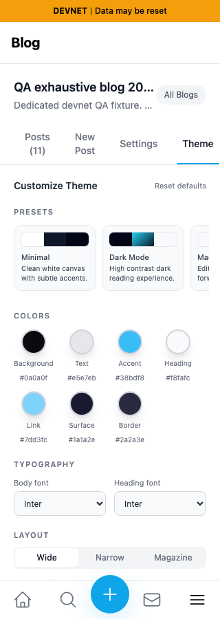
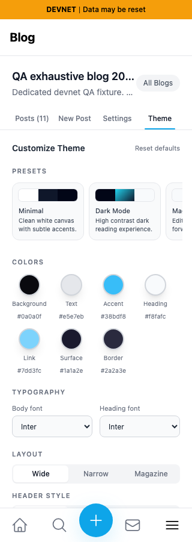
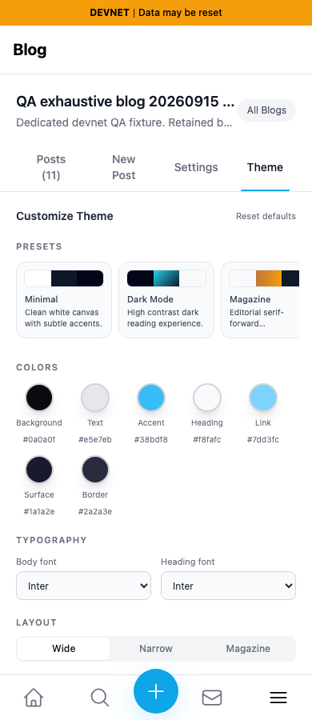
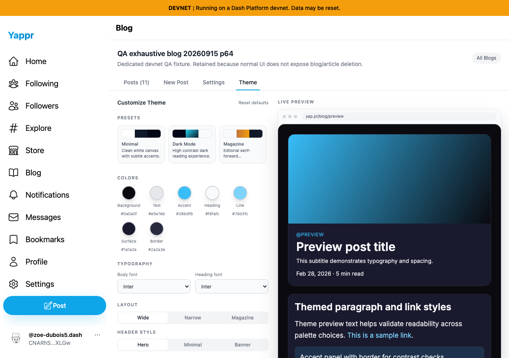

# Blog management tabs fit narrow phones

Exact base `cf0efbc10b8757137063113ebbd2061e8b87d8f7`, full signed head `8ea875040544808c611acb670029c9c095918f69`. Independent committed Devnet builds on3288/3343; build ID checked. Same reserved owner64, actual blogBdMQRKM6xT8jx4bKbkhP3wYo7V835pDjcEWTbN5PMNRU with11actual QA articles, Theme selected, fresh disposable contexts, no writes.

At320px, the base document is327px wide: Theme extends to326.58px and its underline clips. Head uses compact equal-width tabs through360px: all four labels fit one row, Theme ends at300px, and the document is320px wide. Styles and measured positions at375,390and1280px are identical before/after.360px also fits. All four native tab controls stay in the viewport duringTab navigation and Enter opens the expected Settings,Theme,Posts,NewPost surface at all five widths. No claim of ARIA arrow-key tab navigation is made; this fix only addresses overflow.

| Width | Before — exact base | After — full head |
|---|---|---|
|320|||
|390 compatibility|||
|1280 compatibility|||

All six final images personally inspected at original resolution. Raw measurements and keyboard checks are in results JSON; local hashes/bytes inmanifest.json. Public artifacts verified byte for byte after upload and rendered PR/index inspected. Seeded sessions do not establish login coverage. Targeted ESLint,TypeScript,committed Devnet build and independent final source review passed. Intermediate7946699e was never published as final evidence; full head above narrows the nowrap rule so wider layouts remain unchanged.
