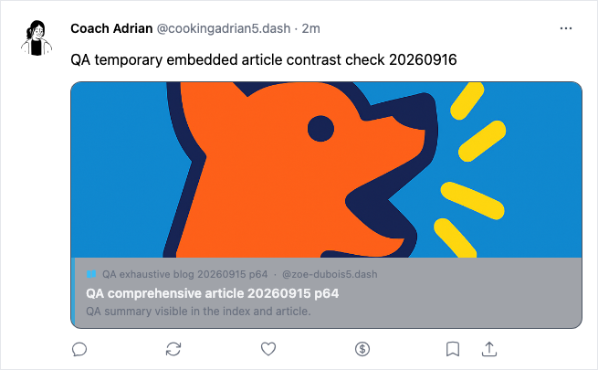
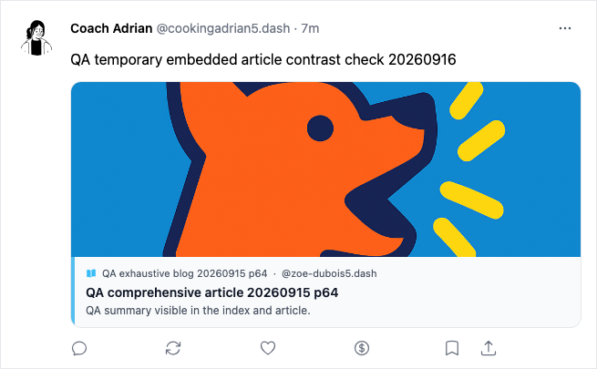
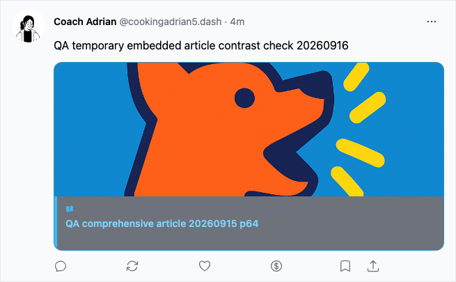
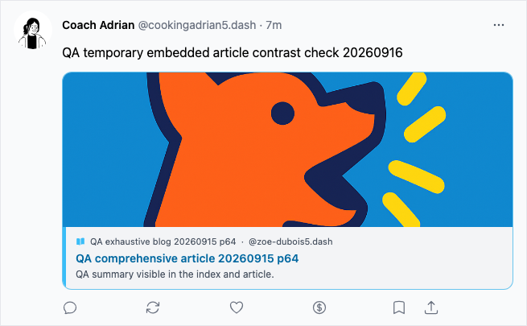
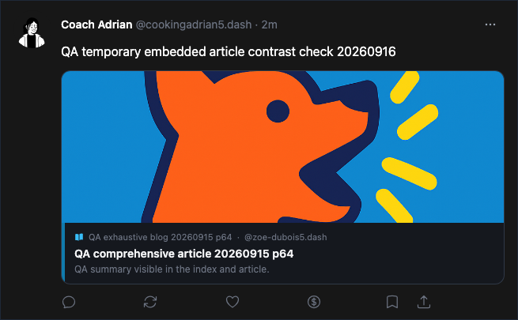
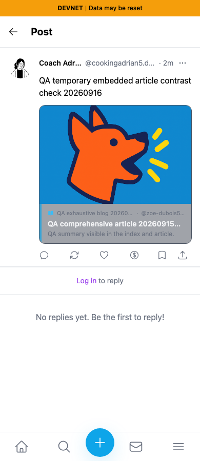
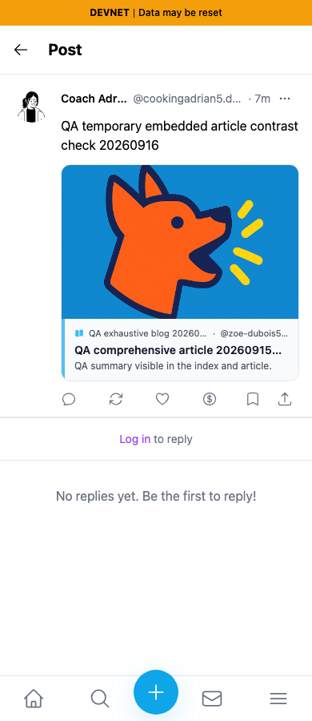

# QA141: embedded blog quote contrast

Before exact staging base: `cf0efbc10b8757137063113ebbd2061e8b87d8f7`. After full PR head: `a153c413815ea340b8ce40bbaf23bb9f9c499d12`. Production builds run independently; source HEAD, clean tree, BUILD_ID and served HTML prefix were checked. Final after server: localhost3397. A conflicting port3381 attempt was rejected by contrast assertions and produced no selected screenshots.

The same real devnet quote `AhFkuPmp5TjxyiswZpWowAoA85ofrX8YDBcSmcBKWkPg` appears in both revisions. It was created through the normal article Quote action by dedicated persona65, Coach Adrian (`9cjhprZAFUDVG71Fo8b5eCzHpwjo9Aj9npcRRpmCJBbw`). The quoted blog is `BdMQRKM6xT8jx4bKbkhP3wYo7V835pDjcEWTbN5PMNRU`, article `66syyLM2ZAakx2JNZuMJw4PY896cphx8Q2vc1kVCNTK`, slug `qa-comprehensive-article-20260915-p64`. This is a controlled QA fixture using actual UI creation and public document reads, with no fabricated responses or edited DOM.

Fresh guest Chromium contexts,1280×900 and390×900 screenshots;320×900 also measured. Theme selected through OS color-scheme emulation, with the app's default system preference. Normal and hover states settled before capture. Text/background values come from actual computed CSS, with alpha background colors composited across ancestors. All title, source, and excerpt ratios exceed4.5:1 after the fix across12theme/viewport/interaction states (36assertions). These measurements concern this card's text, not application-wide accessibility compliance.

| Text/state | Before | After |
|---|---:|---:|
| Light title, normal |2.31:1|16.98:1|
| Light title, hover |2.88:1|5.39:1|
| Light source/excerpt, normal |1.90:1|7.23:1|
| Light source/excerpt, hover |1.01:1|6.87:1|
| Dark source/excerpt, normal |3.70:1|7.04:1|
| Dark source/excerpt, hover |3.89:1|7.41:1|

Both revisions passed real quote-to-article navigation in both themes, with no horizontal page overflow at320/390/1280. Lint, types, production build, and independent actual-diff review passed. No interaction, data, image, or truncation behavior changed.

Every final screenshot and focused crop was opened and inspected at original resolution. Focus images are unscaled crops of the same x275,y100,width655,height405 region. Full overviews retain application context. Relative-time text and the unrelated external footer logo vary naturally; the post, cover, author, title, excerpt, route, viewport, and theme remain matched. No claim is made about the footer logo.

| Before — exact base | After — full PR head |
|---|---|
|  |  |
|  |  |
|  |  |
|  |  |

The temporary quote was deleted through the UI after both captures. A fresh direct route shows its tombstone without the embedded article, and independent SDK read confirms deleted=true, empty content, correct owner, and revision2. The original blog/article metadata was not modified. See cleanup.json and public-tombstone.json. SHA256SUMS records final published file hashes; public bytes/content types and rendered PR comparison are verified separately before handoff.
