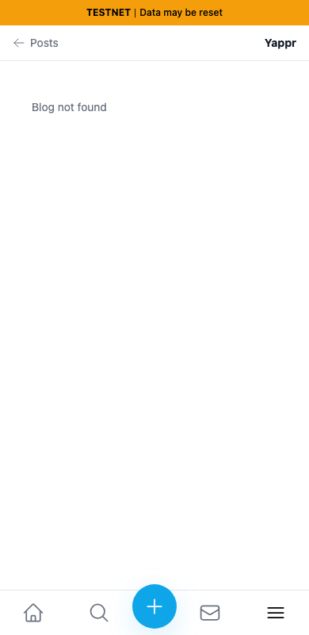
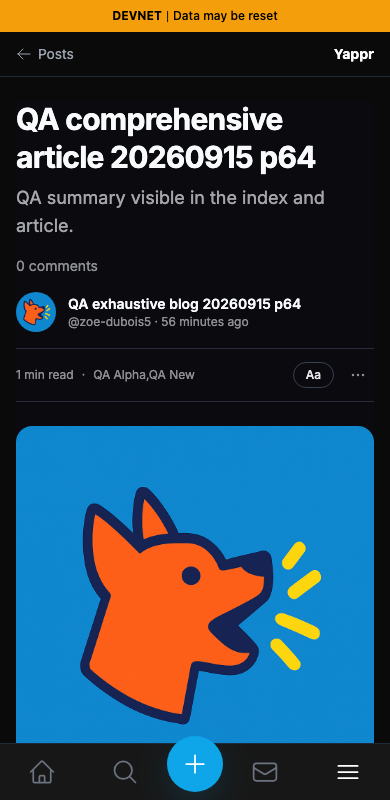

# Article share links preserve the deployment path

The actual Copy link result from exact base `cf0efbc10b8757137063113ebbd2061e8b87d8f7` is `https://yap.pr/blog?blog=BdMQRKM6xT8jx4bKbkhP3wYo7V835pDjcEWTbN5PMNRU&post=qa-comprehensive-article-20260915-p64`. From full signed head `7d2125e2aa5b4de9e0efe76d035acfecfd454702`, it includes `/devnet` before `/blog`. Both revisions were built independently, base on3288 and head on3342; head build ID `7d2125e2` was checked. All three social actions use the same correct URL, verified from their actual outgoing popup requests before any external redirects. No social posts were submitted.

The screenshots below show **the live canonical destinations opened directly from those clipboard values**, not local copies of the destination UI. The root site uses Testnet and cannot find this Devnet article; the corrected link opens the actual article on Devnet. Destination deployments may advance independently of the source revisions which generated the links. Exact resulting URLs and page text are in the corresponding results JSON.

Same persona65 for clipboard generation, fresh disposable sessions,1280×900, same existing actual QA article66syyLM2ZAakx2JNZuMJw4PY896cphx8Q2vc1kVCNTK. Sessions were seeded; this is not login evidence. No blog/article/comment writes. Theme differences are inherent to the wrong deployment/error destination and not a style claim.

| Destination copied from exact base | Destination copied from full PR head |
|---|---|
|  |  |

The390×800 focused pair reopens the recorded actual clipboard destinations in fresh guest contexts. [Desktop before](before-destination.png) and [desktop after](after-destination.png) preserve the original1280×900 capture.

Four final original-resolution images were personally inspected. `manifest.json` records local SHA-256 hashes and bytes. Public files were retrieved and compared after publication; the rendered PR and evidence index were checked separately.

Validation: targeted ESLint, full TypeScript, committed Devnet build, independent source review, actual clipboard destination and X/Facebook/Reddit request URL comparisons. Empty basePath retains the existing root-deployment URL by inspection of the shared construction. No merge performed.
