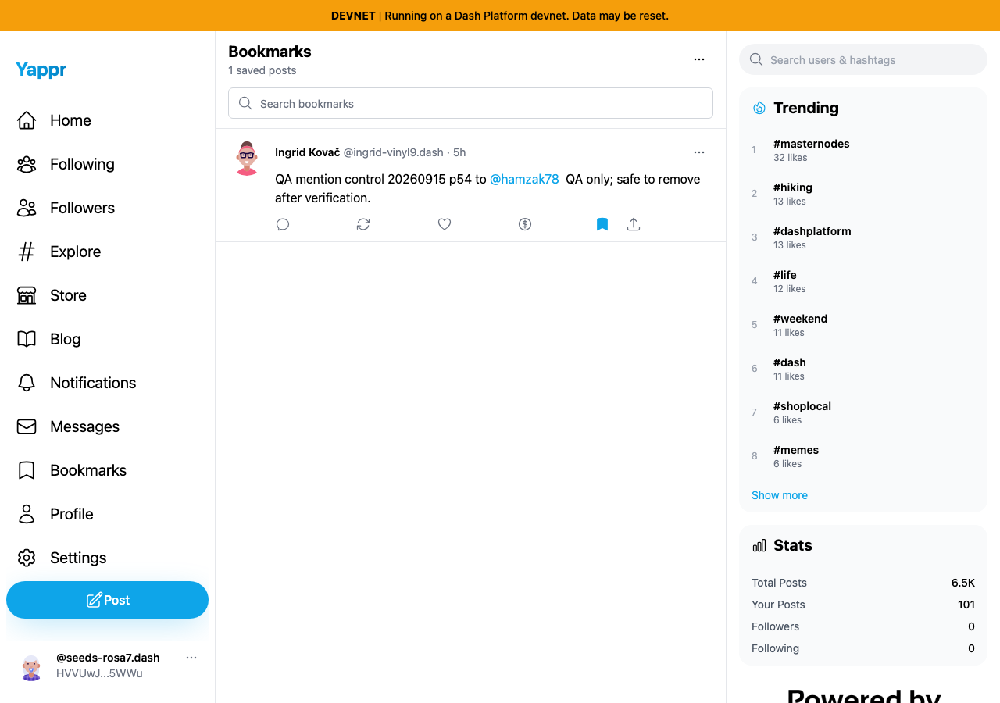

# Singular bookmark count — QA116

Exact before base `cf0efbc10b8757137063113ebbd2061e8b87d8f7`; full signed after head `f12264e96bfcc36da5e853632f15e9ba3951cea1`. Independent committed production devnet builds on local ports 3288/3396; same synthetic persona55 `HVVUwJLhEngLH5LkZx8FgUkcso28xK7tn5gaaHke5WWu`, same saved public post `9gWVtfjkRp9dytJiKZ3FJENZnt3sqppe5V3bc1VkZavs`, fresh Chromium contexts, light theme and matching 1280×900 / 390×844 viewports. Private scoped session restoration is not fresh-login evidence.

With exactly one saved post, the base says **1 saved posts**. The head says **1 saved post**. Focused header captures make the corrected word readable; the full overviews show the same real saved post. No DOM, response or displayed count was injected.

| Header | Before — exact base | After — full PR head |
|---|---|---|
| Desktop |  |  |
| 390px |  |  |

| Page context | Before — exact base | After — full PR head |
|---|---|---|
| Desktop |  |  |
| 390px |  |  |

All eight final PNGs were opened and inspected at original resolution. The unrelated footer branding differs with local static-asset mounting. Exact single-count assertions are in the adjacent before/after JSON.

Validation: targeted ESLint, full TypeScript check and committed devnet production build passed. The account initially showed **0 saved posts**. One existing public post was added through the normal post action to capture the singular state. A second existing post `AGRLKvfiUQWdhadft4GG3Z4V2v9zoxCuy8BQS9M5ZHTx` was then added; independent fresh contexts on both revisions displayed **2 saved posts**. Normal Clear all removed both temporary bookmarks. A fresh head UI displayed **0 saved posts**, and an independent Platform SDK query returned no bookmark documents. See [controls.json](controls.json) and [platform-final.json](platform-final.json). No posts were created or edited.

The source change is one label expression; removal behavior, count calculation, plural wording and bookmark menus are unchanged.
