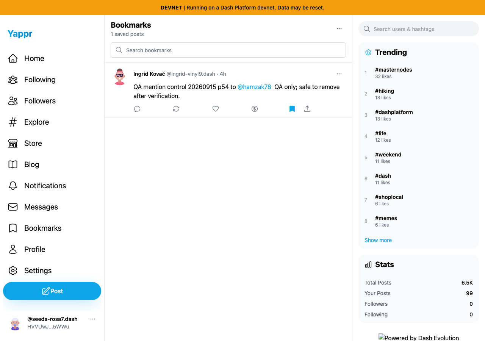
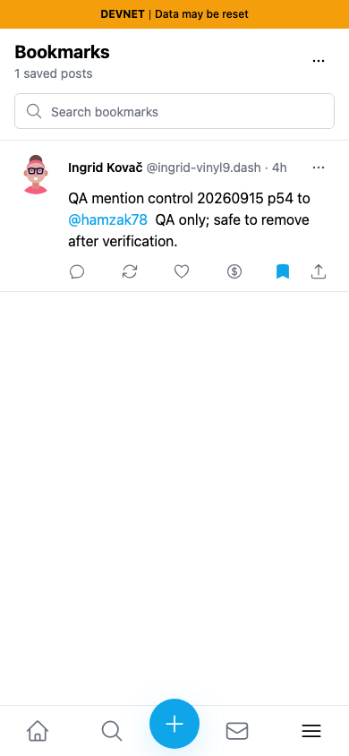
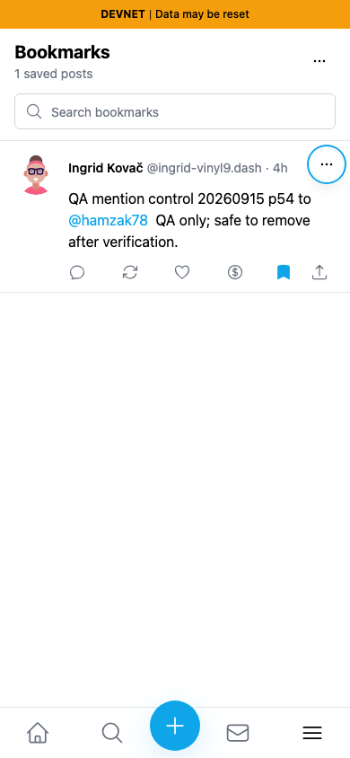
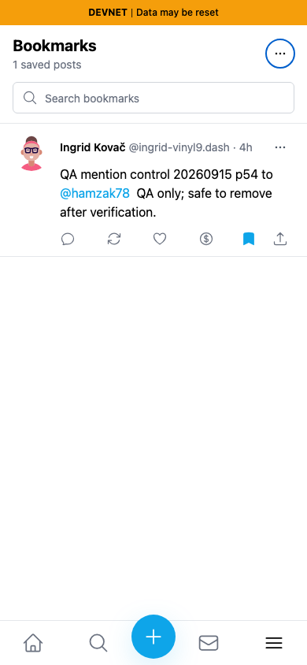
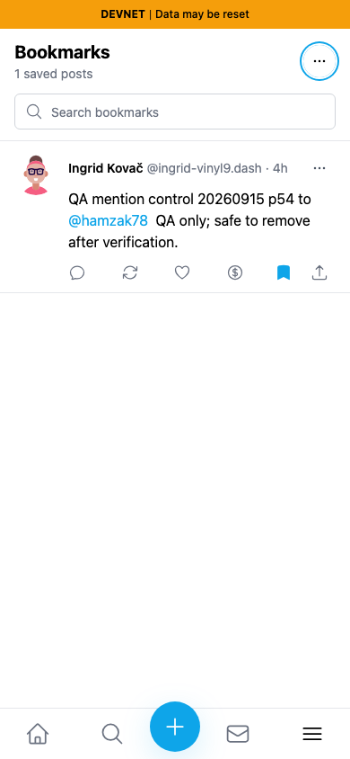

# Bookmark menu keyboard access — QA111

Exact before base `733faf53cd893cba861476a4af75b442ed67ca72`; full signed after head `30ab261bab35dd9b8446692b3b231305b30f5c0d`. Separate committed production devnet builds on local ports 3278 and 3394. Same synthetic persona55 `HVVUwJLhEngLH5LkZx8FgUkcso28xK7tn5gaaHke5WWu`, one existing saved public post `9gWVtfjkRp9dytJiKZ3FJENZnt3sqppe5V3bc1VkZavs`, fresh Chromium contexts, light theme and matching 1280×900 / 390×844 viewports. The fixture restores a private scoped session; this is not a fresh-login test.

The mouse is placed outside the card and ordinary Tab reaches the header and saved-card menu triggers. On the base, both buttons have an empty accessible name, and the saved-card overlay remains fully transparent while focused. Enter can open that invisible trigger's menu; Escape returns focus to the still invisible control. The head adds clear accessible names and reveals the overlay while focus is within the card. The focused overlay and its ring are visible in the comparison below. The underlying plain dots visible in the base are a separate shared PostCard control, not the focused saved-card overlay.

| Keyboard focus | Before — exact base | After — full PR head |
|---|---|---|
| Saved-card menu, desktop |  |  |
| Saved-card menu, 390px |  |  |
| Header menu, desktop |  |  |
| Header menu, 390px |  |  |

Header accessible name changes from empty to **Bookmarks options**; saved-card trigger changes from empty to **Bookmark options**. Those names are semantic assertions, not visible text shown in the screenshots. The header screenshots show its consistent application focus ring; the main visual bug/fix is the saved-card focus pair. Exact Tab counts, viewport sizes, accessible-name assertions and computed overlay opacity are recorded in [before/results.json](before/results.json) and [after/results.json](after/results.json).

All eight final PNGs were opened and inspected at original resolution. No DOM or application state was injected to simulate the focused controls. Relative post timestamps can advance with capture time. The missing footer branding is the known local static-server artifact and is unrelated.

Validation: targeted ESLint, full TypeScript check and committed devnet production build passed. On both viewports, Enter opens each menu, ArrowDown focuses the actual menu entries, and Escape restores visible focus to the correct trigger. A final normal keyboard sequence (Tab → Space → ArrowDown → Enter) selected Remove bookmark and succeeded. A fresh UI and independent Platform SDK read confirm zero saved posts, restoring the original empty account. See [cleanup.json](cleanup.json) and [platform-final.json](platform-final.json). Only this one temporary bookmark was added for this test; no post was created or edited.

This is separate from the shared PostCard menu fix and from the removal-confirmation fix. It changes only the bookmark page's two trigger attributes, focus styling and overlay focus visibility.
