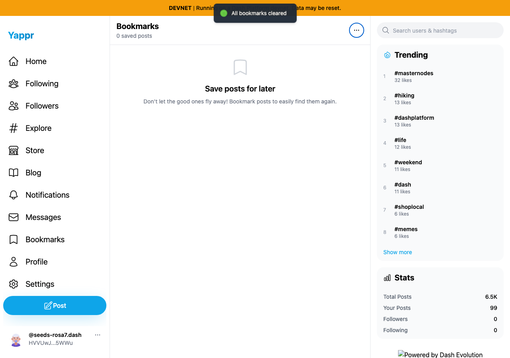
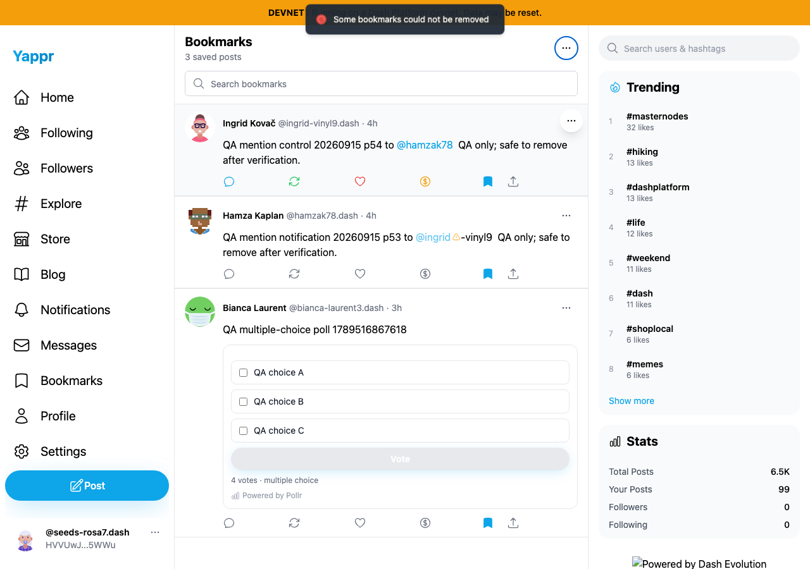
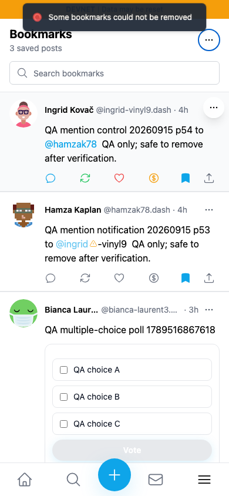
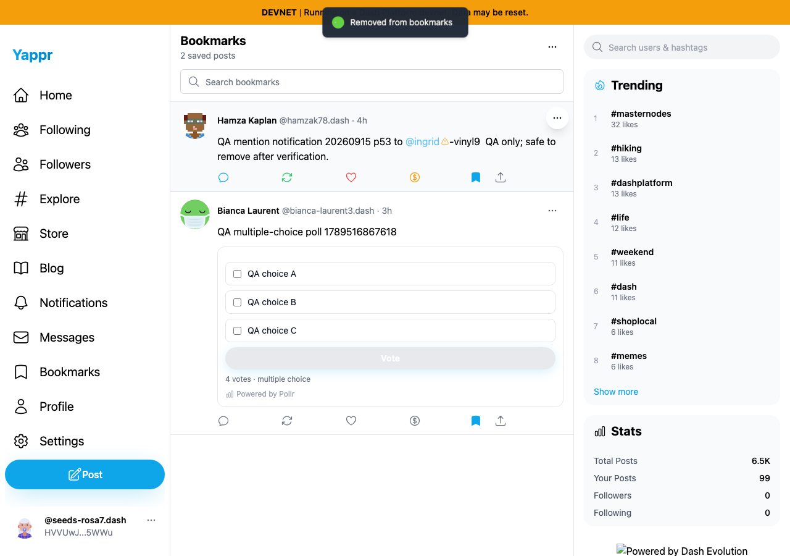
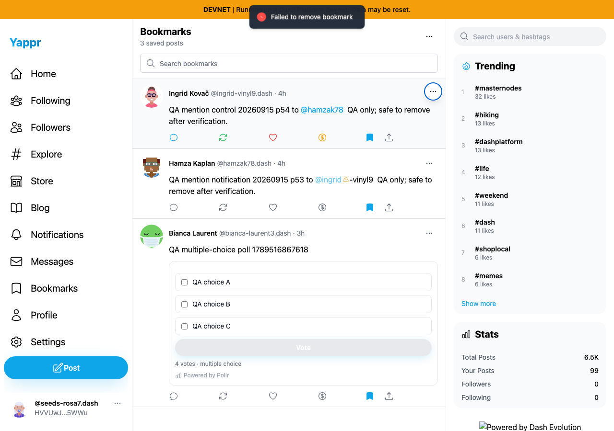
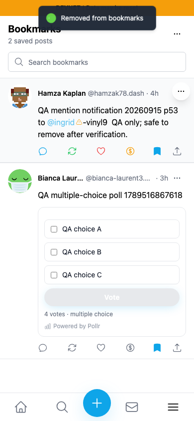
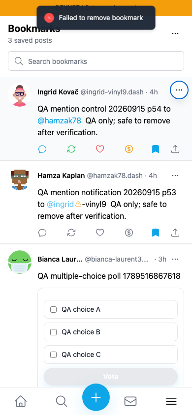
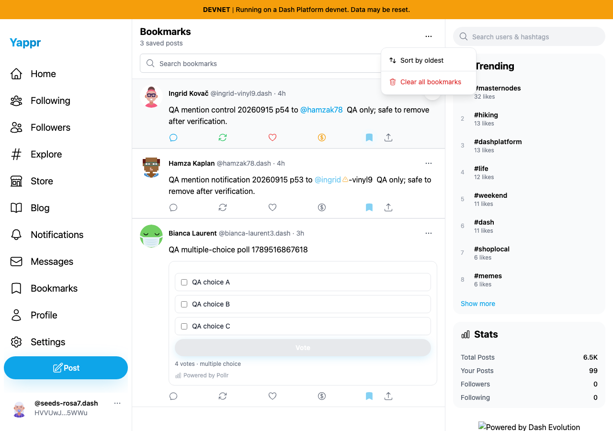
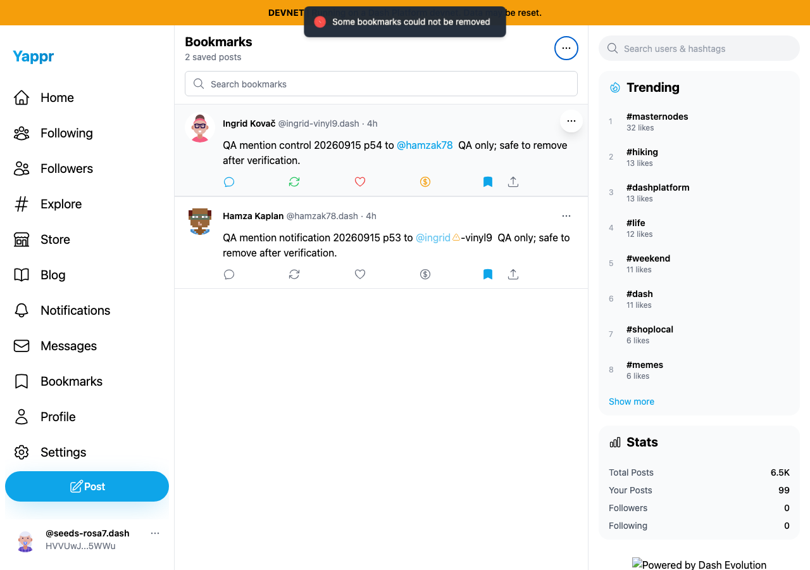
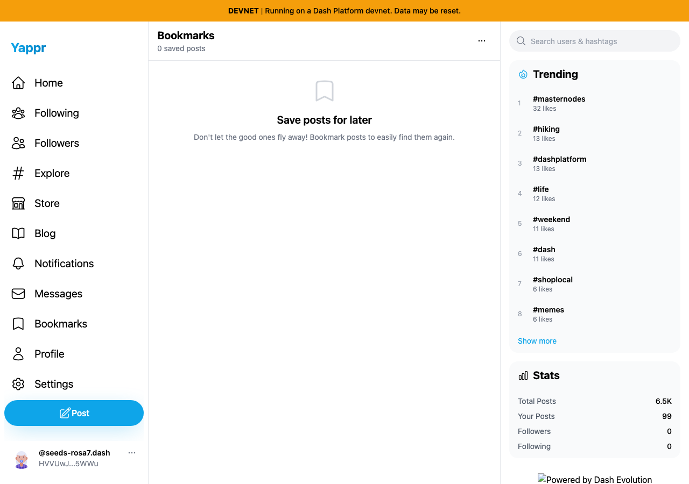

# Bookmark removal confirmation — QA88

Before exact base `733faf53cd893cba861476a4af75b442ed67ca72`; after full signed head `94508becbb959097f53462e728a7f430acc60de8`. Separate committed production devnet builds at local ports 3278/3293; same synthetic QA persona55 `HVVUwJLhEngLH5LkZx8FgUkcso28xK7tn5gaaHke5WWu`, fresh Chromium contexts, light theme, 1280×900 and 390×844. A private seeded session restores this dedicated identity; these are not fresh-login tests. No DOM, application response, clipboard data or success result was injected.

The fixture starts with zero bookmarks, verified in the UI and by an independent Platform SDK read. Three existing public posts were added through the normal post action. Exact post IDs:

- `A97wUuDzx6uxJAKKxicTJZHrhL4huq8w58uiSXZM7tHa`
- `AGRLKvfiUQWdhadft4GG3Z4V2v9zoxCuy8BQS9M5ZHTx`
- `9gWVtfjkRp9dytJiKZ3FJENZnt3sqppe5V3bc1VkZavs`

For each comparison, the browser goes offline only after the same three bookmarks load. Normal menu actions then expose the bug: the base reports success and removes rows despite leaving all three stored. The head reports failure and keeps all three visible. A fresh online browser independently confirmed all three still stored after each set. The base's single-removal image shows two saved posts; bulk shows zero. Both head images show three. No transaction is sent while offline.

| Operation | Before — exact base | After — full PR head |
|---|---|---|
| Clear all, desktop |  |  |
| Clear all, 390px |  |  |
| Per-card Remove, desktop |  |  |
| Per-card Remove, 390px |  |  |

The JSON beside each pair records the actual toast, visible post IDs and fresh online readback. All eight comparison PNGs and three control PNGs were opened and inspected at original resolution before publication. Relative timestamps may advance with capture time. Missing footer branding is a known local static-server artifact unrelated to this change.

## Real transaction controls, partial failure and cleanup

The controls used the signed head and real devnet data. A local transport harness paused or aborted actual `broadcastStateTransition` requests and their retries, without changing request bodies or supplying replacement responses. The healthy transaction reached Platform and was observed independently.

1. Begin single removal using the underlying post action-row bookmark. While its actual broadcast is paused, all three post bookmark buttons are disabled, and the overlay Remove and header Clear menu items have `aria-disabled=true`. The pending screenshot shows the dimmed post actions; the header disabled semantics are asserted procedurally.
2. Abort that broadcast and its retries. The UI reports failure, retains all three rows and re-enables controls.
3. Begin bulk clear. Permit only the first unique real broadcast; pause the other two transactions and retries. A separate fresh browser confirms exactly one deletion persisted. Abort the held requests. The active UI retains exactly the same two IDs shown by the independent reader and reports a partial failure.
4. In a fresh online context, retry one retained entry via its post bookmark action. It succeeds, and another independent reader confirms one remains.
5. Re-add that entry through the normal post-detail bookmark action. Healthy Clear all then succeeds for both entries. A fresh UI and an independent SDK query confirm zero remaining bookmarks, restoring the original account state.

| Control | Full PR head |
|---|---|
| Single removal pending; other bookmark controls disabled |  |
| One actual deletion; two failed removals retained |  |
| Successful retry and final fresh empty state |  |

[Control assertions](controls/results.json), [final independent Platform read](controls/platform-final.json), [initial independent Platform read](platform-initial.json), [creation fixture](fixture.json).

## Additional bookmark stories tested

On the frozen base, fresh persisted readback, case-insensitive content search, username search, no-match state, clearing search, oldest/recent ordering and canceling Clear all passed. Username search can match an author or a mention in content; the exact expected set is recorded in [read-ui.json](read-ui.json). The separate card-menu copied-link issue is QA84, fixed by [Yappr PR #488](https://github.com/PastaPastaPasta/yappr/pull/488). Successful single removal, re-add, bulk clear and cleanup are verified above. These records do not claim comprehensive keyboard or screen-reader coverage.

Validation: targeted ESLint, full TypeScript check, all 238 unit tests in 35 files, and committed devnet production build passed. Seven bookmark-service cases pass the head; two fail on the actual base (false successful removal on lookup error, and creation attempted after lookup error). Other tests cover confirmed absence, delete success/false/rejection, and unchanged read-only lookup fallback. Independent final actual-diff review approved. Source changes are limited to strict mutation lookup, confirmed-only list removal and coordinated pending controls.
