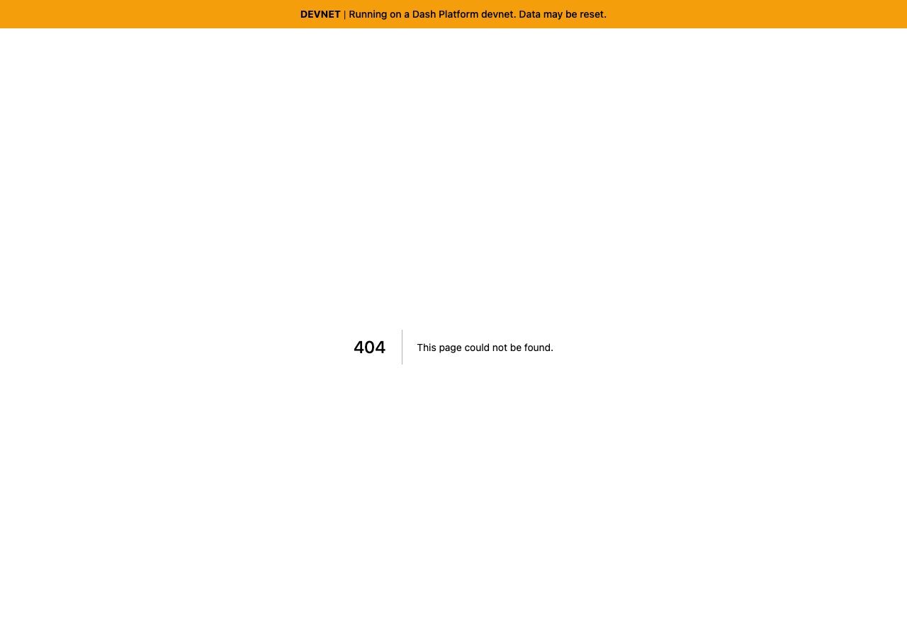
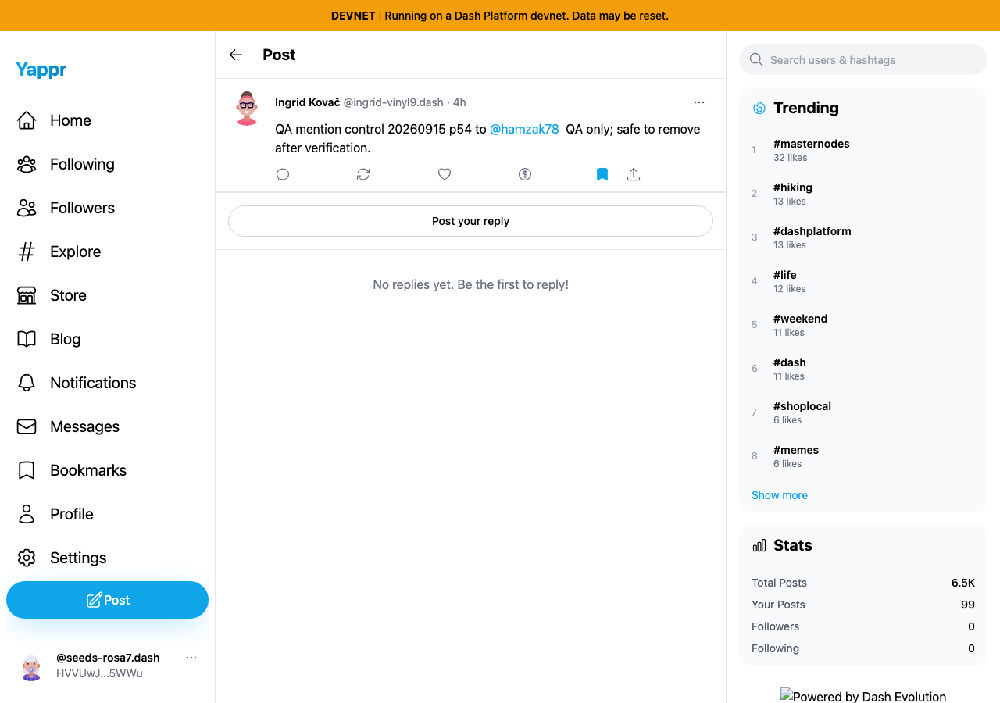
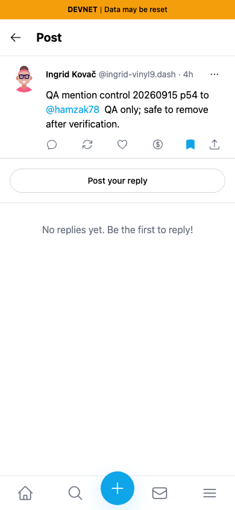
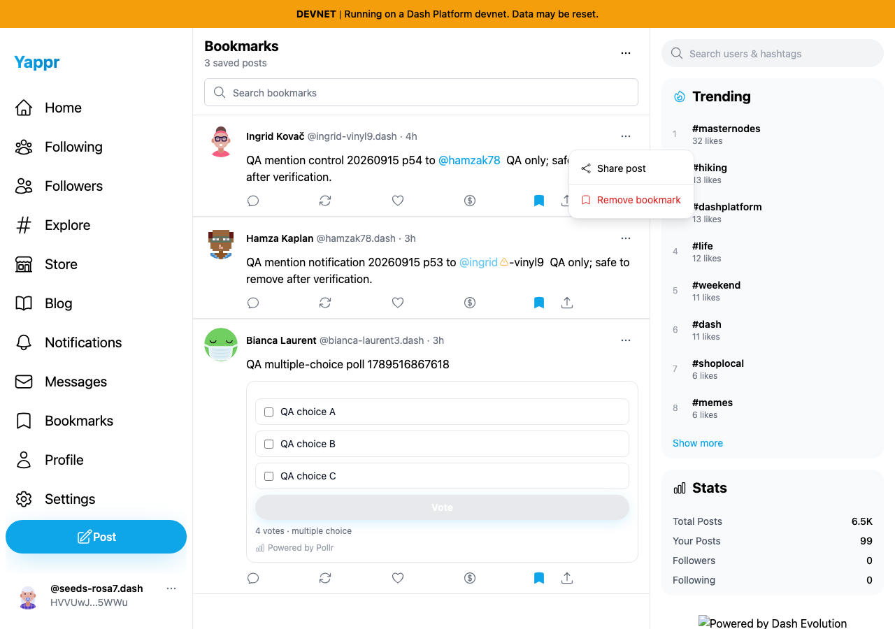
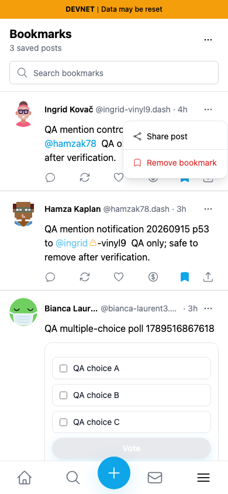

# Bookmark menu deployment-aware copied links — QA84

Before exact source `733faf53cd893cba861476a4af75b442ed67ca72`; after full signed head `a4b1ae0da3f6be39a91bdf90cf0c78e46060ebe0`. Separate committed production devnet builds at local ports3278/3292; same synthetic persona55 `HVVUwJLhEngLH5LkZx8FgUkcso28xK7tn5gaaHke5WWu`, same saved public post `9gWVtfjkRp9dytJiKZ3FJENZnt3sqppe5V3bc1VkZavs`, fresh Chromium contexts, light theme,1280×900 and390×844. Private seeded session restoration is not fresh login evidence. No application content, clipboard value or destination UI was injected.

Using the **Bookmarks page's separate per-card menu → Share post**, the actual before clipboard URL is `/post?id=9gWVtfjkRp9dytJiKZ3FJENZnt3sqppe5V3bc1VkZavs`; its destination returns404 on the deployed-path local server. After uses `/devnet/post/?id=...` and returns200 with that exact post and its real author/content. This does not claim that the root public deployment itself404s: on production the wrong root selects a different network. The independent PostCard action-row share fix already exists; this captures the separate bookmark menu.

| Surface | Before — exact base | After — full head |
|---|---|---|
| Actual copied destination, desktop |  |  |
| Actual copied destination,390px |  |  |
| Menu used, desktop (unchanged control) |  |  |
| Menu used,390px (unchanged control) |  |  |

The JSON beside each state records exact copied URLs,HTTP statuses and same-post DOM assertions. The menu screenshots identify the exercised control; the destination screenshots show the visible bug/fix. All eight final images were opened at original resolution and inspected before publication. Missing footer branding is the known local base-only static-server artifact and is unrelated to this change.

Validation: targeted ESLint, full TypeScript check, committed production build, independent actual-diff review approved; real clipboard/destination checks passed in both viewport cases. Existing QA account initially had zero bookmarks by UI and independent Platform read; three existing public posts were temporarily bookmarked for this test and continued bookmark lifecycle QA. Restoration is tracked in the separate bookmark lifecycle report; no post/poll/mention was created or edited by this comparison.
