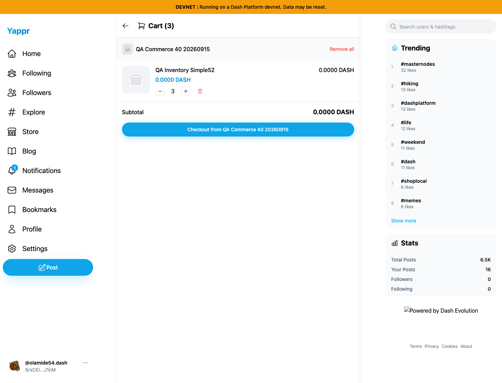
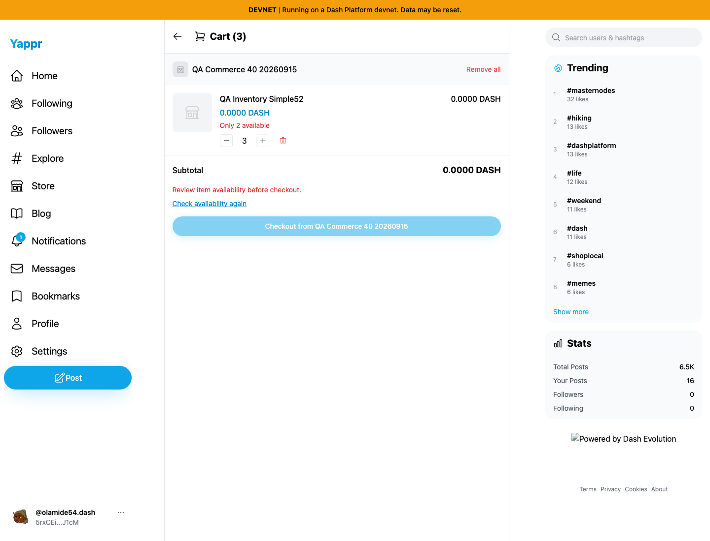
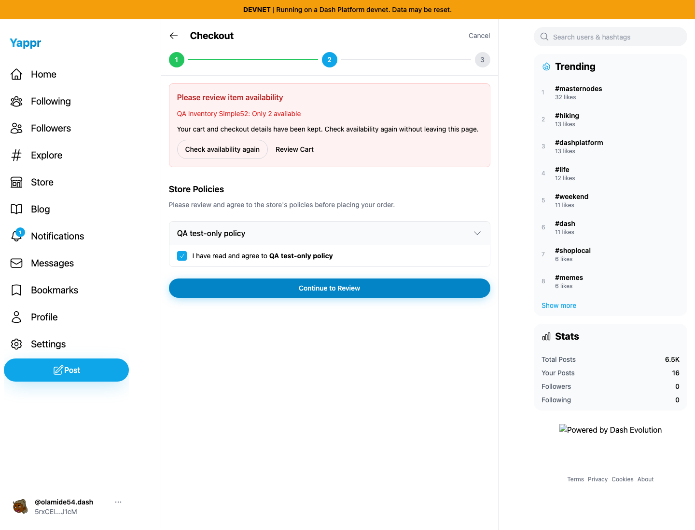
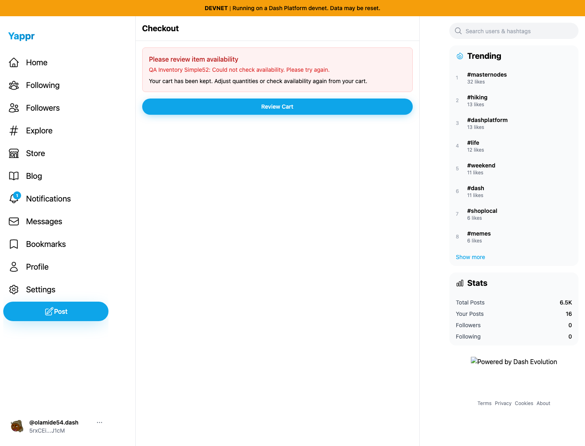
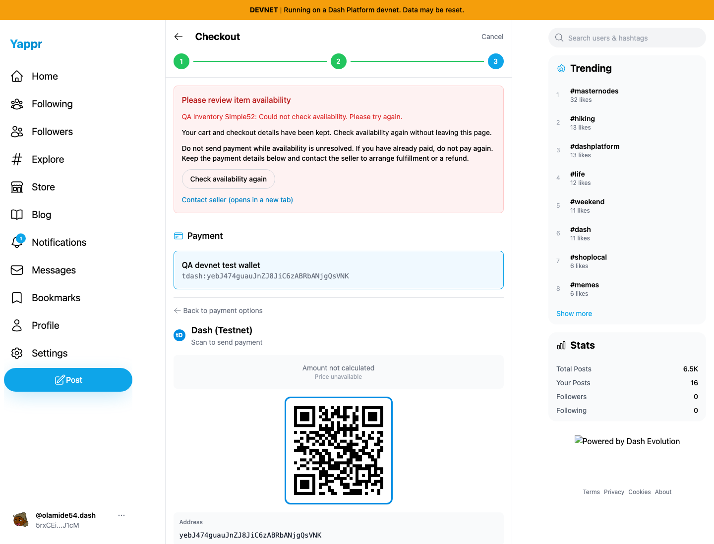
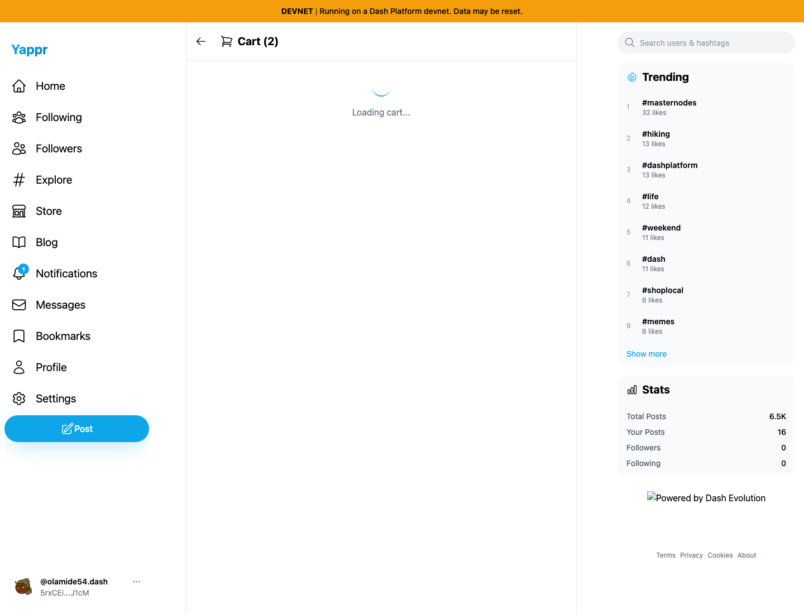
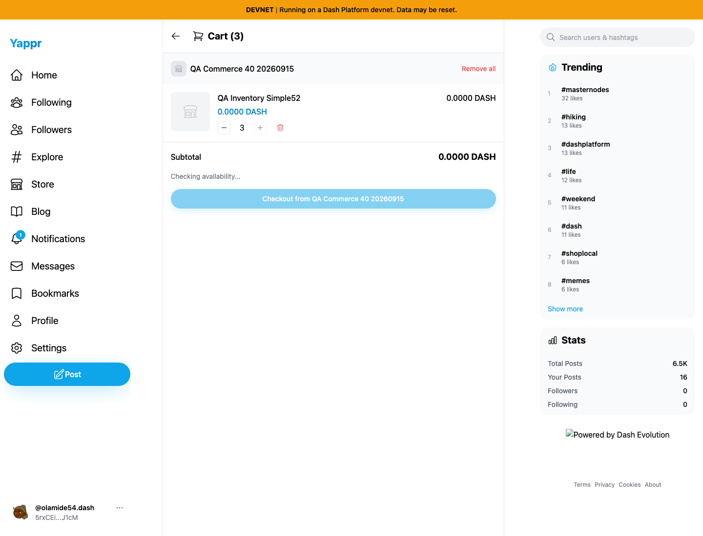
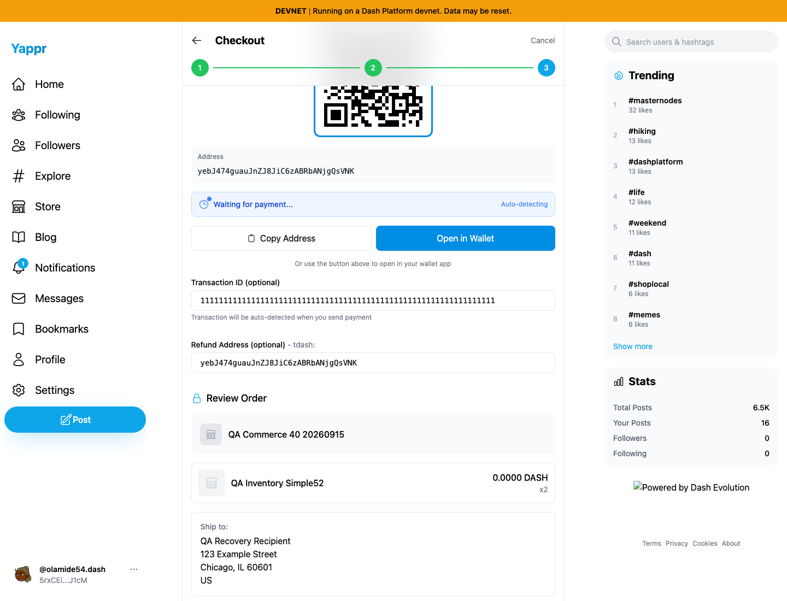
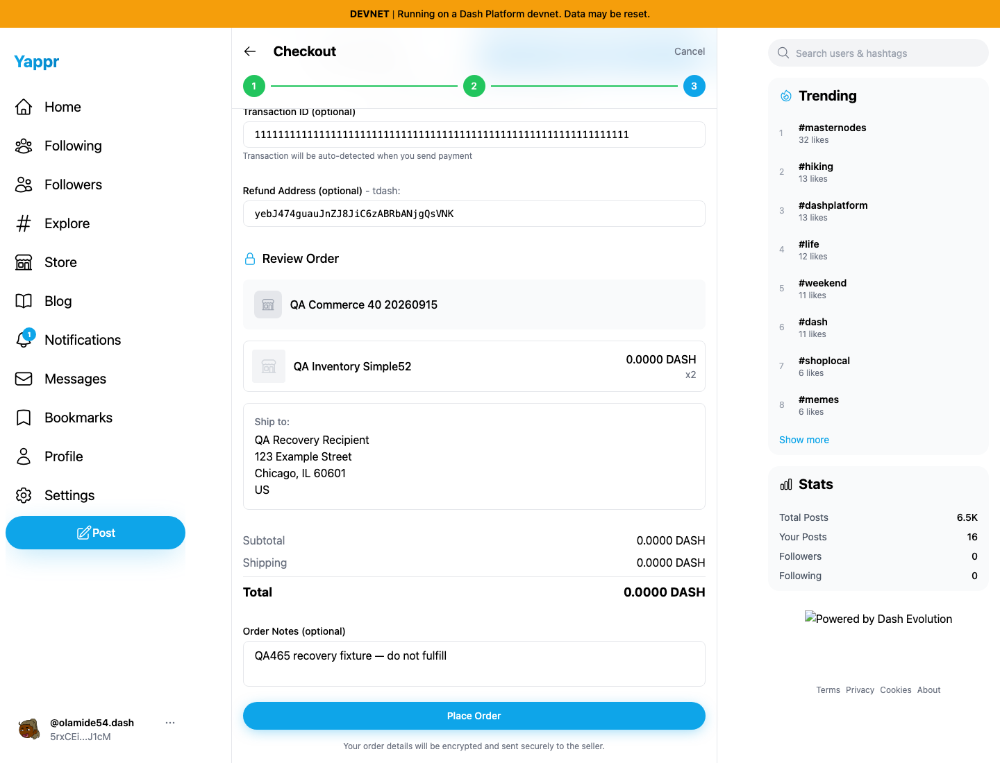

# Cart stock availability and checkout recovery (QA-56)

A cart could increase a product with stock 2 to quantity 3 and proceed to payment. The final fix limits repeated additions and cart quantities, checks fresh inventory before payment and order creation, and preserves carts for correction. If the final stock read fails after payment details have been entered, checkout keeps those details visible, offers an in-place retry, and blocks order creation until a fresh check succeeds. Cart refreshes keep removal/decrement controls mounted while checkout/increases wait for current results.

## Revisions and fixture

| Comparison | Before | After |
| --- | --- | --- |
| Primary pre-PR comparison | Current staging target `c98a6ecd7e26ae5bc9fc8e400e6011eb8465b3a0`, build `c98a6ecd`, port 3260 | Full final PR head `4454c7922a2897da2e86b617013d4b644fa50509`, build `4454c792`, port 3284 |
| Supplemental review iteration | Former PR head `12fb4cce4cc0c1110a23492b33a3df3f36dc6fbe`, separately built as `12fb4cce`, port 3283 | Same full final head `4454c7922a2897da2e86b617013d4b644fa50509` |

The review iteration is **not a pre-PR base comparison**. Both comparisons use separate builds, fresh Chromium contexts at 1440 × 1100, matching dedicated buyer52 authentication fixtures, the repository Node export adapter, light theme, and live devnet reads. Store `98FYBhEF9Q8xNzbamzy66Dm5cMQ5gm9MoAZaiy518sNp`, product `6mp5PmmL7vU792PGEHC84VNy632gcFDo47c9qMpErD3E`, live stock 2. The initial cart of 3 originates from ordinary baseline product/cart actions. Sidebar statistics can change with live chain activity; the compared product, quantities and entered fields match.

Review recovery uses synthetic shipping/contact information, a transaction field of **64 ones that was never broadcast or submitted**, and a public devnet refund-address placeholder. Browser offline mode causes the final read failure. Pending screenshots delay outgoing HTTPS reads then release them unchanged. No rendered UI, product response or availability result is fabricated. No store, inventory, payment or order was written in these new runs; all local carts were cleared. Private authentication data and traces are excluded.

## Primary comparison: stock limit

| Before — exact staging base | After — full PR head |
| --- | --- |
|  |  |
|  |  |

[Baseline ordinary increment beyond stock](primary-before-c98/increment-past-stock.png), [valid quantity recovery](primary-after-4454/quantity-recovered.png), [valid order review](primary-after-4454/valid-checkout.png), and [repeat addition blocked](primary-after-4454/repeated-add-blocked.png) support the main pair. No Place Order action was submitted for a valid cart.

## Supplemental review iteration: retained checkout

| Before — former PR head 12fb4cce | After — full PR head 4454c792 |
| --- | --- |
|  |  |
|  |  |
|  |  |

The error-only screen previously offered only Review Cart. The browser check confirms that following it and re-entering checkout loses the synthetic contact and shipping draft. The final head keeps the payment selector mounted, retains entered transaction/refund/notes/shipping fields, exposes a seller-contact link in a separate tab, and restores Place Order after reconnecting and clicking Check availability again. The contact link target is asserted; no message was sent.

## Validation and limits

- Exact-head devnet build, full TypeScript check, lint, 12 cart-service tests and two independent source reviews pass.
- Actual browser checks pass for baseline overstock/reload, blocked payment progression, valid quantity recovery, repeated additions and reload persistence.
- Final offline validation blocks order creation and preserves payment/draft fields; reconnect/retry succeeds in place. Existing Back actions prove contact and shipping inputs remain populated.
- Delayed decrement and manual refresh keep the cart mounted. Checkout and increases remain disabled; two rapid decrements still work, and obsolete results cannot replace the latest cart validation.
- Availability checks are not atomic stock reservations. This does not claim safety against simultaneous buyers changing inventory after the final check.
- The known amount-conversion error, testnet label on devnet, small DASH amount rounding, and local adapter footer logo are outside this stock PR. Their existing visible states are retained in these screenshots.

Every final PNG was inspected at original resolution. Published files are verified against the SHA-256 manifest. [Evidence matrix](review-matrix.md) and per-run JSON files state exact revisions and assertions.

## Superseded historical evidence

The old `before/`, `after/` and `after-12fb4cce/` comparisons are superseded by the explicitly named primary/review folders above. [The previous immutable report](https://github.com/PastaPastaPasta/dash-ui-artifacts/tree/6c40020c07414f478f3d1e527014ff14b0f38824/yappr/pr-cart-stock-availability) retains the earlier live variant, seller stock-change, and cleanup observations at their original revisions. They were not rerun for this review correction and are not presented as final-head screenshots. That historical run cancelled the earlier unpaid oversell order, restored stock 2 and removed its temporary variant. The current capture did not change those records.
