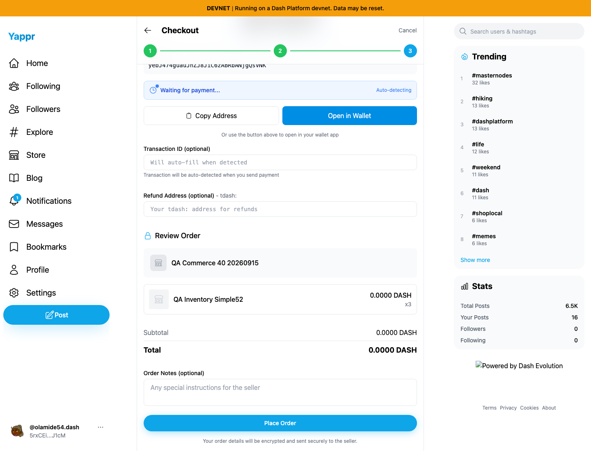
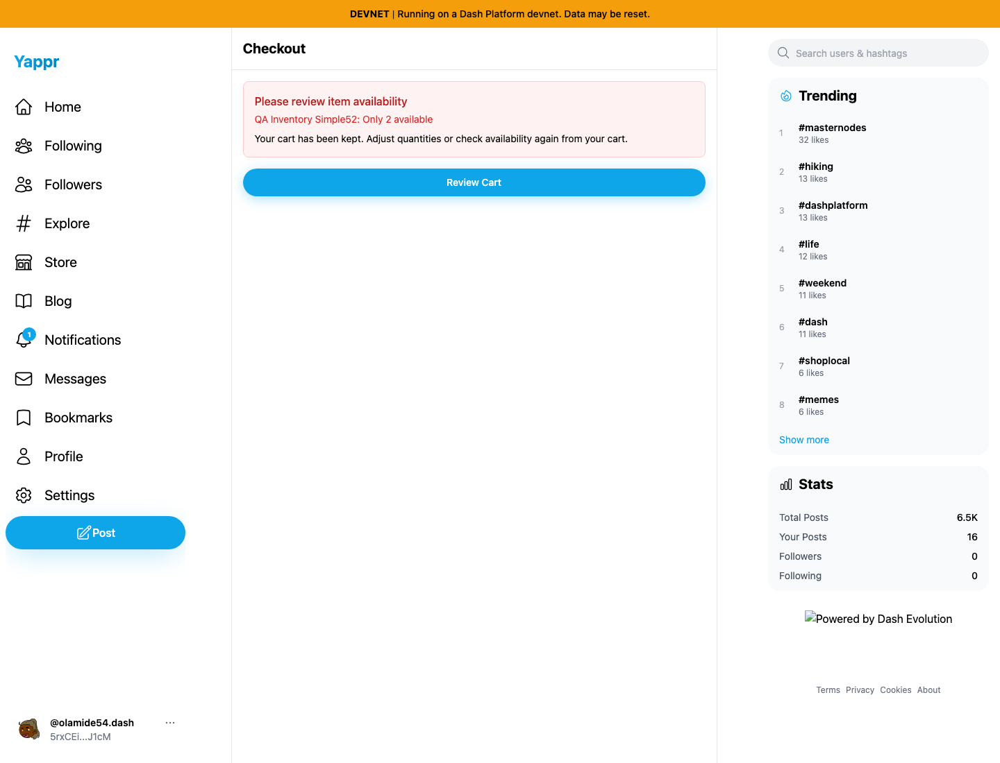
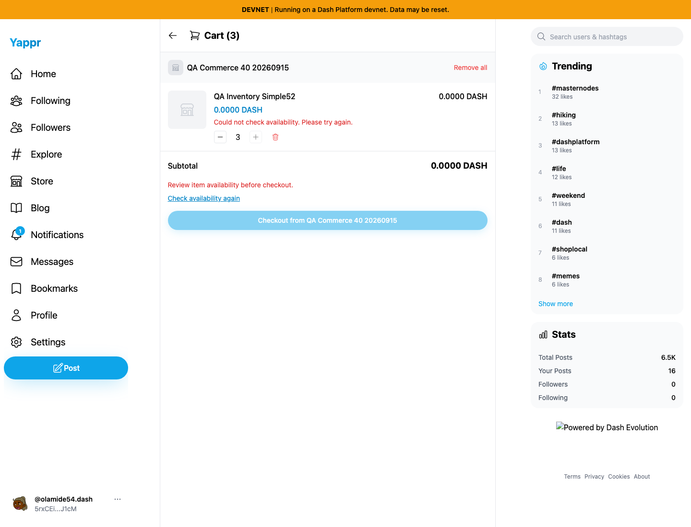
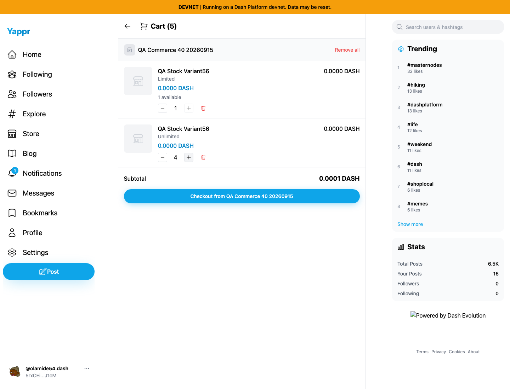
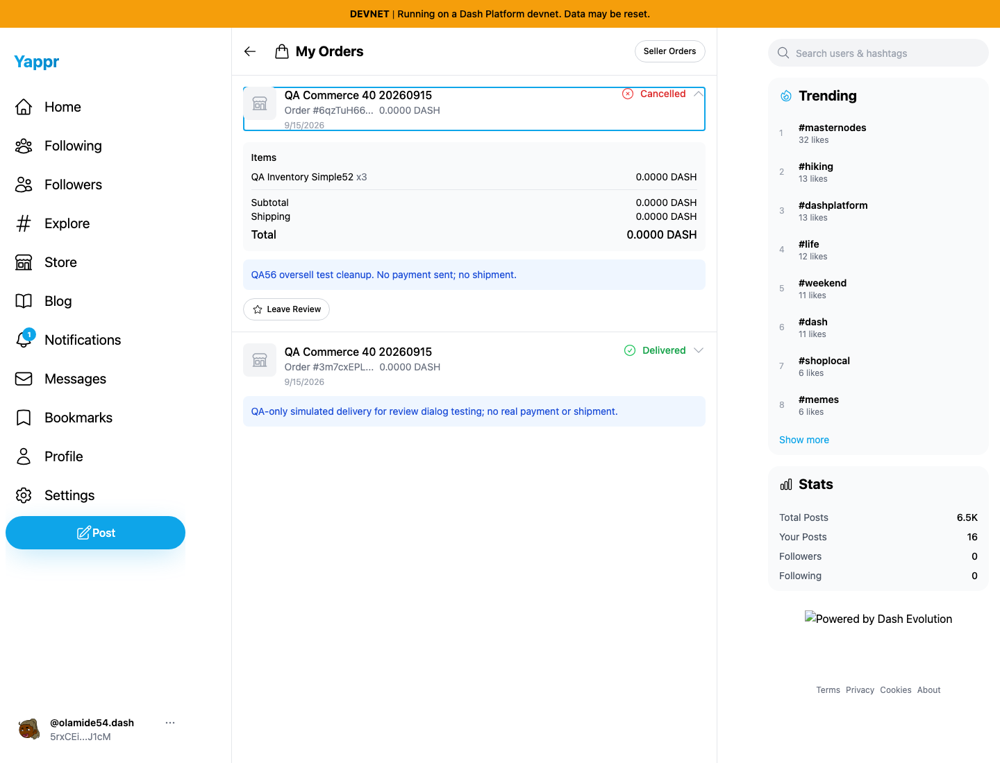

# Cart stock availability (QA-56)

With a product stock of 2, the product page stops at 2, but the old cart plus button permits 3 and checkout accepts all 3. The fix reads current stock, limits cart controls and repeated product additions, and validates the selected store's checkout snapshot before showing payment and again before order creation. Failed reads and invalid quantities preserve the cart for recovery.

Exact before revision: `eb895be71a7207c73fb9329ac9d9bb7b398f53da`, build ID `eb895be7`. Exact after revision: `844359dfbc4de41976bfa606b3c06b457750acf9`, build ID `844359df`. Both use the unchanged repository Node static adapter, Chromium at 1440 × 1100, the same synthetic buyer52 and seller40 product, and live devnet reads. Authentication uses dedicated QA storage fixtures. The initial cart of 3 was obtained through actual baseline product/cart actions and copied between origins; no rendered UI, stock response or application result was mocked. All PNGs are unmodified browser captures inspected at original resolution.

Before: quantity 3, no stock guidance, checkout enabled.

After: the same retained cart explains that only 2 are available and disables increment/checkout.

Before: order review permits placing 3 units. No additional baseline order was sent for this capture.

After: directly opening checkout blocks before payment.

Passed validation:

- Exact-head devnet build, lint, 12 focused unit tests and independent source review. Review also added obsolete-request/store guards to the new asynchronous stock-error state.
- Baseline reproduction using product Add 2 → Cart plus → 3, retained on reload.
- Decrease 3 → 2 restores checkout, keeps plus disabled at stock, and reaches valid order review. Returning to the product blocks adding any further units; remove 1 then add 1 returns to exactly 2.
- A real offline browser read preserves the stored cart byte-for-byte, blocks checkout, and recovers after reconnect/retry. No product responses were mocked.
- A temporary real variant product with Limited stock 1 and Unlimited untracked stock preserves independent quantity controls through reload; the untracked variant increases to 4 normally.
- Seller inventory edits 2 → 3 make the same cart valid after refresh. While that buyer is reviewing 3 units, seller edits 3 → 2. Clicking Place Order rechecks current stock and blocks before creating any order. Independent SDK readback confirms only the two pre-existing buyer orders remain. This does not implement or claim atomic inventory reservation across simultaneous buyers.

Cleanup: Simple52 returned to stock 2. All local carts used in these runs were cleared. The prior normal baseline QA created unpaid oversell order `6qzTuH66vEUW2FaREypaBEZdUAtyPKiJaELqUKnqqfE8`; it is now Cancelled, confirmed by seller UI, fresh buyer decryption and SDK status. No payment or shipment occurred. The existing reviewed order was untouched. The temporary variant was deleted and SDK absence verified. Its first delete attempt reported local success but returned on reload; an immediate ordinary retry succeeded. That separate false-success path is QA-63, and its original transport/consensus failure cause was not captured.

Structured before/after, offline, restock, variant and cleanup results are included. Two harness selectors were corrected: the Next route announcer also has role=alert, and order item labels include a quantity suffix. Those were harness errors, not product bugs. Supporting checkout/product screenshots were recaptured with the relevant controls scrolled into view; the offline capture waits for the row animation to finish.

The footer logo omitted by the local Node adapter and the small DASH values rounded to 0.0000 are unrelated known issues, not part of this stock fix (price precision has a separate PR).
