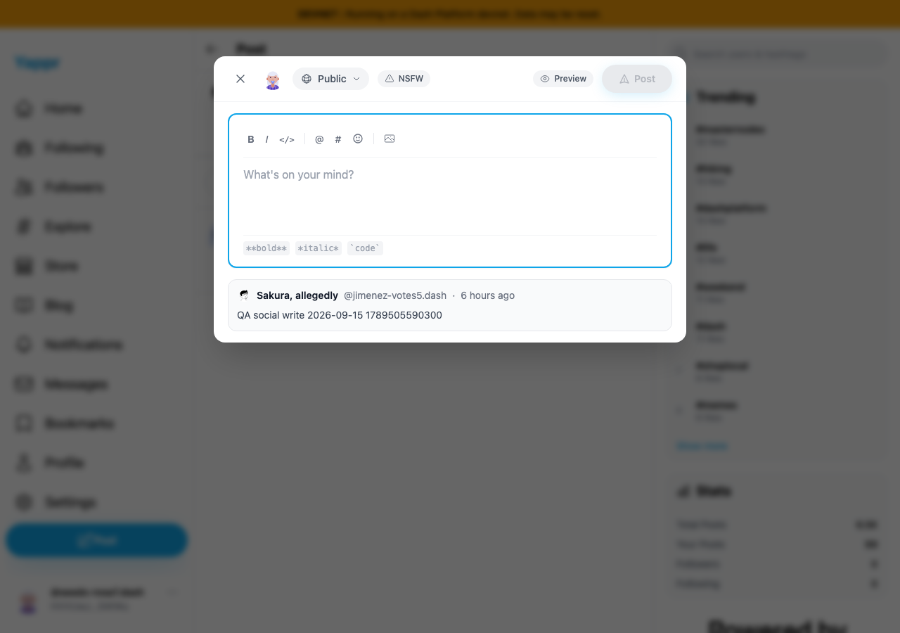
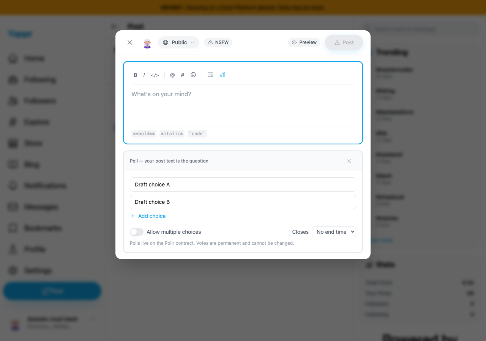
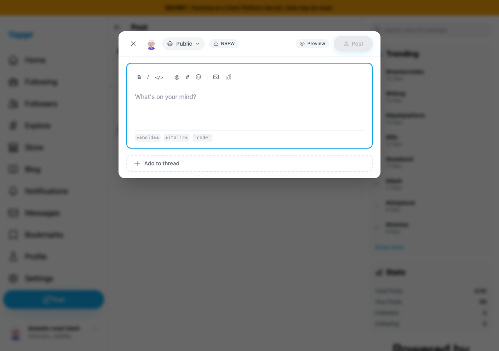
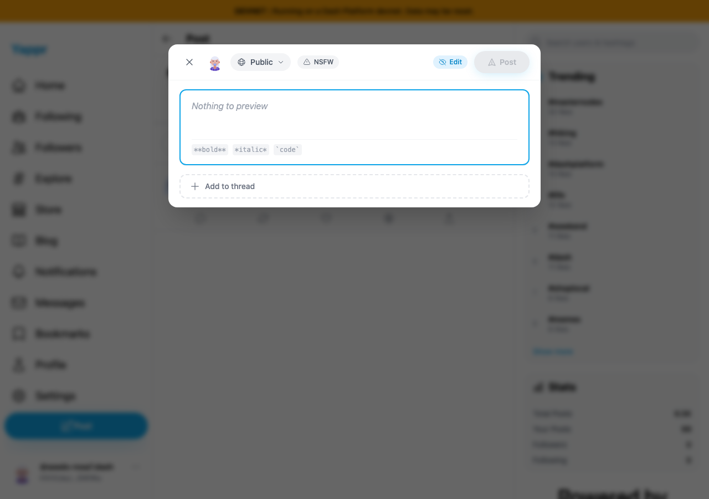
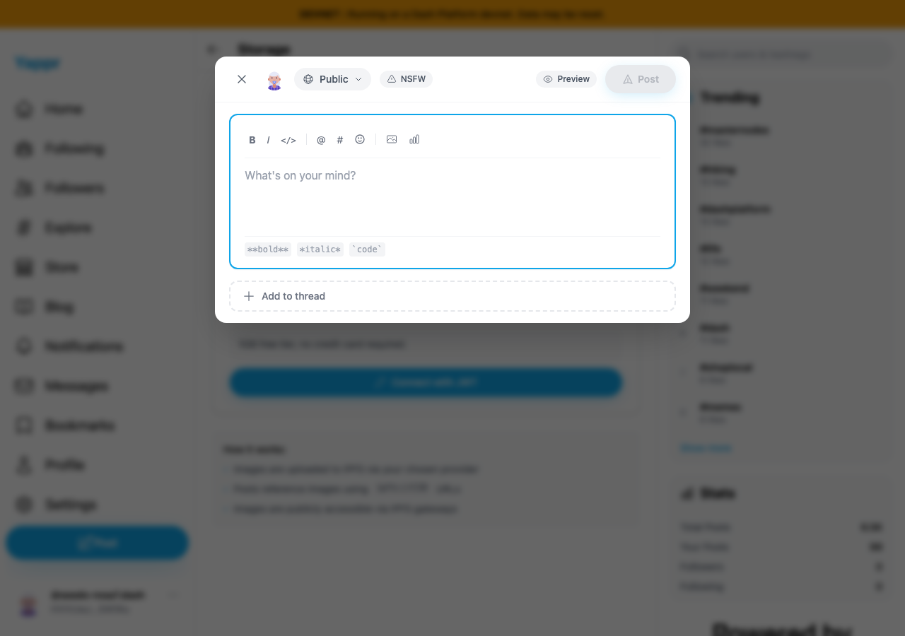

# QA86 — Composer dismissal resets the whole draft

Before exact staging: `cf0efbc10b8757137063113ebbd2061e8b87d8f7`.
After full signed head: `a57de1332b390823942a317af1e6f491f5aaa41a`.

Separate committed devnet builds, Chromium1280×900/light theme, fresh controlled persona55 session: `HVVUwJLhEngLH5LkZx8FgUkcso28xK7tn5gaaHke5WWu`. Reply/quote target is the same existing public post, `9mcdDNznWP86bScjmMykF1kzNpecneoFoZVVNAB5qCFd`, by `jimenez-votes5.dash`. Sessions were seeded from the private QA corpus; this is not login evidence. No posts, polls or messages were submitted. No data, DOM styling, responses or screenshots were mocked or altered.

Before runtime: `http://127.0.0.1:3288/devnet`. After runtime: `http://127.0.0.1:3292/devnet`, verified IPv4 Python process serving the exact head's `out` directory; that capture server was stopped afterward. Each pair repeats the same dismissal sequence and clicks the normal sidebar Post button. Explicit Close already clears the entire draft on both revisions; Escape/backdrop and provider-settings navigation previously bypassed that cleanup.

| Transition | Before — exact base | After — full PR head |
|---|---|---|
| Reply → Escape → Post |  |  |
| Quote → backdrop → Post |  |  |
| Poll → Escape → Post |  |  |
| Preview → backdrop → Post |  |  |
| Reply → Attach image → Go to Settings → Post |  |  |

`before.json` and `after.json` contain the actual dialog titles, text, textarea values and poll choices for all five cases. Before shows all five stale auxiliary states while text is empty; after shows a fresh editable post in all five cases. Each case also checks explicit Close still resets correctly. Cancel in the nested storage-provider prompt preserves the parent reply draft on both revisions. The NSFW toggle returns to the persona's actual profile default on both revisions; that is a compatibility pass, not a claimed bug fix. Actual image upload/attachment readback is not covered because no storage-provider fixture is configured.

ESLint, exact committed devnet production build/type check and all265unit tests passed. Independent actual-diff review: APPROVED. The change reuses existing cleanup for Radix dismissal and storage-settings navigation; it does not introduce a new draft-retention policy. All ten final PNGs were opened at original resolution and checked for matching state, readable relevant fields and absence of secrets. The blur around the dialog is the application's existing backdrop treatment.
