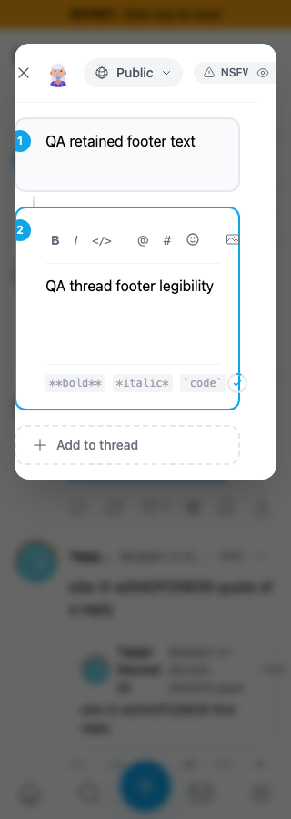
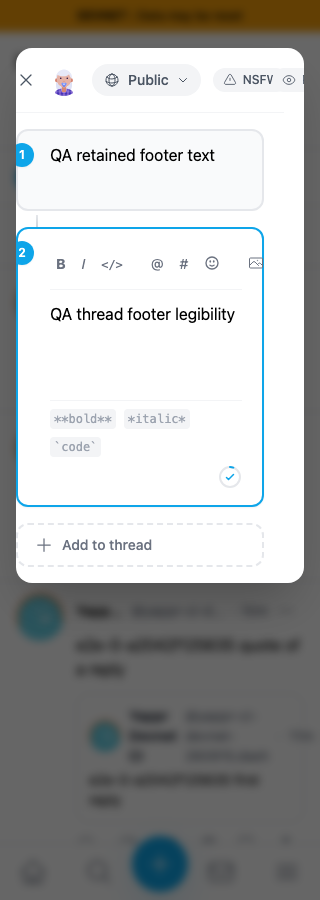
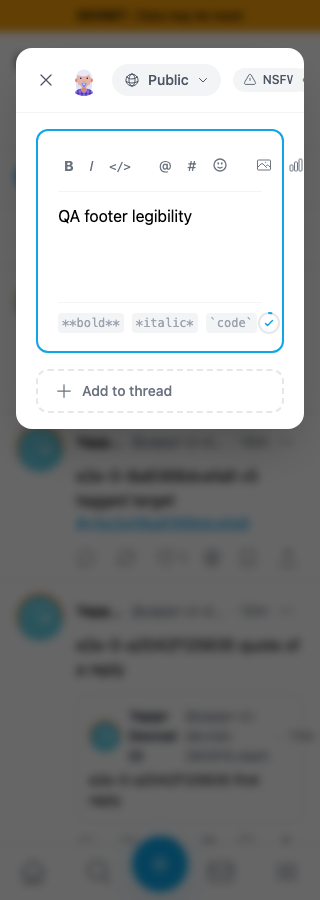
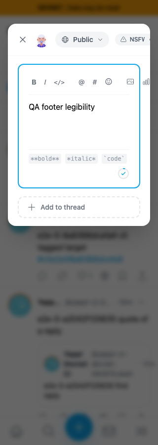
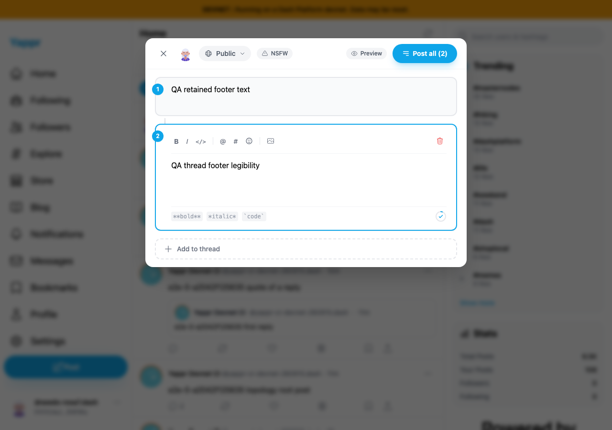

# QA138: keep composer footer hints and counters within their card

Before: exact staging `cf0efbc10b8757137063113ebbd2061e8b87d8f7`. After: full signed head `3acb20dca174435428472b7f43cf46e1f8c6b003`. Separate committed devnet production builds verified by visible About hash; same QA persona55, seeded sessions (not login evidence), light Chromium, no submissions or uploads.

At320px, formatting examples and the character counter force the footer beyond its content width. The thread counter crosses the card border. Allow the footer and formatting examples to wrap while keeping the counter at the right edge. Desktop retains one row.

| State | Before | After |
|---|---|---|
|320px thread|||
|320px single post|||
|1280px thread|||

The independent header and toolbar clipping visible in the small-screen images are QA110/PR518 and QA120/PR534. This PR changes only the footer.

Each exact revision exercised30 states:320,390,1280px × single/thread × short,450,480,500,501 characters. Every after-state keeps each formatting label, progress circle and remaining-character number inside the footer width and viewport. Keyboard formatting and Preview/Edit preserve the entered text; all local drafts closed without publication. [Before measurements](before.json), [after measurements](after.json).

An additional [isolated prop fixture](isolated-image-counter.json) renders the real committed ThreadPostEditor and CharacterCounter with499 text characters plus image-length props100,2048 and1,000,000 at320/390/1280px. Only unrelated markdown/autocomplete/emoji children are stubbed. All labels and the full24px progress circle remain inside the footer, including the negative counter. This verifies component layout and is explicitly not an image-upload or storage-provider integration pass.

Validation: devnet production build (including TypeScript), targeted ESLint,265 unit tests and independent source review passed. Six final original PNGs visually inspected, unaltered. Hashes cover all published files; public byte/type verification and rendered comparison follow publication.
