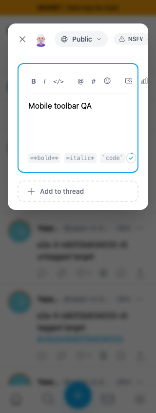
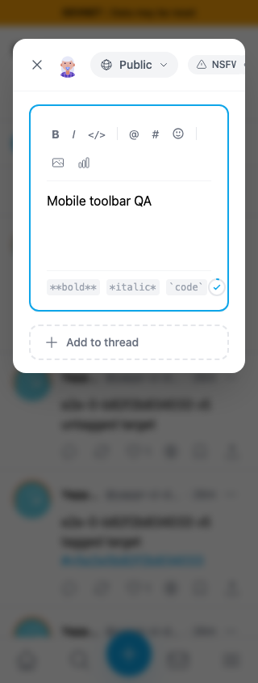
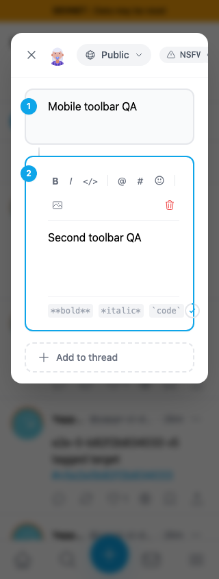

# Composer toolbar on narrow screens

At320px, a single-post toolbar draws Attach image and Add poll beyond its editor. In a thread, Remove this post is off-screen. Allowing the existing flex row to wrap keeps every toolbar control inside its editor.

- Exact base: `cf0efbc10b8757137063113ebbd2061e8b87d8f7`.
- Full source head: `938a771f8222eabd6327922e3f12761c85dbb60c`.
- Independently built committed devnet exports, About revision verified. Same real persona55, light theme,320×844 viewport, identical local drafts and focused textarea. Session is seeded for these layout checks; this is not login evidence.
- No post submissions or Platform writes. The feed behind the modal is live and can differ.

| Surface | Before — exact base | After — full head |
|---|---|---|
| Single post |  |  |
| Thread continuation |  |  |

All four final originals were inspected at original resolution. The initial thread capture was rejected because the entry animation had not settled; these final images wait for settled state.

## Validation

Committed devnet build including lint/types passed; six existing compose tests passed; independent actual-diff source review approved. Actual browser assertions cover single/thread toolbars at320/390/1280px, every control's editor/viewport bounds, enabled-control Tab order, poll add/remove, Bold, thread add/remove and dismissal. All head controls fit;390px and desktop already fit before. Measurements and runtime source checks are in `before.json` and `after.json`.

The composer header overflow is separate QA110. Formatting hints/character-counter overflow is separate QA138. Both remain visible here and are outside this one-class toolbar fix. This does not claim provider upload, emoji-selection focus or publication coverage.
