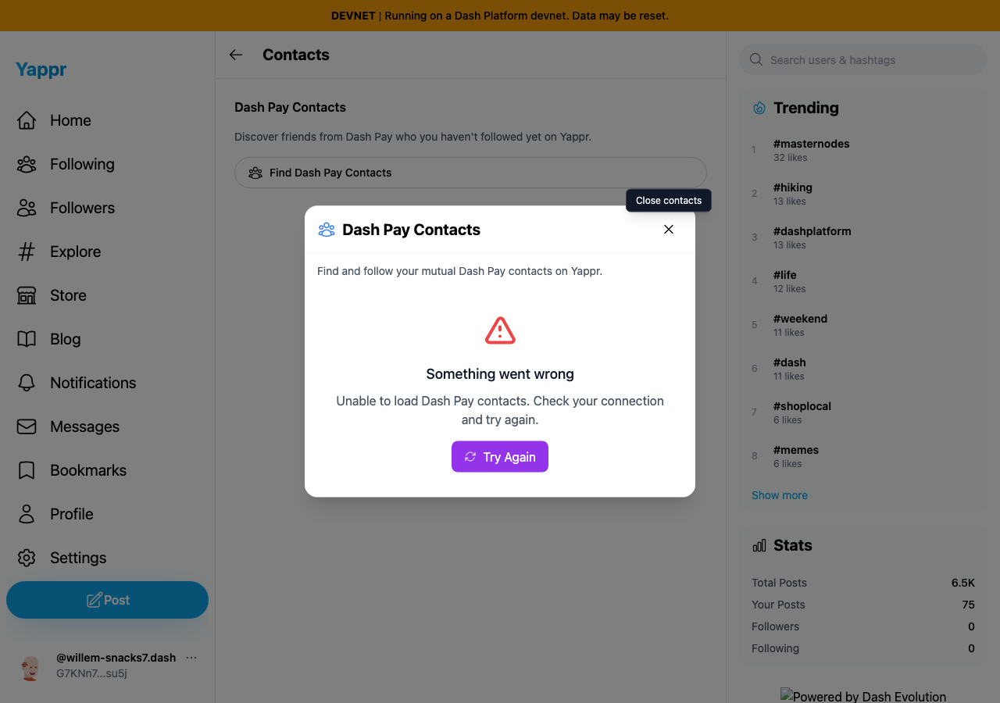
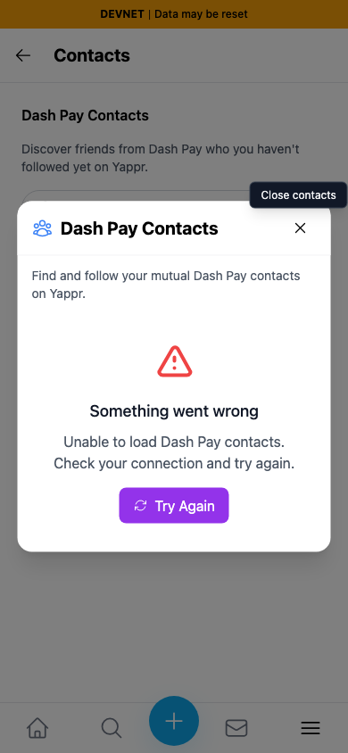
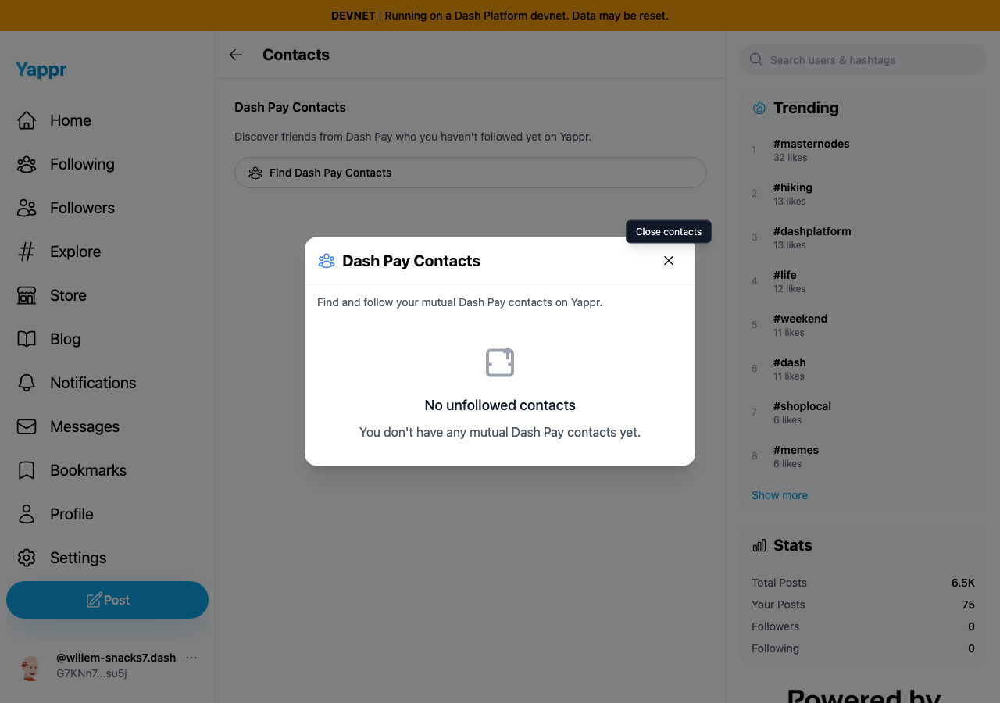
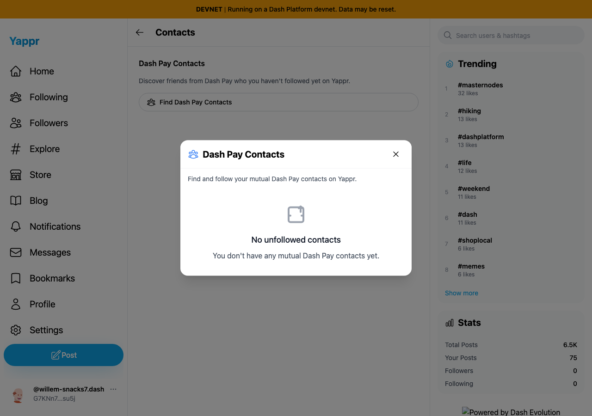
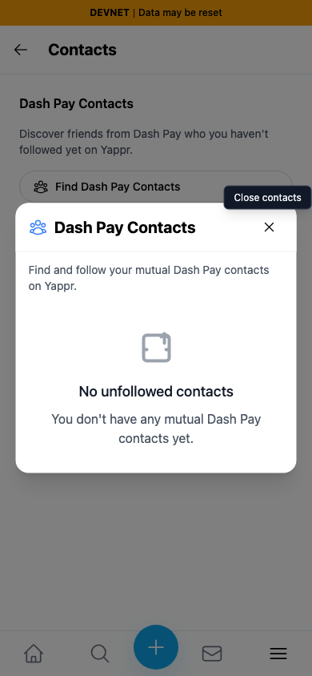
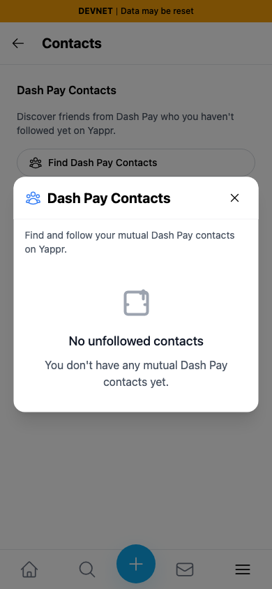

# Dash Pay contact read failures — QA115

Exact before base `cf0efbc10b8757137063113ebbd2061e8b87d8f7`; full signed after head `9c646c1b754de5308580056f2f0bcd66a212951c`. Independently committed production devnet builds on local ports 3288/3395. Same dedicated synthetic persona70 `G7KNn78UJvYLVMZdAZRwiXnBknjeMFU2sccCuKc5su5j`, fresh Chromium contexts, light theme, matching 1280×900 / 390×844 viewports. A private scoped session restores this existing QA identity; this is not fresh-login evidence. No contact requests, follows or other Platform documents were written.

Each phase first confirms the dedicated account has a successful empty contact result in a separate fresh online browser. Each failure case then loads Settings → Contacts in a fresh context, waits for SDK initialization, takes the browser offline and selects **Find Dash Pay Contacts** for the first time. Four real Platform requests fail with `net::ERR_INTERNET_DISCONNECTED` in every captured case. No replacement response or application state is injected to simulate the failure.

The base treats a failed outgoing read as an empty list and says the account has no mutual contacts. The head propagates the failure, displays a concise error and exposes the existing **Try Again** action.

| First lookup while offline | Before — exact base | After — full PR head |
|---|---|---|
| Desktop |  |  |
| 390px |  |  |

## Same-session reconnection and recovery

After returning the browser online, the base dialog was closed and reopened. It immediately reused the failed empty result with **zero new Platform requests**. On the head, selecting **Try Again** issued **two real Platform requests** and returned the known successful empty result. Both screens below are intentionally empty; their provenance differs and the request assertions establish the recovery behavior. This is not evidence of a populated mutual-contact import.

| Reconnected control | Before — cached false-empty result | After — successful fresh read |
|---|---|---|
| Desktop |  |  |
| 390px |  |  |

[Before observations](before/results.json) and [after observations](after/results.json) record exact identity, viewport, real failure metadata, displayed text and subsequent request counts. All eight final PNGs were opened and inspected at original resolution. The unrelated footer branding differs with local static-asset mounting; no claim depends on that background detail.

## Validation and limits

Nine meaningful contact-service tests verify outgoing and incoming query failures; no failed empty cache; immediate retry; strict follow-list failures; successful empty caching; already-followed mutual contacts; enrichment and contact-established dates. Five tests fail the actual base and all nine pass the head. The full local suite passes **274 tests in 38 files**. Targeted ESLint, full TypeScript check, committed devnet production build and independent final actual-diff review passed.

The service now uses the existing strict follow-list reader so failure cannot classify every contact as unfollowed. Existing successful results still use the five-minute cache. The dialog retains the existing loading/error/retry components and logs technical error detail outside the user-facing message.

Populated mutual-contact filtering is covered by unit fixtures only here. A separate read-only investigation located the real DashEvoTool send/accept GUI protocol but found no ready dedicated mutual-devnet pair or configured devnet wallet fixture. No fabricated wallet/contact ceremony was used. All browser contexts were restored online and disposed; no persistent fixture cleanup was necessary.
